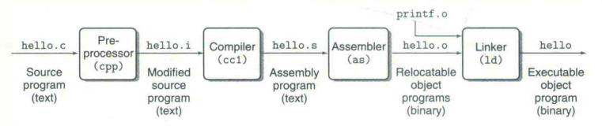
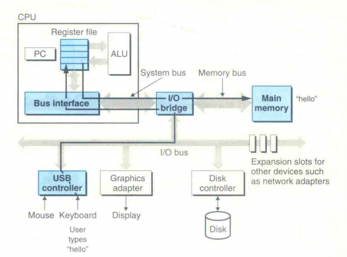
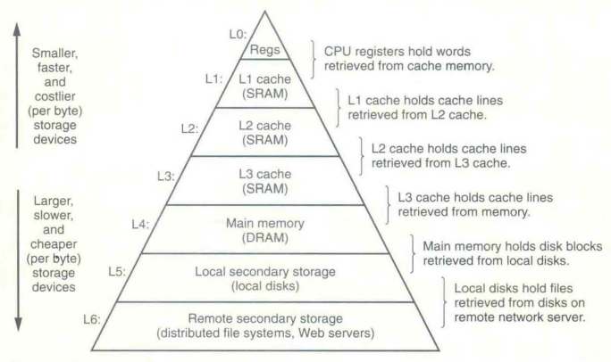
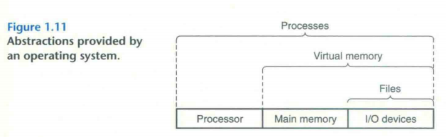
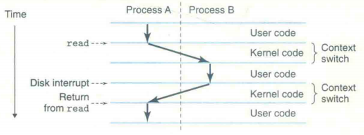
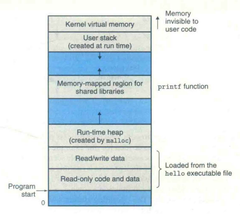
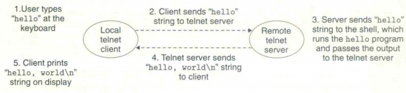

# Chapter 1 A Tour of Computer System

## 1.1 Information Is Bits + Context

etc.

## 1.2 Programs Are Translated by Other Programs into Different Forms

-   The individual C statements must be translated by other programs into a sequence of low-lecel *machine-language* instructions.

-   On a Unix system, the translation from source file to object file is performed by a compiler driver:

    

```shell
linux> gcc -o hello hello.c
```

***preprocessor, compiler, assembler, and linker*** are known collectively as the compilation system.

-   **Preprocessing phase.** The preprocessor modifies the original C program according to directives that begin with the `#` character. The result is another C program, typically with the `.i` suffix.
-   **Compilation phase.** The compiler translates the text file `hello.i` into the text file `hello.s`, which contains an *assmbly-language program*.
-   **Assembly phase. **The assembler translates `hello.s` into machine-language instructions, packages them in a form known as a *relocatable object program*, and stores the result in the object file `hello.o`. 
-   **Linking phase.** Lingking is the process of combining object files and libraries into a single executable file or library in C programming. In `hello` program, Lingker links `printf.o` and `hello.o`. 

## 1.3 It Pays to Understand How Compilation Systems Work

-   ***Optimizing program performance.*** 
-   ***Understanding link-time errors.*** 
-   ***Avoiding security heles.*** 

## 1.4 Processors Read and Interpret Instructions Stored in Memory

### 1.4.1 Hardware Organization of a System

#### Buses

Running throughout the system is a collection of electrical conduits called *buses* that carry bytes of information back and forth between the components. 

Buses are typically designed to transfer fixed-size chunks of bytes known as *words*.

*word size* : The number of bytes in a word, is a fundamental system parameter that varies across systems.

#### I/O Devices

**Input/output(I/O)** devices are the system’s connection to the external world. 

Each I/O device is connected to the I/O bus by either a *controller* or an *adapter*. 

#### Main Memory

The *main memory* is a temporary storage device that holds both a program and the data it manipulates while the processor is executing the program.

Physically, main memory consists of a collection of *dynamic random access memory*(DRAM) chips.

Logically, memory is organized as a linear array of bytes, each with its own unique address starting at zero. 

#### Processor

The *center processing unit*(CPU), or simply *processor*, is the engine that interprets (or *executes*) instructions stored in main memory. 

At its core is a word-size storage device (or *register*) called the *program counter* (PC). 

### 1.4.2 Running the `hello` Program



## 1.5 Caches Matter

From a programmer’s perspective, much of this copying is overhead that slows down the “real work” of the program.

Because of physical laws, larger storage devices are slower than smaller storage devices. And faster devices are more expensive to build than their slower counterparts.

To deal with the processor-memory gap, system designers include smaller, faster storage devcies called *cache memories* that serve as temporary staging areas for information that the processor is likely to need in the near future.

L1 and L2 caches are implemented with a hardware technology known as *static random access memory* (SRAM). 

## 1.6 Storage Devices Form a Hierarchy

This notion of inserting a smaller, faster storage device between the processor and a larger, slower device turns out to be a general idea. 

The main idea of a memory hierarchy is that storage at one level serves as a cache for storage at the next lower level. 



## 1.7 The Operating System Manages the Hardware

*Operating system* is a layer of software interposed between the application program and the hardware.

The operating system has two primary purposes:

1.   To protect the hardware from misuse by runaway applications. 
2.   To provide applications with simple and uniform mechanisms for manipulating complicated and often wildly different low-level hardware devices. 



The operating system achieves both goals via the fundamental abstractions shown in Figure 1.11 : *processes, virtual memory* and *files*. 

As this figure suggests, files are abstractions for I/O devices, virtual memory is an abstrations for both the main memory and disk I/O devices, and processes are abstractions for the processor, main memory, and I/O devices. 

### 1.7.1 Processes

When a program such as `hello` runs on a modern system, the operating system provides the illusion that the program is the only one running on the system. 

A *process* is the operating system’s abstraction for a running program. 

*concurrently* : the instructions of one process are interleaved with the instructions of another process.

*context switching* : a single CPU can appear to execute multiple processes concurrently by having the processor switch among them. 

*context* : the operating system keeps track of all the state information that the process needs in order to run.



When the operating system decides to transfer control from the current process to som new process, it performs a *context switch* by saving the context of the current process, restoring the context of the new process, and then passing control to the new process.  

The transition from one process to another is managed by the operating *system kernel*. 

### 1.7.2 Threads

Although we normally think of a process as having a single control flow, in modern system a process can actually consist of multiple execution units, called *threads*, each running in the context of the process and sharing the same code and global data. 

### 1.7.3 Virtual Memory

*Virtual Memory* is an abstraction that provides each process with the illusion that it has exclusive use of the main memory. 

Each process has the same uniform view of memory, which is known as its *virtual address space*. 



The topmost region of the address space is reserved for code and data in the operating system that is common to all processes. 

The lower region of the address space holds the code and data defined by the user’s process. 

-   *Program code and data*. Code begins at the same fixed address for all proccesses, followed by data locations that correspond to global C variables. 
-   *Heap*. The code and data areas are followed immediately by the run-time *heap*.
-   *Shared libraries*. Near the middle of the address space is an area that holds the code and data for *shared libraries* such as the C standard library and the math library. 
-   *Stack*. At the top of user’s virtual address space is the *user stack* that the compiler uses to implement function calls. 
-   *Kernel virtual memory*. The top region of the address space is reserved for the kernel.

### 1.7.4 Files

A *file* is a sequence of bytes, nothing more and noting less. 

## 1.8 System Communicate with Other Systems Using Networks

Running the `hello` program remotely involves the five basic steps shown in FIgure.



## 1.9 Important Themes

### 1.9.1 Amdahl’s law

*Amdahl’s law* : When we speed up one part of a system, the effect on the overall system performance depends on both how significant this part was and how much it sped up. 

>   Consider a system in which executing some application requires time $T_{old}$.
>
>   Suppose some part of the system requires a fraction $\alpha$ of this time, and we improve its performance by a factor of $k$. 
>
>   The component originally required time $\alpha T_{old}$, and it now requires time $(\alpha T_{old}) / k$.
>
>   The overall execution time would thus be:
>   $$
>   T_{new} = (1-\alpha)T_{old}+(\alpha T_{old})/k \\
>   = T_{old}[(1-\alpha) + \alpha / k]
>   $$
>   From this, we can compute the speedup $S=T_{old}/T_{new}$as
>   $$
>   S=\frac{1}{(1-\alpha)+\alpha/k}
>   $$

The major insight of Amdahl’s law : To significantly speed up the entire system, we must improve the speed of a very large fraction of the overall system.
