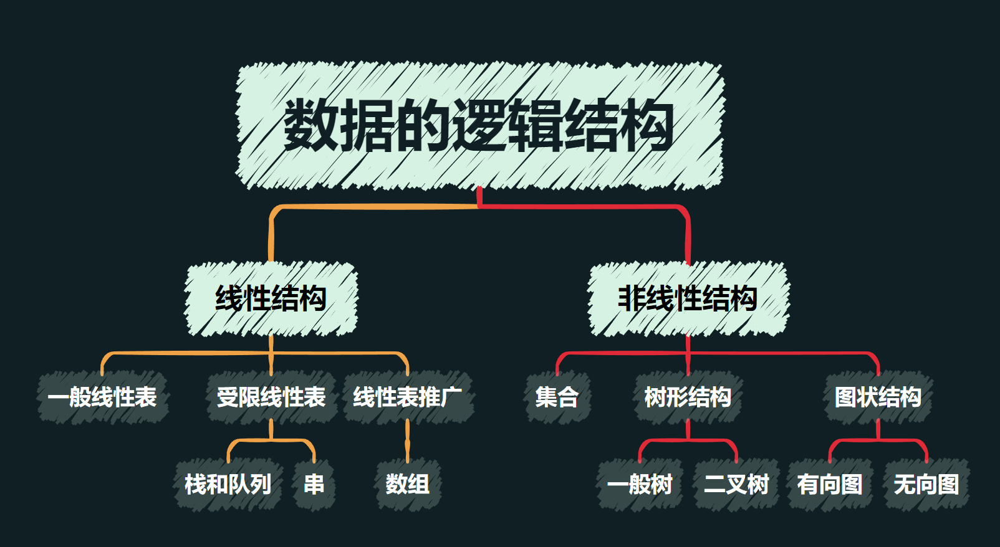
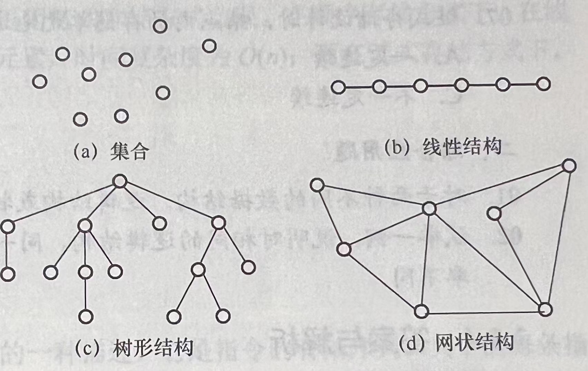

# 1.1 数据结构的基本概念

## 1.1.1 基本概念和术语

#### 数据

- 数据是信息的再提，是描述客观事物属性的数、字符及所有能输入到计算机中并被计算机程序识别和处理的符号的集合。 
- 数据是计算机程序加工的原料。

#### 数据元素

- 数据元素是数据的基本单位，通常作为一个整体进行考虑和处理。 
- 一个数据元素可由若干数据项组成，数据项是构成数据元素的不可分割的最小单位。

#### 数据对象

- 数据对象是具有相同性质的数据元素的集合，是数据的一个子集。

#### 数据类型

	- 数据类型是一个值的集合和定义在此集合上的一组操作的总称。 
    1. 原子类型。其值不可再分的数据类型。 
    2. 结构类型。妻子可以再分解为若干成分的数据类型。 
    3. 抽象数据类型。抽象数据组织及与之相关的操作。 

#### 数据结构

	- 数据结构是相互之间存在一种或多种特定关系的数据元素的集合。 
    - 数据元素不是孤立存在的，他们之间存在某种关系——<b>结构</b>。 
    - 数据结构包括三方面的内容：<b>逻辑结构</b>、<b>存储结构</b>、<b>数据的运算</b>。 
    - 一个算法的设计取决于所选定的逻辑结构，而算法的实现依赖于所采用的存储结构。

## 1.1.2 数据结构三要素

#### 数据的逻辑结构

逻辑结构是指数据元素之间的逻辑关系，即从逻辑关系上描述数据。它与数据的存储无关，是独立于计算机的。

**集合**：结构中的数据元素之间除“同属一个集合”外，别无其他关系。

**线性结构**：结构中的数据元素之间只存在一对一的关系。

**树形结构**：结构中的数据元素之间存在一对多的关系。

**图状结构和网状结构**：结构中的数据元素之间存在多对多的关系。

#### 数据的存储结构

存储结构是指数据结构在计算机中的表示(又称映像)，也称**物理结构**。

它包括数据元素的表示和关系的表示。

数据的存储结构是用计算机语言实现的逻辑结构，依赖于计算机语言。

1. 顺序存储

   

       - 把逻辑上相邻的元素存储在物理位置上也相邻的存储单元中，元素之间的关系由存储单元的邻接关系来体现。 
       - 优点：可以实现随机存取，每个元素占用最少的存储空间。
        
       - 缺点：只能使用相邻的一整块存储单元，因此可能产生较多的外部碎片。
   

2. 链式存储

   

       - 不要求逻辑上相邻的元素在物理位置上也相邻，借助指示存储地址的指针来表示元素之间的逻辑关系。 
       - 优点：不会出现碎片现象，能充分利用所有存储单元。
        
       - 缺点：每个元素因存储指针而占用额外的存储空间，且只能实现顺序存取。
   

3. 索引存储

   

       - 在存储元素信息的同时，还建立附加的索引表。 
       - 索引表中的每项称为<b>索引项</b>，索引项的一般形式是<code>&lt;关键字，地址&gt;</code>。 
       - 优点：检索速度快。 
       - 缺点：附加的索引表额外占用存储空间。增加和删除数据时要修改索引表，会花费比较多的时间。
   

4. 散列存储

   

       - 根据元素的关键字直接计算出该元素的存储地址，也称<b>哈希存储</b>。
        
       - 优点：检索、增加和删除结点的操作都很快。 
       - 缺点：若散列函数不好，元素存储单元可能会出现冲突，解决冲突会增加时间和空间开销。
   

#### 数据的运算

施加在数据上的运算包括运算的定义和实现。

运算的定义是针对**逻辑结构**的，指出运算的功能。

运算的实现是针对**存储结构**的，指出运算的具体操作步骤。

## 1.2 算法的基本概念

**算法**是对特定问题求解步骤的一种描述，它是指令的有限序列，其中的每条指令表示一个或多个操作。

算法必须具备的特性：

- 有穷性。一个算法必须在执行有穷步之后结束，且每一步都可在有穷时间内完成。
- 确定性。算法中每条指令必须有确切的含义，对于相同的输入只能得出相同的输出。
- 可行性。算法中描述的操作都可以通过已经实现的基本运算执行有限次来实现。
- 输入。一个算法有零个或多个输入。
- 输出。一个算法有一个或多个输出。

一个好的算法应考虑达到以下目标：

- 正确性。算法应能够正确地解决求解问题。
- 可读性。算法应具有良好的可读性，以帮助人们理解。
- 健壮性。输入非法数据时，算法能适当地做出反应或进行处理，而不会产生莫名其妙的输出结果。
- 高效率与低存储量需求。

### 1.2.1 算法效率的度量

#### 时间复杂度

问题规模n：指算法的输入量。

语句频度：一条语句的重复执行次数。

基本语句：指对算法运行时间影响最大的语句。

用函数$f(n)$表示一个算法中基本语句的频度之和。

#### 时间复杂度计算

计算步骤：

1. 找到所有语句中执行次数最多的那条语句作为基本语句。
2. 计算基本语句执行次数的数量级。
3. 取其数量级用大O来表示即可。

**最坏时间复杂度**是指在最坏情况下算法的时间复杂度。

**平均时间复杂度**是指所有可能输入实例在等概率出现的情况下，算法的期望运行时间。

**最好时间复杂度**是指在最好情况下算法的时间复杂度。

> 时间复杂度默认指最坏时间复杂度，以保证算法的运行时间不会比它更长。

#### 两条运算规则

1. 加法规则
   $$
   T(n) = T_1(n) + T_2(n) = O(f(n))+O(g(n))=O(max(f(n), g(n)))
   $$

2. 乘法规则
   $$
   T(n) = T_1(n)\times T_2(n) = O(f(n))\times O(g(n)) = O(f(n)\times g(n))
   $$

常见的渐近时间复杂度：
$$
O(1)<O(log_2n)<O(n)<O(nlog_2n)<O(n^2)<O(n^3)<O(2^n)<O(n!)<O(n^n)
$$

#### 时间复杂度总结

- 基本操作：只有常数项，时间复杂度为$O(1)$。
- 顺序结构：时间复杂度按**加法规则**进行相加。
- 分支结构：时间复杂度按**最坏时间复杂度**进行计算。
- 循环结构：时间复杂度按**乘法规则**进行计算。
- 分析具体算法的时间复杂度时，一般分析最坏情况下的时间复杂度。
- 利用时间复杂度判断算法的效率高低时，只需关注基本操作的最高次项即可。

#### 空间复杂度

一个具体的算法在占用的存储空间主要包括三部分:

- 存储程序本身的空间：比如具体代码。
- 存储算法输入和输出数据的空间：与问题规模n有关。
- 对数据进行辅助操作的临时变量所占存储空间：分析算法的空间复杂度，就是分析这部分的空间。

> 若算法在运行过程中占用临时空间为常数级别，则称算法是**原地工作**的。

极限$lim_{n\rightarrow\infty}\sum^{n}_{k=1}\frac{k}{n^2}sin^2(1+\frac{k}{n})=$

