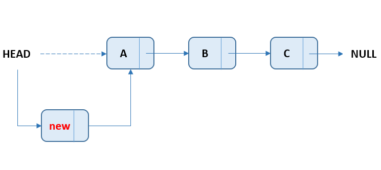
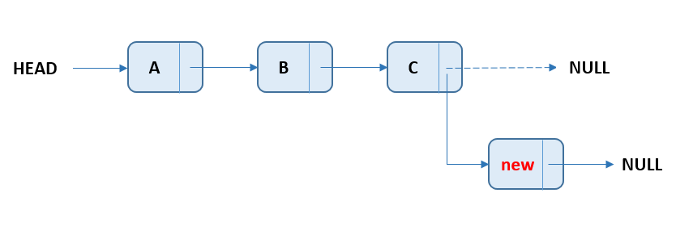
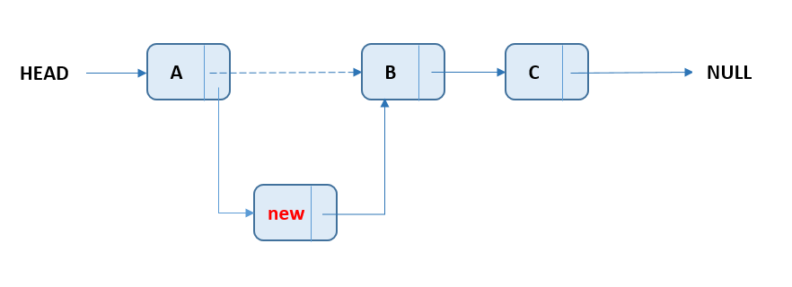
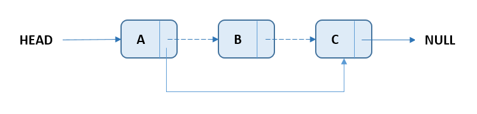

# 2.1 线性表的定义和基本操作

## 2.1.1 线性表的定义

线性表是具有相同特性的数据元素的一个**有限序列**。可以为**空表**。

线性表L一般表示为：

其中，$a_1$称为**表头元素**，$a_n$称为**表尾元素**。除表头元素外，每个元素有且仅有一个直接前驱；除表尾元素外，每个元素有且仅有一个直接后继。

线性表的特点如下：

- 表中元素的个数有限。
- 表中元素具有逻辑上的顺序性，表中元素有其先后次序。
- 表中元素都是数据元素，每个元素都是单个元素。
- 表中元素的数据类型都相同，这意味着每个元素占有相同大小的存储空间。
- 表中元素具有抽象性，即仅讨论元素间的逻辑关系，而不考虑元素究竟表示什么内容。

> 线性表是一种逻辑结构，表示逻辑上存在一一对应的先后关系；
> 顺序表和链表是指存储结构，两者属于不同层面的概念。

## 2.1.2 线性表的基本操作

线性表的主要操作如下：

```cpp
List InitList(&L);								//初始化表。构造一个空的线性表。
int listLength(List L);							//求表长，获得L中数据元素个数。
ElemType getElem(List L, int i);				//按位查找，获得第i个数据元素的值，查找失败返回ERROR_ELEM
int locateElem(List L, ElemType e);				//按值查找，获得第一个等于e的元素位置
void listVisit(List L);							//遍历输出，输出L中所有元素
bool listInsert(List &L, int i, ElemType e);	//插入元素，在L中第i个位置插入新的元素e
bool listDelete(List &L, int i, ElemType e);	//删除元素，删除L中的第i个数据元素e
void clearList(List &L);						//置空，将L重置为空表
bool listEmpty(List L);							//判空，判断L是否为空表
```

## 2.1.3 线性表的分类

<mark>线性表是逻辑结构，规定了数据之间的关系，但不关心这些数据关系是如何实现的。</mark>

线性表可分为顺序表和链表，顺序表和链表属于物理结构。

与链表相比，顺序表具有以下特点：

1.  **支持随机存放**：即知道下标就能取得其中的元素，可在$O(1)$时间内找到第i个元素。
2.  **存储密度高**：每个结点只存储数据元素本身。
3.  **插入删除开销大**：顺序表插入需要逐个后移元素。

# 2.2 线性表的顺序表示

## 2.2.1 顺序表的定义

线性表的顺序存储称为**顺序表**，顺序表中逻辑相邻的两个元素在物理位置上也相邻。

i为元素$a_i$在线性表中的位序。

特点：**逻辑顺序与其物理顺序相同**

顺序表中的任意一个数据元素都可以随机存取，所以线性表的顺序存储结构是一种随机存取的存储结构。通常使用数组来描述线性表的顺序存储结构。

==注意：线性表中元素的位序是从1开始的，而数组中元素的下标是从0开始的。==

```cpp
#define Maxsize 50			//定义线性表的最大长度
typedef struct {
    ElemType data[MaxSize];		//顺序表的元素
    int length;					//顺序表的当前长度
}SqList;						//顺序表的类型定义
```

一位数组可以静态分配也可以动态分配。

```cpp
#define InitSize 100		//表长度的初始定义
typedef struct {
    Elemtype *data;				//指示动态分配数组的指针
    int MaxSize, length;		//数组的最大容量和当前个数
} SeqList;						 //动态分配数组顺序表的类型定义
```

> C的初始动态分配语句为`L.data = (ElemType*)malloc(sizeof(ElemType) *InitSize);`
>
> C++的初始动态分配语句为`L.data = new ElemType[InitSize];`

==注意：动态分配并不是链式存储，它同样属于顺序存储结构，物理结构没有变化，依然是随机存取方式，只是分配的空间大小可以在运动时动态决定。==

**随机访问：**通过首地址和元素序号可在时间$O(1)$内找到指定的元素。

顺序表的存储密度高，每个节点只存储数据元素。

顺序表逻辑上相邻的元素物理上也相邻，所以插入和删除操作需要移动大量元素。

## 2.2.2 顺序表上基本操作的实现

### 插入操作

在顺序表L的第$i(1\leq i \leq L.length+1)$个位置插入新元素e。

```cpp
bool ListInsert(SqList &L, int i, ElemType e) {
    if (i < 1 || i > L.length + 1)
        return false;
    if (L.length >= MaxSize)
        return false;
    for (int j = L.length; j >= i; --j)
        L.data[j] = L.data[j-1];
    L.data[i-1] = e;
    L.length++;
    return true;
}
```

最好情况：在表尾插入，不移动元素，$O(1)$

最坏情况：在表头插入，每个元素都需要后移，$O(n)$

平均情况：

$$
\sum_{i=1}^{n+1}p_i(n-i+1)=\sum_{i=1}^{n+1}\frac{1}{n+1}(n-i+1)=\frac{1}{n+1}\sum_{i=1}^{n+1}(n-i+1)=\frac{1}{n+1}\frac{n(n+1)}{2}=\frac{n}{2}
$$

==顺序插入算法的平均时间复杂度为$O(n)$。==

### 删除操作

删除顺序表L中第$i(1\leq i \leq L.length+1)$个位置的元素，用引用变量e返回。

```cpp
bool ListDelete(SqList &L, int i, Elemtype &e) {
    if (i < 1 || i > L.length)
        return false;
    e = L.data[i-1];
    for (int j = i; j < L.length; ++j)
        L.data[j-1] = L.data[j];
    L.length--;
    return true;
}
```

最好情况：删除表尾元素，不用移动元素，$O(1)$

最坏情况：删除表头元素，需要移动所有元素，$O(n)$

平均情况:

$$
\sum_{i=1}^{n}p_i(n-i)=\sum_{i=1}^{n}\frac{1}{n}(n-i)=\frac{1}{n}\sum_{i=1}^{n}(n-i)=\frac{1}{n}\frac{n(n-1)}{2}=\frac{n-1}{2}
$$

==顺序表删除算法的平均时间复杂度为$O(n)$。==

### 按值查找(顺序查找)

在顺序表L中查找第一个元素值等于e的元素，并返回其位序。

```cpp
int LocateElem(SqList L, ElemType e) {
    int i;
    for (i = 0; i < L.length; ++i)
        if (L.data[i] == e)
            return i + 1;
    return 0;
}
```

最好情况：查找的元素就在表头，仅需比较一次，时间复杂度为$O(1)$

最坏情况：查找的元素在表尾(或不存在)，需要比较n次，时间复杂度为$O(n)$

平均情况：

$$
\sum_{i=1}^{n}p_i\times i=\sum_{i=1}^{n}\frac{1}{n}\times i=\frac{1}{n}\frac{n(n+1)}{2}=\frac{n+1}{2}
$$

==顺序表按值查找算法的平均时间复杂度为$O(n)$。==

# 2.3 线性表的链式表示

> 链式存储线性表时，不需要使用地址连续的存储单元，即不要求逻辑上相邻的元素在物理位置上也相邻，它通过“链”建立起元素之间的逻辑关系，因此插入和删除操作不需要移动元素，而只需修改指针，但也会失去顺序表可随机存取的优点。

## 2.3.1 单链表的定义

链表通常用指针实现，每个存储结点包含指针域和数据域。

数据域存放数据元素本身的信息，指针域存放表示数据元素间逻辑关系的信息。

由于单链表结点间存在链接关系，因此每一个结点根据其指针域都能找到其直接后继，从而只要知道第一个结点的位置，就能顺序查找到所有结点。

首结点与头节点的区别：

- 头结点一般不存储数据，为了方便实现单链表的相关操作，可以将其放在单链表的第一个位置。
- 首结点是指真正存放元素的起始结点，尾结点是单链表的最后的结点。
- 链表中有头结点时，头指针指向头结点；反之，若链表没有头结点，头指针指向首结点。


单链表结点的C语言代码如下：

```c
typedef struct LNode{
    ElemType data;
    struct LNode *next;
}LNode, *LinkList;
```

引入头节点后的优点：

- 由于第一个数据结点的位置被存放在头结点的指针域中，因此在链表的第一个位置上的操作和在表的其他位置上的操作一致，无须进行特殊处理。
- 无论链表是否为空，其头指针都是指向头结点的非空指针，因此空表和非空表的处理也就得到了统一。

## 2.3.2 单链表基本操作的实现

### 1. 采用头插法建立单链表

该方法从一个空表开始，生成新节点，并将读取到的数据存放到新结点的数据域中，然后将新结点插入到当前链表的表头，即头结点之后。



头插法建立单链表的C描述如下：

``` c
LinkList List_HeadInsert(LinkList &L) {
	LNode *s;
    int x;
    L = (LinkList)malloc(sizeof(LNode));
    L->next = NULL;
    scanf("%d", &x);
    while (x != 9999) {
        s = (LNode*)malloc(sizeof(LNode));
        s->data = x;
        s->next = L->next;
        L->next = s;
        scanf("%d", &x);
    }
    return L;
}
```

采用头插法建立单链表时，读入数据的顺序与生成的链表中的元素的顺序是相反的。每个结点插入的时间为$O(1)$，设单链表长为$n$，则总时间复杂度为$O(n)$。

### 2. 采用尾插法建立单链表

如果希望生成的链表中结点次序和输入数据的顺序一致，可采用尾插法。

该方法将新节点插入到当前链表的表尾，为此必须增加一个尾指针r，使其始终指向当前链表的尾结点。



尾插法建立单链表的算法如下：

```c
LinkList List_TailInsert(LinkList &L) {
    int x;
    L = (LinkList)malloc(sizeof(LNode));
    LNode *s, *r = L;
    scanf("%d", &x);
    while (x != 9999) {
        s = (LNode*)malloc(sizeof(LNode));
        s->data = x;
        r->next = s;
        r = s;
        scanf("%d", &x);
    }
    r->next = NULL;
    return L;
}
```

时间复杂度和头插法相同。

### 3. 按序号查找结点

在单链表中从第一个结点出发，顺指针next域逐个向下搜索，直到找到第i个结点为止，否则返回最后一个结点指针域`NULL`。

按序号查找结点值的算法如下：

```c
LNode *GetElem(LinkList L, int i) {
    if (i < 1) {
        return NULL;
    }
    int j = 1;
    LNode *P = L->next;
    while (p != NULL && j < i) {
        p = p->next;
        j++;
    }
    return p
}
```

按序号查找操作的时间复杂度为$O(n)$。

### 4. 按值查找表结点

从单链表的第一个结点开始，由前往后依次比较表中各结点数据域的值。

若某结点数据域的值等于给定值e，则返回该结点的指针；

若整个单链表中没有这样的结点，则返回`NULL`;

```c
LNode *LocateElem(LinkList L, Elemtype e) {
    LNode *p = L->next;
    while(p != NULL && p->data != e)
        p = p->next;
    return p;
}
```

按值查找操作的时间复杂度为$O(n)$。

### 5. 插入结点操作

插入结点操作将值为x的新结点插入到单链表的第i个位置上。先检查插入位置的合法性，然后找到待插入位置的前驱节点，即第i-1个结点，再在其后插入新结点。



实现插入结点的代码片段如下：

```c
p = GetElem(L, i-1);
s->next = p->next;
p->next = s;
```

> ⚠️ 其中语句②和语句③不能颠倒。

### 6. 删除结点操作

删除结点操作是将单链表的第i个结点删除。先检查删除位置的合法性，后查找表中第i-1个结点，即被删结点的前驱结点，再将其删除。



假设结点`*p`为找到的被删结点的前驱结点，为实现这一操作后的逻辑关系的变化，仅需修改`*p`的指针域，即将`*p`的指针域`next`指向`*q`的下一结点。

实现删除结点的代码片段如下：

```c
p = GetElem(L, i-1);
q = p->next;
p->next = q->next;
free(q);
```

和插入算法一样，该算法的主要时间也耗费在查找操作上，时间复杂度为$O(n)$。

### 7. 求表长操作

求表长操作就是计算单链表中数据结点的个数，需要从第一个结点开始顺序依次访问表中的每个结点，为此需要设置一个计数器变量，每访问一个结点，计数器加1，直到访问到空结点为止。算法的时间复杂度为$O(n)$。

## 2.3.3 双链表

