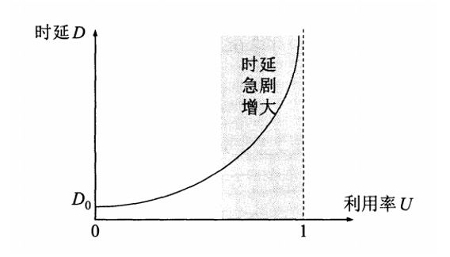

# 第一章 计算机网络概述

## 1.1 计算机网络概述

### 1.1.1 什么是计算机网络

**计算机网络的主要功能就是数据交换和资源共享。**

计算机网络是一个将分散的、具有独立功能的计算机系统，通过通信设备与线路连接起来，由功能完善的软件实现资源共享和信息传递的系统。

-   简单来说，计算机网络就是一些互联的、自治的计算机系统的集合。
    -   互联的：通过通信链路连接起来的。
    -   自治的：是一个自治系统，无从主关系。
-   网络互连并不是把计算机仅仅简单地在物理上连接起来。
-   计算机网络不仅仅是软件概念，还包括硬件设备。
-   计算机网络由若干个节点和连接节点的链路构成。
-   计算机网络不仅仅是信息通信，还可以支持广泛的应用。

### 1.1.2 计算机网络的组成

从组成成分来看，计算机网络可以分为硬件、软件以及协议。

-   **硬件：**计算机网络的硬件组成包括计算机、网络设备、通信介质等。
-   **软件：**计算机网络的软件组成包括各种网络应用程序。
-   **协议：**是作用于两台计算机之间的，它可以规定两台计算机交换信息时的规则。

从工作方式看，计算机网络被划分为边缘部分和核心部分。

-   **边缘部分：**边缘部分是计算机网络中最外围的部分，它是指所有的端系统。
    -   边缘部分是网络的用户和应用程序的接入点，也是网络与外界进行信息交换的接口。
-   **核心部分：**核心部分是计算机网络中的主干部分，它是指所有的网络设备和通信线路。
    -   核心部分的主要任务是实现数据的转发和传输，确保数据在网络中的快速、安全、可靠的传输。

从功能组成看，计算机网络被分为通信子网和资源子网。

-   **通信子网：**实现数据通信。
-   **资源子网：**实现资源共享和数据处理。

### 1.1.3 计算机网络的功能

-   **数据通信：**计算机网络的最基本功能是实现计算机之间的数据通信，使得用户可以在不同的计算机上共享数据、信息和资源。
-   **资源共享：**通过计算机网络，不同的计算机可以共享各种资源，提高资源利用率。
-   **远程访问：**计算机网络可以实现远程访问，让用户通过网络访问远程计算机上的文件、应用程序和数据等，增强信息的共享和交流。
-   **信息传递：**计算机网络可以传递不同类型的信息，使得信息的传递和共享更加方便和快捷。
-   **大规模计算：**计算机网络可以将分布在不同地理位置的计算机资源集合起来，实现大规模计算和数据处理。
-   **安全保障：**计算机网络可以通过加密、认证、访问控制等技术手段，保护网络和数据的安全，防止信息泄露和攻击。

### 1.1.4 计算机网络的分类

#### 覆盖范围

-   **广域网(WAN)：**广域网也称公网，覆盖范围可以是一个或多个国家，地理距离可达几千千米。
-   **城域网(MAN)：**城域网的覆盖范围可以延伸到整个城市，地理距离约5km~50km
-   **局域网(LAN)：**局域网是一种在小区域内使用的，由多台计算机组成的网络，通常局限在10m~10km范围之内。
-   **个人局域网(PAN)：**个人区域网是指在个人工作的地方把属于个人使用的电子设备用无线技术连接起来的网络。

#### 拓扑结构

|        | 特点                                                         | 优点                                                         | 缺点                                                         |
| :----: | :----------------------------------------------------------- | :----------------------------------------------------------- | :----------------------------------------------------------- |
|  星形  | 非中心节点间需要通过中心节点转发数据才能通信，中心节点一般是集线器或交换机 | 单点故障不会影响全网； 中心节点可方便地对各个站点提供服务和配置 | 中心节点负担重，容易形成瓶颈，若中心节点故障，整个网络会陷入瘫痪； 节点的分布式处理能力较弱。 |
|  环形  | 一个节点若要与其他节点通信，需依次经过两个通信节点之间的所有节点。 | 增减节点时，仅需简单地连接； 信息传输时间固定，易于实时控制。 | 单点故障会引起全网故障； 非集中控制，故障检测更难。     |
| 总线形 | 所有节点通过接口直连到总线并通过总线进行数据传输。           | 通信电缆少； 易于扩充 结构简单，有较高可靠性       | 网络效率和带宽利用率低； 总线故障会影响整个网络。       |
|  网状  | 每个节点至少与其他两个节点相连，广域网往往采用这个结构。     | 冗余链路提高了可靠性； 可选择最佳路径改善流量分配，降低延时。 | 线路布置成本较高，结构复杂，不易维护。                       |

#### 交换技术

-   **电路交换：**把需要通过”建立连接—传输数据—释放连接“三个步骤的交换方式称为电路交换。主要用于电话通信。
-   **报文交换：**报文交换方式的数据传输单位是报文，报文就是站点一次性要发送的数据块，其长度不限且可变。
-   **分组交换：**适用于交互式通信。采用**存储转发技术**。

### 1.1.5 计算机网络的性能指标

#### 速率

计算机网络上主机在数字信道上传送数据的速率，也称为数据率。表示单位时间传输的信息量。单位$b/s$

#### 带宽

-   **频带宽度：**最高频率与最低频率之差，单位是赫兹(HZ)。(在奈氏定理和香农定理中用到)。
-   **网络带宽：**表示在单位时间内从网络中的某一点到另一点所能通过的**最高数据率**。单位为$bit/s$。

#### 吞吐量

吞吐量表示在单位时间内通过某个网络的数据量，单位为$bit/s$

**吞吐量更经常地用于对现实世界中的网络的一种测量。**

#### 时延

**总时延=发送时延+传播时延+处理时延+排队时延**

**发送时延：**主机或路由器发送数据帧所需要的时间。$传输时延=分组长度÷发送速率$

**传播时延：**电磁波在信道中传播一定的距离需要花费的时间。$传播时延=信道长度\div 传播速率$

**处理时延：**主机或路由器在收到分组时要花费一定的时间进行处理。

**排队时延：**分组在进入路由器后要先在输入队列中排队等待处理。

#### 时延带宽积

**时延带宽积=传播时延**$\times$**带宽**

时延带宽积又称为**以比特为单位的链路长度**。

往返时延(RTT)：表示从发送方发送数据开始，到发送方收到来自接收方的确认所经历的时间。

#### 利用率

**信道利用率：**$信道利用率=\frac{有数据通过的时间}{有数据通过的时间+没有数据通过的时间}$

**网络利用率：**网络利用率则是全网络的信道利用率的加权平均值。

**信道利用率并非越大越好。**

## 1.2 计算机网络体系结构

### 1.2.1 计算机网络分层结构

-   把计算机网络的各层及其协议的集合称为网路的**体系结构**。
-   网络设计者们依据不同的规则，将网络划分成不同的层次结构，每一层都为上一层提供一些特定的服务。
-   我们把某层的活动对象称为该层的**实体**，两台通信设备上的同一层为**对等层**，同一层上的实体称作**对等实体**。
-   每层的对等实体进行通信时都有该层对应的数据单元，称为**协议数据单元**(PDU)。PDU由两部分组成：
    -   协议控制信息(PCI)：控制协议操作的信息。
    -   服务数据单元(SDU)：为完成用户所要求的功能而传输的数据，在传输到接收方同一层时数据不会发生变化。

>   在各层间传输数据时，$SDU_n+PCI_n=PDU_n=SDU_{n-1}$。

层次的结构含义包括以下几个方面：

-   第n层的实体不仅要使用第n-1层的服务来实现自身定义的功能，还要向第n+1层提供本层的服务，该服务是第n层及其下面各层提供的服务总和。
-   最低层只提供服务，是整个层次结构的基础；中间各层既是下一层的服务使用者，又是上一层的服务提供者；最高层面向用户提供服务。
-   上一层只能通过相邻层间的接口使用下一层的服务，而不能调用其他层的服务；下一层所提供服务的实现细节对上一层透明。
-   两台主机通信时，对等层在逻辑上有一条直接信道，表现为不经过下层就把信息传送到对方。

### 1.2.2 计算机网络协议、接口、服务等概念

#### 协议

-   协议是为实现网络中的数据交换而建立的规则或约定，它用来描述对等实体之间信息交互的过程。
-   协议包含三个关键要素：
    -   语法：对数据的结构或格式的说明，即数据是以何种顺序表示的。
    -   语义：对每一段比特流的具体含义的说明。
    -   时序(或同步)：对数据发送的时机及发送速度的说明。

>   协议是水平的，它是控制对等实体之间的通信的规则，即不对等的实体之间不存在相应的协议。

#### 接口

-   相邻两层之间存在一个接口，它是较低层向较高层提供服务的入口。
-   相邻层之间通过接口交换信息，高层无须知道低层的实现方式，只需要知道该层通过接口所能提供的服务，这样就能保持两层之间功能的独立性。
-   每个协议会定义两种类型的接口：
    -   服务接口：提供给同一计算机上希望使用协议服务的对象，它定义了本地对象可在该协议上执行的操作。
    -   对等接口：定义了对等实体之间实现通信服务而交换的消息格式与含义。
-   接口中同一节点相邻两层的实体进行交换的地方称为**服务访问点**(SAP)，它本质上是一个逻辑接口。从物理层开始，每一层都向上层提供服务访问点。

#### 服务

-   服务可以理解为网络各层所提供的功能调用，它是垂直的，由下层向紧邻的上层通过层间的接口提供。
-   上层需要通过与下层交换相应命令来调用下层服务，这些命令被称为**服务原语**。

>   -   请求：用户实体要求服务做某项工作，源(n+1)实体 -> 源(n)实体
>   -   指示：用户实体被告知某事件发生，目的(n)实体 -> 目的(n+1)实体
>   -   响应：用户实体表示对某事件的响应，目的(n+1)实体 -> 目的(n)实体
>   -   确认：用户实体收到关于它的请求的答复，源(n)实体 -> 源(n+1)实体

| 类型         | 概念                                                         |
| :----------- | ------------------------------------------------------------ |
| 面向连接服务 | 通信前要建立连接，包含**连接建立**、**数据传输**和**连接释放**3个阶段。 数据包发送顺序和接收顺序相同。 对带宽的要求较高。 常见的面向连接服务的协议有TCP。 |
| 无连接服务   | 通信时直接发送数据，无需建立连接。 数据包发送数据和接收数据顺序可能不同。 对带宽的要求较低。 比面向连接服务更容易发生流量拥塞。 常见的无连接服务的协议有UDP、IP。 |
| 可靠服务     | 具有检错、纠错、应答机制，保证数据到达目的地时时正确的。     |
| 不可靠服务   | 尽可能正确地交付。                                           |
| 有应答服务   | 接收方需要在收到数据后给出应答。                             |
| 无应答服务   | 接收方收到数据后无需给出应答，若需要应答可以由更高层去实现。 |

>   在一层内完成的全部功能并非都称为服务，只有那些能够被高一层实体“看得见”的功能才叫服务。

### 1.2.3 ISO/OSI参考模型

>   其中低三层统称为**通信子网**，它是为了联网而附加的通信设备，完成数据的传输功能；
>
>   高三层统称为**资源子网**，它相当于计算机系统，完成数据的处理等功能。

#### 物理层

-   物理层的传输单位是比特，功能是在物理媒体上为数据端设备透明地传输原始比特流。

>   传输信息所利用的一些物理媒体，如双绞线、光缆、无线信道等，并不在物理层协议之内而在物理层协议下面。

#### 数据链路层

-   数据链路层的传输单位是帧，任务是将网络层传来的IP数据报组装成帧。
-   数据链路层的功能可以概括为成帧、差错控制、流量控制和传输管理等。
-   广播式网络在数据链路层还要处理新的问题，即如何控制对共享信道的访问。数据链路层的一个特殊的子层——介质访问子层，就是专门处理这个问题的。
-   典型的数据链路层协议有SDLC、HDLC、PPP、STP和帧中继等。
