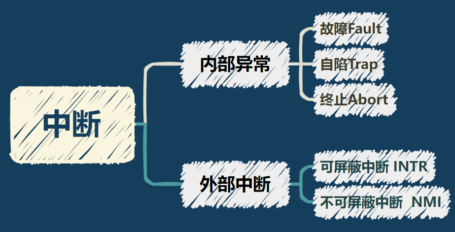
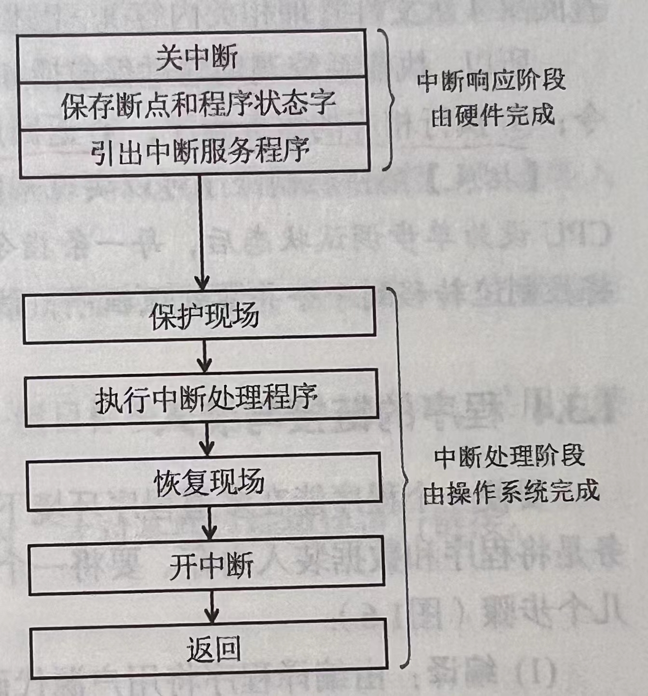
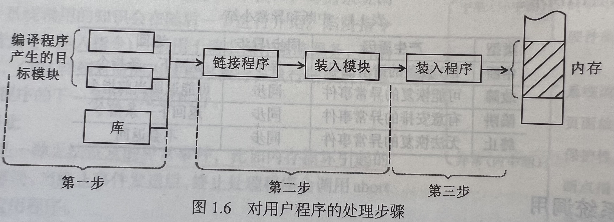
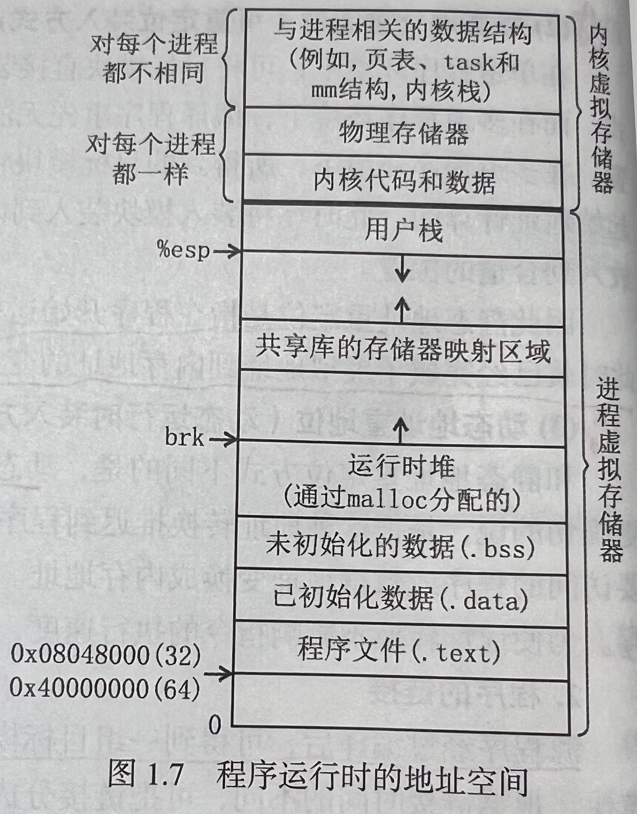

# 第一章 操作系统概述

## 1.1 操作系统的基本概念

### 1.1.1 操作系统的概念

**操作系统**是指控制和管理整个计算机系统的硬件与软件资源，合理的组织、调度计算机的工作与资源的分配，进而为用户和其他软件提供方便接口与环境的程序集合。
操作系统是最基本的系统软件。

**主要作用**：对整个计算机系统的软硬件资源进行管理和控制，提高资源的利用率和系统的吞吐量，并对计算机的工作和资源的分配进行合理的组织和调度，为用户和应用程序提供方便访问的接口。

操作系统位于用户层和硬件层之间，向上提供服务，向下管理资源。

### 1.1.2 操作系统的特征

#### 并发

- 并发是指两个或多个事件在同一时间间隔内发生。
- 操作系统的并行性是指计算机系统中同时存在多个运行的程序。
- 并发(交替)：同一时间间隔；
  并行(同时)：同一时刻
- 单核处理器使用并发，多核处理器使用并行。
- 程序并发性体现在两个方面：
  - 用户程序与用户程序之间的并发执行
  - 用户程序与操作系统程序之间的并发执行

#### 共享

资源共享(资源复用)即共享，是指系统中的资源可供内存中多个并发执行的进程共同使用。

1. 互斥共享方式
   - 在一段时间内只允许一个进程访问该资源。
   - 在一段时间内只允许一个进程访问的资源称为临界资源或独占资源。
   - 临界资源：栈、变量和表格。
2. 同时访问方式
   - 另一类资源允许在一段时间内由多个进程"同时"访问。
   - 这里的"同时"是宏观说法，在微观上，这些进程是交替进行访问的。

并发和共享是操作系统两个最基本的特征。

两者之间互为存在的条件：

- 资源共享是以程序的并发为条件的，若系统不允许程序并发执行，则自然不存在资源共享问题。
- 若系统不能对资源共享实施有效的管理，则必将影响到程序的并发执行，甚至根本无法并发执行。

#### 虚拟

虚拟是把一个物理上的实体变为若干逻辑上的对应物。用于实现虚拟的技术，称为虚拟技术。

- 利用多道程序设计技术把一个物理上的CPU虚拟为多个逻辑上的CPU，称为**虚拟处理器**。
- 采用虚拟存储器技术将一台机器的物理存储器变为虚拟存储器，把用户感觉到的(但实际不存在的)存储器称为**虚拟存储器**。
- 采用虚拟设备技术将一台物理I/O设备虚拟为多台逻辑上的I/O设备，使原来仅允许在一段时间内由一个用户访问的设备变为在一段时间内允许多个用户同时访问的共享设备。

操作系统的虚拟技术：

1. 时分复用技术：通过减少处理器和I/O设备的空闲时间，来提高计算机资源的利用率，如处理器的分时共享；
   - 虚拟处理器技术：将一个物理上的处理器虚拟为多台逻辑上的处理器，用户说感觉到的处理器称为虚拟处理器。
   - 虚拟设备技术：通过虚拟设备技术将一台物理上的I/O设备虚拟为多台逻辑上的I/O设备。
2. 空分复用技术：利用存储器的空闲空间区域存放和运行其他的多道程序，以此来提高内存的利用率，如虚拟存储器。

#### 异步

多道程序环境允许多个程序并发执行，但由于资源有限，进程的执行并不是一贯到底的，而是走走停停的，它以不可预知的速度向前推进，这就是进程的异步性。

### 1.1.3 操作系统的目标和功能

操作系统应该具有以下几个功能：

1. 处理机管理
2. 存储器管理
3. 设备管理
4. 文件管理

同时操作系统可以用来扩充机器，以提供更方便的服务、更高的资源利用率。

#### 操作系统作为计算机系统资源的管理者

1. 处理机管理

   处理机的分配和运行都以进程(或线程)为基本单位。

   主要功能：**进程控制**、**进程同步**、**进程通信**、**死锁处理**、**处理机调度**

2. 存储器管理

   存储器管理是为了给多道程序的运行提供良好环境，方便用户使用及提高内存的利用率。

   主要功能：**内存分配与回收**、**地址映射**、**内存保护与共享**、**内存扩充**

3. 文件管理

   计算机中的信息都是以文件的形式存在的，操作系统中负责文件管理的部分称为**文件系统**。

   主要功能：**文件存储空间的管理**、**目录管理**、**文件读写管理和保护**

4. 设备管理

   设备管理的主要任务是完成用户的I/O请求，方便用户使用各种设备。

   主要功能：缓冲管理、设备分配、设备处理和虚拟设备

#### 操作系统作为用户与计算机硬件系统之间的接口

操作系统提供的接口主要分为两类：

- 一类是命令接口，用户利用这些操作命令来组织和控制作业的执行。

- 另一类是程序接口，编程人员可以用它们来请求操作系统服务。

1. 命令接口
   两种方式进行作业控制：联机控制方式和脱机控制方式。
   按作业控制方式不同，可分为：联机命令接口和脱机命令接口。

   1. 联机命令接口(交互式命令接口)，适用于分时或实时系统的接口。
   2. 脱机命令接口(批处理命令接口)，适用于批处理系统。

2. 程序接口

   程序接口由一组系统调用(也称广义指令)组成。

#### 操作系统实现了对计算机资源的扩充

没有任何软件支持的计算机称为**裸机**。

把覆盖了软件的机器称为**扩充机器或虚拟机**。

## 1.2 操作系统的发展历程

### 1.2.1 手工操作阶段

此阶段无操作系统，所有的工作都需要人工干预。

两个缺点(人机矛盾)：

- 用户独占全机，所有计算机资源在一段时间内只能被一个用户使用。
- CPU需要等待人工操作，这造成CPU和内存资源大部分时间处于空闲状态。

### 1.2.2 批处理操作系统

#### 单道批处理系统

利用脱机输入输出的方式，在监督程序的控制下实现连续工作。

特征：

- 自动性。磁带上的一批作业能自动地逐个运行，无需人工干预。
- 顺序性。先调入内存的作业先完成。
- 单道性。监督程序每次从磁带上只调入一道程序进入内存运行，当程序完成或异常时，才切换后继程序继续运行。

优点：解决了人机矛盾和CPU与I/O设备速度不匹配的问题，提高系统资源的利用率和系统吞吐率。

缺点：每次只能运行一道程序，不能充分利用系统资源。

#### 多道批处理系统

多道程序设计技术允许多个程序同时进入内存并允许它们在CPU中交替地运行，这些程序共享系统中的各种软硬件资源。

特点：

- 多道。计算机内存中同时存放多道互相独立的程序。
- 宏观上并行。同时进入系统的多道程序都处于运行过程中。
- 微观上串行。内存中的多道程序轮流占有CPU，交替执行。

实现多道程序设计技术需要解决下列问题：

- 如何分配处理器
- 多道程序的内存分配问题
- I/O设备如何分配
- 如何组织和存放大量的程序和数据，以方便用户使用并保证其安全性与一致性

在批处理系统中采用多道程序设计技术就形成了多道批处理操作系统。

优点：系统利用率高，多道程序共享计算机资源；系统吞吐量大，CPU和其他资源保持忙碌状态。

缺点：用户响应的时间较长；没有人机交互功能。

### 1.2.3 分时操作系统

分时技术：把处理器的运行时间分成很短的时间片，按时间片轮流把处理器分配给各联机作业使用。

分时操作系统：多个用户通过终端同时共享一台主机，这些终端连接在主机上，用户可以同时与主机进行交互操作而互不干扰。

> 多道批处理是实现作业自动控制而无需人工干预的系统，分时系统是实现人机交互的系统。

分时系统的特征：

- 同时性(多路性)：一台计算机与若干台终端相连接，终端上的这些用户可以同时或基本同时使用计算机。
- 交互性：用户能够方便地与系统进行人机对话。
- 独立性：系统中多个用户可以彼此独立地进行操作，互不干扰。
- 及时性：用户请求能在很短时间内获得响应。

### 1.2.4 实时操作系统

实时系统：系统能够及时地对外部请求作出相应，并在规定的时间处理该事件，让所有实时任务协调一致的运行。

软实时系统：可以允许或容忍偶尔出现某一事件没在规定时间内完成处理。

硬实时系统：任何时刻都要绝对保证某个事件在规定的时刻得到处理和响应。

实时操作系统具有以下特征：

- 多路性：系统周期性地采集多路现场的信息，以及同时控制多个对象和执行机构。
- 独立性：系统在采集信息和控制对象的时候都是互不影响、彼此独立的。
- 实时性：系统的实时性是严格根据控制对象所规定的截止时间来确定的。
- 交互性：用户通过和程序直接交互来控制它的运行。
- 可靠性：实时系统要求高度可靠，因为任何差错都会产生无法预料的灾难性后果。

### 1.2.5 其他操作系统

网络操作系统：网络环境下管理和控制网络资源的操作系统，其建立在网络中不同计算机的单机操作系统之上，为用户提供了使用网络资源的接口。

分布式操作系统：配置在分布式系统上的操作系统，可以直接对分布式系统中的各种资源进行动态分配。分布式操作系统管理若干计算机，使它们协调配合完成同一个任务。

## 1.3 操作系统运行环境

### 1.3.1 处理器运行模式

CPU通常执行两种不同性质的程序：一种是**操作系统内核程序**，一种是**用户自编程序**(即应用程序)。

其中内核程序是应用程序的“管理者”，因此内核程序要执行一些特权命令，而应用程序处于安全考虑不能执行这些指令：

- 特权指令：指不允许用户直接使用的指令。
- 非特权指令：指允许用户直接使用的指令。

用户程序调用系统API函数称为**系统调用**，一旦发生了系统调用，将暂停用户程序的运行，转而执行内核代码，访问内核空间，这称为**内核模式**(即内核态)。

当在用户空间执行应用程序自己的代码时，称为**用户模式**(即用户态)。

操作系统内核有以下几种功能：

- 资源抽象：屏蔽底层的硬件细节，使应用程序独立于实际使用的物理资源。
- 资源分配和回收：将抽象资源分配给应用程序，并在适当的时机进行回收。
- 资源共享：允许进程共享资源，并提供进程同步和互斥机制，以协助多道程序并发执行。

操作系统内核还包括四个方面的内容：

- 时钟管理
  - 在计算机的各种部件中，时钟是最关键的设备。
  - 时钟的功能：
    - 计时：操作系统需要通过时钟管理，向用户提供标准的系统时间。
    - 中断管理：实现进程的切换。
- 中断机制
  - 中断机制是操作系统各项操作的基础。
  - 中断机制中，只有一小部分属于内核，它们负责保护和恢复中断现场的信息，转移控制权到相关的处理程序。这样可以减少中断的处理时间，提高系统的并行处理能力。
- 原语
  - 把具有以下特点的程序称为**原语**：
    - 处于操作系统的最底层，是最接近硬件的部分。
    - 这些程序的运行具有原子性，其操作只能一气呵成。
    - 这些程序的运行时间都较短，而且调用频繁。
  - 定义原语的方法：关闭中断，让其所有动作都不可分割地完成后再打开中断。
- 系统控制的数据结构及处理
  - 系统常见的操作：
    - 进程管理。
    - 存储器管理。
    - 设备管理。

### 1.3.2 中断和异常的概念

操作系统内核工作在核心态，而用户程序工作在用户态。

发生中断或异常时，运行用户态的CPU会立即进入核心态。

#### 中断(外部中断)

> 中断是一种由I/O外部设备触发的异步事件，它与CPU正在执行的指令无关，中断提供了外设与CPU交流的机制，它也是一种重要的输入输出方式。

1. 可屏蔽中断

   可屏蔽中断是指通过INTR线发出的中断请求，通过改变屏蔽字可以实现多重中断，从而使得中断处理更加灵活。

2. 不可屏蔽中断

   不可屏蔽中断是指通过NMI线发出的中断请求，通常是紧急的硬件故障。

#### 异常(内部异常)

> 异常是CPU执行当前指令产生的事件，是同步发生的，与CPU正在执行的指令密切相关。

1. 故障(fault)
   - 故障是一种可能恢复的异常事件。
   - 若可以修复，则CPU跳转到引起故障的指令继续进行。
   - 若不能修复，则终止当前程序。
2. 陷阱(trap)
   - 陷阱是一种有意安排的异常事件。
   - 陷阱指令也称为**访管指令**、**陷入指令**。
3. 终止(abort)
   - 终止是一种无法恢复的异常事件。

#### 中断与异常的处理过程

1. 中断响应过程

   1. 关中断

      CPU首先要关中断，禁止在进行中断处理时又去响应新的中断，防止保存的断点、程序状态字、现场信息被破坏。

   2. 保存断点和程序状态字

      断点和状态字信息在特殊的寄存器中(PC和PSW)，CPU会将这两个寄存器内容压栈。

   3. 引出中断服务程序

      CPU检测到中断信号后对具体中断源进行识别，以此引出对应的中断服务程序。

2. 中断处理过程

   

   1. 保护现场
   2. 执行中断处理程序
   3. 恢复现场

#### 小结

| 类型 |      产生原因      | 同步/异步 | 返回             |
| :--: | :----------------: | :-------: | ---------------- |
| 中断 | I/O设备的请求信号  |   异步    | 返回下一条指令   |
| 故障 | 可能恢复的异常事件 |   同步    | 可能返回当前指令 |
| 陷阱 | 有意安排的异常事件 |   同步    | 返回下一条指令   |
| 终止 | 无法恢复的异常事件 |   同步    | 不会返回         |

 ### 1.3.3 系统调用

陷阱是一种有意安排的内部异常事件，这样安排的目的是实现系统调用。

所谓系统调用，是指用户在程序中调用系统所提供的一些子功能，系统调用可视为特殊的公共子程序。

系统调用的功能：

- 设备管理：完成设备的请求和释放，以及设备启动等功能。
- 文件管理：完成文件的读、写、创建及删除等功能。
- 进程控制：完成进程的创建、撤销、阻塞及唤醒等功能。
- 进程通信：完成进程之间的消息传递或信号传递等功能。
- 内存管理：完成内存的分配、回收以及获取作业占用内存区大小及始址等功能。

用户程序可以执行陷入指令来发起系统调用，请求操作系统提供服务。

若程序的运行由用户态转到核心态，则会用到访管指令，访管指令是在用户态使用的，所以它不可能是特权指令。

### 1.3.4 程序的链接与装入

要使一个程序能在多道程序环境下运行，首先要做的事情是创建进程，而创建进程的首要任务是将程序和数据装入内存。

要将一个用户源程序变为一个可在内存中执行的程序，一般有以下几个步骤：

1. 编译

   由编译程序将用户源代码编译成CPU可执行的目标代码，产生了若干个目标模块。

2. 链接

   由链接程序将编译后形成的一组目标模块，以及它们所需要的库函数链接在一起，形成一个完整的装入模块。

3. 装入

   由装入程序将装入模块装入内存。

#### 程序的装入(地址的变换)

- 绝对装入方式

  按照物理内存的位置赋予实际的物理地址。

- 静态地址重定位(可重定位装入方式)

  静态地址重定位是指在程序开始运行前，程序中指令和数据的各个地址均已完成重定位，此时就已经完成了虚拟地址到内存地址的变换，并且以后不再改变。

- 动态地址重定位(动态运行时装入方式)

  动态地址重定位方式是在程序执行过程中进行地址变换。

#### 程序的链接

源程序经过编译后，可得到一组目标模块，再利用链接程序将这组目标模块链接，形成装入模块。

根据链接的时间不同，可把链接分为以下三种:

- 静态链接：在程序运行之前，先将各目标模块及它们所需的库函数，链接成一个完整的装配模块，不再拆开。
- 装入时动态链接：将用户源程序编译后所得到的一组目标模块，在装入内存时，采用边装入边链接的链接方式。
- 运行时动态链接：在程序执行中需要该目标模块时，才对某些目标模块进行链接。

### 1.3.5 程序运行时的内存映像与地址空间

地址空间：指的是一组非负整数地址的集合。

采用虚拟地址的好处：

- 每个进程的虚拟地址空间是独立的，方便操作系统之上的用户编程，在多道程序并发的情况下，防止其他进程的干扰破坏。
- 所有进程的虚拟地址空间的大小和结构划分是一致的，这简化了操作系统对存储器的管理。
- 将主存看做外部存储器的缓存副本，根据实际运行需要进行信息的交换，可以节省主存空间。

程序运行时的内存映像指的是进程在内存中存放和组织的方式，进程会被映射到一个统一的虚拟地址空间。

**只读代码和数据区**：进程虚拟地址从此区域开始，该区域存放进程的只读代码

和只读数据。

**可读/写数据区**：该区域存放进程的可读可写数据。

**运行时堆**：由进程在运行时动态创建，该区域可以动态增长和收缩。

**共享库**：该区域用于存放公共的共享库代码和数据。

用户栈：该区域用来存放局部变量、返回地址、函数调用参数等信息。

**操作系统内核区**：该区域是操作系统内核使用的地址空间，包括内核程序、代码、内核栈等信息，这些信息对用户程序不可见。

## 1.4 操作系统的体系结构

