# 2.1 进程与线程

## 2.1.1 进程的概念和特征

#### 进程的概念

进程是计算机中一个执行的程序实例，是操作系统资源分配和调度的独立单位，是操作系统中最基础与最重要的概念之一。

进程控制块PCB：操作系统为每个进程配备的一个记录型数据结构。

由**程序段**、**数据段**和**PCB**三部分构成了进程实体(也称进程映像)。

所谓创建进程，实质上是创建进程实体中的PCB；

而撤销进程，实质上是撤销进程的PCB。

==❗注意：PCB是进程存在的唯一标志！！！==

> 进程的定义：进程是进程实体的运行过程，是系统进行资源分配和调度的一个独立单位。

#### 进程的特征

- 动态性：动态性是进程最基本的特征。
- 并发性。
- 独立性：进程实体是一个能独立运行、独立获得资源和独立接受调度的基本单位。
- 异步性。

#### 进程的其他定义

- 进程是程序的一次执行过程。
- 进程是一个程序及其数据在处理器上顺序执行时所发生的活动。
- 进程是具有独立功能的程序在一个数据集合上运行的过程，它是系统进行资源分配和调度的独立单位。
- 进程是正在计算机上执行的程序实例。
- 进程是能分配给处理器并由处理器执行的实体。
- 进程是由一组执行的指令、一个当前状态和一组相关的系统资源表征的活动单元。
- 进程由程序段、数据段、进程控制块三部分组成。

## 2.1.2 进程的状态与转换

进程通常有以下五种状态：

- 运行态：进程在处理机上运行。
- 就绪态：进程获得了除处理机外的一切所需资源，一旦得到处理机，便可立即运行。
- 阻塞态(也称等待态)：进程正在等待某一事件而暂停运行，如等待某资源为可用或等待输入/输出完成。
- 创建态(也称新建态)：进程正在被创建，尚未转到就绪态。
- 终止态(也称结束态)：进程正从系统中消失，可能是进程正常结束或其他原因退出运行。

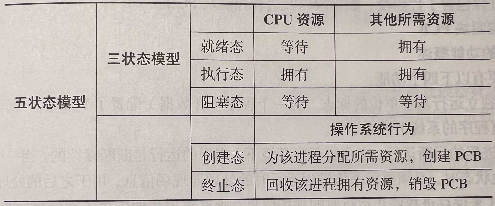

> 区别就绪态和等待态：
>
> - 就绪态是指进程仅缺少处理器，只要获得处理机资源就立即运行。
> - 等待态是指进程需要其他资源或等待某一事件。

三种基本状态的转换：

- 就绪态->运行态：处于就绪态的进程被调度后，获得处理机资源，于是进程由就绪态转换为运行态。
- 运行态->就绪态：处于运行态的进程在时间片用完后，不得不让出处理机，从而进程由运行态转换为就绪态。
- 运行态->阻塞态：进程请求某一资源的使用和分配或等待某一事件的发生时，它就从运行态转换为就绪态。
- 阻塞态->就绪态：进程等待的事件到来时，如I/O操作结束或中断结束时，中断处理程序必须把进程由阻塞态转换为就绪态。
- 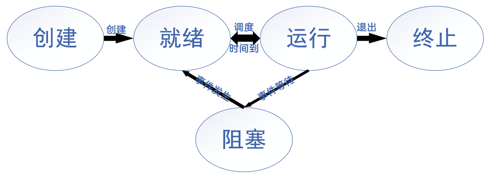

> - 不能由阻塞态直接转换为运行态。
> - 不能由就绪态直接转换为阻塞态。
> - 一个进程从运行态变成阻塞态是主动行为。
> - 一个进程由阻塞态变成就绪态是被动行为。

## 2.1.3 进程组织

进程是操作系统资源分配的最小单位，在未引入线程概念的操作系统中，也是调度的最小单位。

#### 进程控制块PCB的功能概述

- 作为独立运行基本单位的标志。
- 实现进程的间断运行。
- 提供进程调度和管理所需要的信息。
- 实现与其他进程的同步与通信。

#### PCB中的内容

- 标识符：标识符是唯一标识，以数字或数字加字母的形式存储在PCB中。
  - 进程标识符PID
  - 父进程的PID
  - 用户标识符UID
- 处理器状态信息：又称处理器上下文，记录进程在执行态下关键寄存器的信息，用于进程切换后恢复处理器上的重要信息。
  - 通用寄存器
  - 程序计数器PC
  - 程序状态字PSW
  - 用户栈指针
- 处理器调度信息：该类信息的存储取决于操作系统使用何种调度方法来将处理器分配给进程。
  - 进程调度状态，记录执行态、就绪态、阻塞态等。
  - 进程调度优先级，在多个进程就绪时，用于决定那个进程先获得处理器资源。
  - 调度的相关信息，这取决于调度算法。
  - 事件，指进程由执行态转换为阻塞态的原因。
- 进程控制信息：用于进程控制所必须的信息。
  - 代码段和数据段的地址
  - 进程同步和通信机制
  - 进程特权
  - 资源清单
  - 存储管理
  - 链接指针

## 2.1.4 进程控制

进程控制包括创建新进程、撤销已有进程、实现进程状态转换等功能。

一般把进程控制用的程序段称为原语，原语的特点是执行期间不允许中断，它是一个不可分割的基本单位。

原语采用“关中断指令”和“开中断指令”实现。

> 两个问题：
>
> - 为什么需要把多个指令设计成一个原语？
>
>   如果多个指令不是一个原语，两个进程可能会发生冲突，互相都认为自己可以使用设备，发生错误。
>
> - 为什么在进程控制的过程中要使用原语？
>
>   进程创建、进程唤醒等一系列控制操作均包含了多个步骤，要确保这些步骤全部进行或全部不进行才能得到正确的结果。

### 进程的创建

#### 进程创建的场合

- 用户登陆时。
- 高级调度发生时。
- 系统响应用户程序提出的请求时。
- 现有进程创建新进程时。

#### 进程创建原语的执行过程

- 为进程分配一个唯一的进程标识号，并申请一个空白PCB。
- 为进程分配其运行所需的资源。==如果资源不足，并不是创建失败，而是处于创建态，等待内存资源==。
- 初始化PCB。
- 若进程就绪队列能够接纳新进程，则将新进程插入就绪队列，等待被调度运行。

### 进程的终止

#### 进程终止的场合

- 进程运行完毕，正常退出。
- 进程运行中出现错误退出，例如除零异常。
  - ==当发生了这种错误后，进程会收到操作系统反馈的信号，而不至于错误发生时就立刻退出==。
- 进程发生了严重错误而退出。
- 被其他进程杀死。
- 其他：例如超过时限、无可用内存、访问越界、保护错误、I/O失败、无效指令、数据误用等。

#### 终止原语的执行过程

- 根据进程的PID，找到进程对应的PCB，获取进程的状态。
- 修改该进程的状态，置位终止态。
- 若该进程运行期间调用了进程创建指令，创建了子进程，则要把其子进程也进行终止。
- 将该进程所拥有的全部资源，或归还给其父进程，或归还给操作系统。
- 将该PCB从所在队列(链表)中删除。

### 进程的阻塞和唤醒

> - 当进程请求资源失败或等待某个事件发生时，该进程无法继续执行，便会执行阻塞原语，让出处理器资源，变为阻塞态。
> - 当进程请求的资源到达或等待的事件发生时，相关进程可以调用唤醒原语，通知之前因为等待而变为阻塞态的进程，使其变为就绪态。

⚠️注：

- 进程阻塞的过程是主动的，而进程唤醒的过程是被动的。
- 阻塞原语和唤醒原语一定是成对出现的。

#### 进程阻塞的场合

- 进程向系统请求临界资源失败。
- 进程等待某种操作的完成。
- 新数据尚未到达。
- 等待新任务的到达。

#### 阻塞原语的执行过程

- 根据进程的PID，找到进程对应的PCB，获取进程的状态。
- 若该进程当前为执行态，将状态转换为阻塞态，将其PCB插入到阻塞队列中。
- 进行上下文切换，从就绪队列中选择一个进程，将其转换为运行态并为其分配处理器，使其可以运行。

#### 进程唤醒的场合

- 进程向系统请求临界资源失败后，使用该临界资源的进程释放了该资源。
- 进程等待的操作已经发生。
- 进程等待的数据到达。
- 进程获得了一个新的任务。

#### 唤醒原语的执行过程

- 找到阻塞队列中对应进程的PCB。
- 更改该进程状态为就绪态，将该进程的PCB放入就绪队列中。

### 进程切换

进程切换，指操作系统内核挂起当前运行的进程，调度就绪进程占用处理器运行。

> 进程切换必然发生在内核态而不是用户态。

#### 上下文切换

- 上下文切换，指保存和恢复处理器上的信息，也可认为是==保存当前使用处理器进程的相关信息，并将待调度进程的处理器信息恢复到处理器上。

- “上下文”可理解为进程的工作环境。

#### 上下文切换的时机

- 上下文切换发生在操作系统从执行态进程处获得控制权的任意时刻。
- 中断、陷阱、系统调用，这些事件都会导致控制权移交给操作系统。

#### 上下文切换过程

- 保存处理器的上下文。
- 修改进程状态。
- 调度程序选择另一个进程执行。
- 读取待调度进程的PCB，修改其运行状态为执行态。
- 更新内存管理的数据结构。
- 恢复待调度程序的上下文环境。
- 根据程序计数器(PC)指向的位置找到下一行执行的代码，恢复该进程。

## 2.1.5 进程的通信

进程通信是指进程之间的信息交换。

实现进程通信需要解决三个问题：

-   进程通过何种方式把信息传递给其他进程。
-   保证多个进程在关键活动上不会重叠。
-   进程按照正确的顺序推进。

==⚠️一个进程不能直接访问另一个进程的地址空间==

### 共享存储

在通信的进程之间存在一块可直接访问的共享空间，通过对这片共享空间进行读/写操作实现进程之间的信息交换。

在对共享空间进行读/写操作时，需要使用**同步互斥工具**，对共享空间的读/写进行控制。

共享存储分为两种：

- 低级方式的共享是基于数据结构的共享。
- 高级方式的共享是基于存储区的共享。

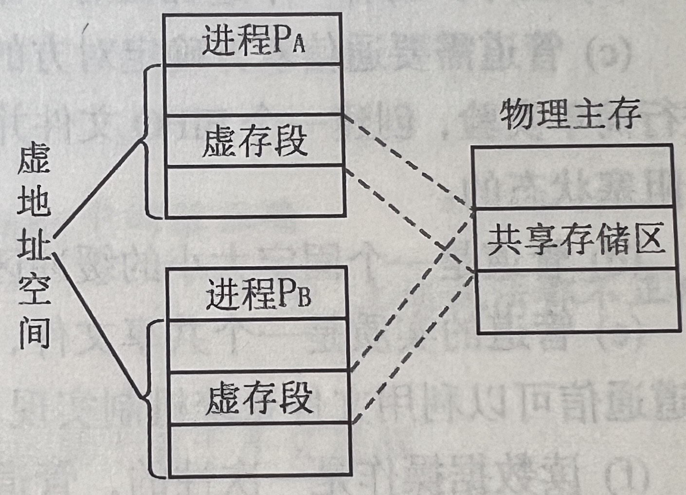

### 消息传递

在消息传递系统，进程间的数据交换以格式化的信息为单位。

**格式化的信息**：消息头 + 消息尾

进程通过系统提供的发送消息(send)和接收消息(receive)两个原语进行数据交换。

- **直接通信方式**：发送进程直接把消息发送给接收进程，并将它挂在接收进程的消息缓冲队列上，接收进程从消息缓冲队列中取得消息。
- **间接通信方式**：发送进程把消息发送到某个中间实体(一般称为“信箱”)，接收进程从中间实体取得消息。

>   间接通信方式和共享存储区通信方式有相似之处，区别在于间接通信方式由操作系统规范化管理，不允许进程直接操作开辟的空间，因此比共享存储更加安全，但效率略有下降。

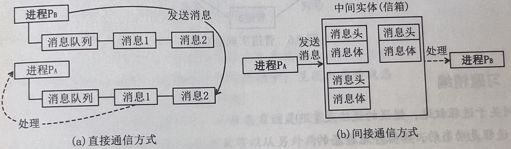

### 管道通信

管道通信允许两个进程按生产者-消费者方式进行通信，生产者向管道的一端写，消费者从管道的另一端读。

数据在管道中是**先进先出**的。

管道机制必须提供三方面的协调能力：**互斥**、**同步**和**确定对方的存在**。

- 管道只能采用**半双工通信**。如果要实现双向同时通信，需要设置两个管道。

- 当有一个进程在对一个管道进行读/写时，其他想要读/写该管道的进程必须等待。

- 当管道写满时，写进程将阻塞；当管道读空时，读进程将堵塞。

- 管道是一个固定大小的缓冲区，在内核中实现，大小不受磁盘大小影响。

- 管道的实质是一个共享文件，读进程将管道视为输出文件，写进程将管道视为输入文件，利用文件系统机制实现。

- 管道中的数据一旦被读出，就彻底消失。因此，当多个进程读同一个管道时，可能会错乱。

  两种解决方案：

  - 一个管道允许多个写进程，一个读进程。
  <<<<<<< HEAD
  - 允许多个写进程，多个读进程，但系统会让各个读进程轮流从管道中读数据。

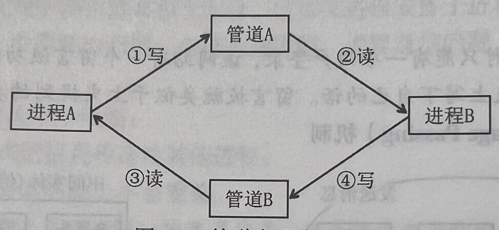

## 2.1.6 线程和多线程模型

线程最直接的理解就是“轻量级线程”，它是一个基本的CPU执行单元，也是程序执行流的最小单元，由线程ID、程序计数器、寄存器集合和堆栈组成。

>   在引入线程前，进程是操作系统调度的最小单位；
>   在引入线程且是由操作系统内核支持的线程之后，线程是操作系统调度的最小单位。
>   同时，进程仍然是操作系统分配资源的最小单位，线程的引入并未改变进程资源所有权这一特点。

### 引入线程的优势

#### 进一步提高并发性能

借助多线程，可以分解部分被阻塞的活动，使得一个进程的任务能进一步细分，提高任务的并行性。

#### 共享地址空间与可用数据

线程使得并行实体拥有了共享地址空间、数据的能力，这种能力是一些任务需要但进程模型无法提供的。

#### 线程更轻量级

线程无论是撤销还是创建，都远快于进程。
在短时间需要反复开启或撤销大量线程时，线程的轻量级是十分有优势的。

#### 性能上的优势

如果开启的多个线程均为处理器密集型，则线程难以提升进程执行的效率。
而当一个进程同时存在着大量的I/O请求和计算时，通过线程可以让这些活动彼此重叠，从而大大加快进程的执行速度。

>   处理器密集型：一个线程或进程主要的工作是使用处理器进行计算，很少用到I/O设备。
>   I/O密集型：一个进程或线程使用I/O设备远多于处理器。

### 线程的属性

-   线程是处理机调度的单位
-   多CPU计算机中，各个线程可占用不同的CPU
-   每个线程都有一个线程ID、线程控制块TCB
-   线程也有就绪、阻塞、运行三种基本状态
-   线程几乎不拥有系统资源
-   同一进程的不同线程间共享进程的资源
-   由于共享内存空间，同一进程中的线程间通信甚至无需系统干预
-   统一进程中的线程切换，不会引起进程切换，系统开销很小
-   不同进程中的线程切换，会引起进程切换，系统开销较大

### 线程的组织

一个操作系统中的多个进程之间具有很大的独立性，而进程中的多个线程则不同，它们拥有完全相同的地址空间，这意味着它们可以共享全局数据。

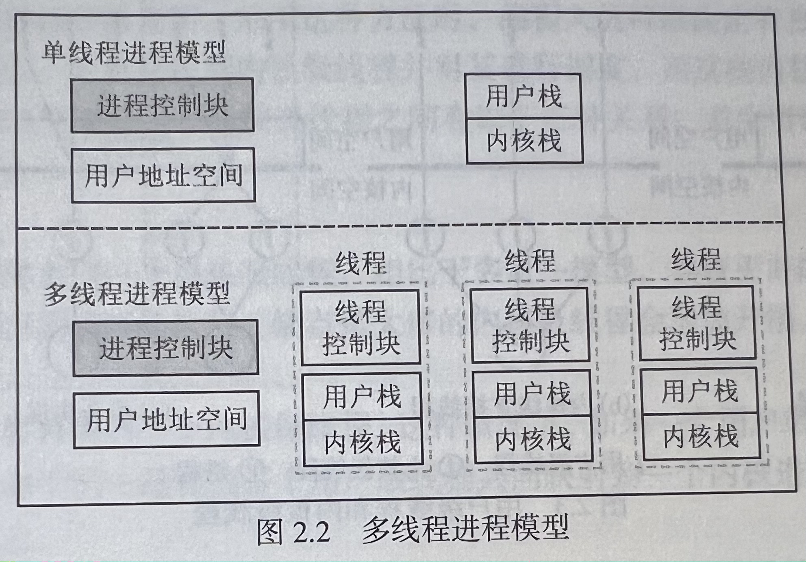

#### 线程的三个基本状态

-   执行态：在该状态下，线程获得处理器并运行
-   就绪态：表示线程可以被调度进行，被分配处理器就可以立刻执行工作
-   阻塞态：指线程在执行过程中，因为某些事件而阻塞并等待

#### 线程控制块TCB

每个线程也具有一个对应的线程控制块TCB，用于控制和管理线程的状态、保存线程的信息。

线程控制块中通常有以下几类信息：

-   线程标识符TID：每个线程的唯一标识符。
-   寄存器信息：用来记录包括通用寄存器、程序计数器、状态寄存器等关键寄存器的信息。
-   线程执行态：用于记录线程的执行状态。
-   优先级：用于线程调度。
-   线程专有存储区：用于线程切换时保存现场信息。
-   信号屏蔽：每个线程拥有各自的信号屏蔽字。
-   堆栈指针：TCB中分别设置了两个指向堆栈的指针，分别指向自己的堆栈和核心栈。

>   核心栈是线程运行在内核态时使用的。

### 线程的实现方式

#### 用户级线程ULT

-   线程的管理由应用程序实现，在用户空间下完成。

-   操作系统内核感知不到线程的存在，在该种方式下，调度的最小单位依然是进程，线程的调度则由其所在进程实现。

-   优点：

    -   线程切换不需要转换到内核空间，节省了模式切换的开销。
    -   调度算法可以是进程专用的，不同的进程可根据自身的需要，对自己的线程选择不同的调度算法。
    -   用户级线程的实现与操作系统平台无关，对线程管理的代码是属于用户程序的一部分。
    -   可以在不支持线程的操作系统中实现线程。
    -   可以允许进程自主定制调度算法。
    -   线程的切换完全在本进程中完成而没有内核的参与。

    >   所有线程相关的数据结构都在进程的用户地址空间，所以线程的切换不需要转换成内核态，这就避免了两次状态转换带来的开销。

-   缺点：

    -   一旦某个线程被阻塞，该线程所属的整个进程都会被阻塞。
    -   如果只使用用户级线程，一个多线程程序不能利用多处理器技术。

#### 内核级线程

-   内核级线程在内核的支持下运行，线程管理的所有工作也是在内核空间内实现的。
-   内核通过TCB来对线程进行感知和控制。
-   在该种方式下，线程是调度的最小单位。
-   优点：
    -   在多处理系统中，内核可以调度一个进程内的多个线程到多个处理器上运行。
    -   当一个线程被阻塞，内核可以调度该进程中的另一个线程到处理器上运行。
    -   内核进程自身可以使用多线程。
-   缺点：
    -   同一进程中的线程切换，需要从用户态转到和核心态进行，系统开销较大。

#### 组合方式

在组合实现方式中，内核支持多个内核级线程的建立、调度和管理，同时允许用户程序建立、调度和管理用户级线程。

**线程库**是为程序员提供创建和管理线程的API。实现线程库的两种方法：

-   在用户空间中提供一个没有内核支持的库。
-   实现由操作系统直接支持的内核级的一个库。

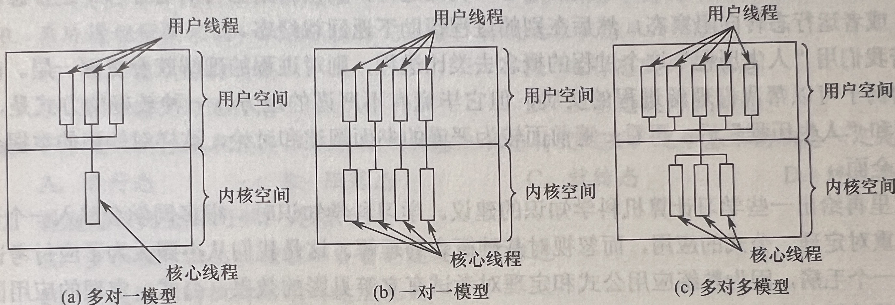

#### 多线程模型

由于用户级线程和内核级线程连接方式的不同，从而形成了下面三种不同的多线程模型：

-   **多对一模型**：将多个用户级线程映射到一个内核级线程。
    -   优点：线程管理是在用户空间进行的，效率比较高。
    -   缺点：如果一个线程在访问内核时发生阻塞，则整个进程都会被阻塞；在任何时刻，只有一个线程能够访问内核，多个线程不能同时在多个处理机上运行。
-   **一对一模型**：将每个用户级线程映射到一个内核级线程。
    -   优点：当一个线程被阻塞后，允许调度另一个线程运行，并发能力较强。
    -   缺点：每创建一个用户线程，相应地就需要创建一个内核线程，开销较大。
-   **多对多模型**：将n个用户线程映射到m个内核级线程上，要求$n\geq m$。
    -   特点：克服了多对一模型并发度不高的缺点；克服了一对一模型的一个用户进程占用太多内核级线程而开销太大的缺点。

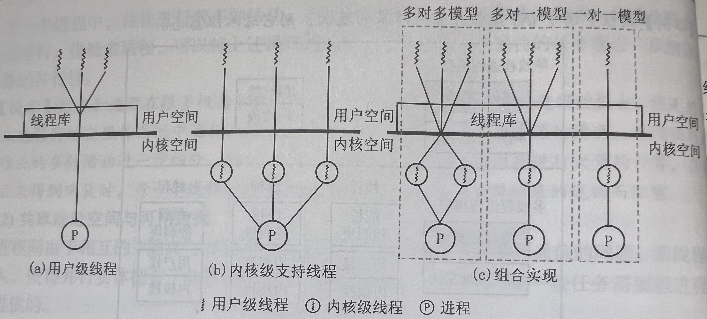

#### 进程和线程的对比

|          |            进程            |              线程              |
| :------: | :------------------------: | :----------------------------: |
|   调度   |    不再是调度的最小单位    |        是调度的最小单位        |
| 拥有资源 | 进程都是资源分配的基本单位 |       线程只拥有少量资源       |
|  并发性  |   多个进程间可以并发执行   | 一个进程的多个线程也能并发执行 |
|  独立性  |       只共享全局变量       |      只有少数资源不能共享      |
| 系统开销 |    通信、进程切换开销大    |        通信、切换开销小        |
|   其他   |      进程间相互不影响      | 用户级线程的阻塞会影响整个进程 |

# 2.2 处理机调度

## 2.2.1 调度的概念

 #### 基本概念

处理机调度是对处理机进行分配，即从就绪队列中按照一定的算法选择一个进程并将处理机分配给它运行，以实现进程并发地执行。

>   区别**进程调度**和**上下文切换**。
>
>   -   进程调度是一种资源分配的行为，包括了调度程序的决策和上下文切换；
>   -   上下文切换时调度的实现手段，执行调度程序的决策。

#### 三种调度层次

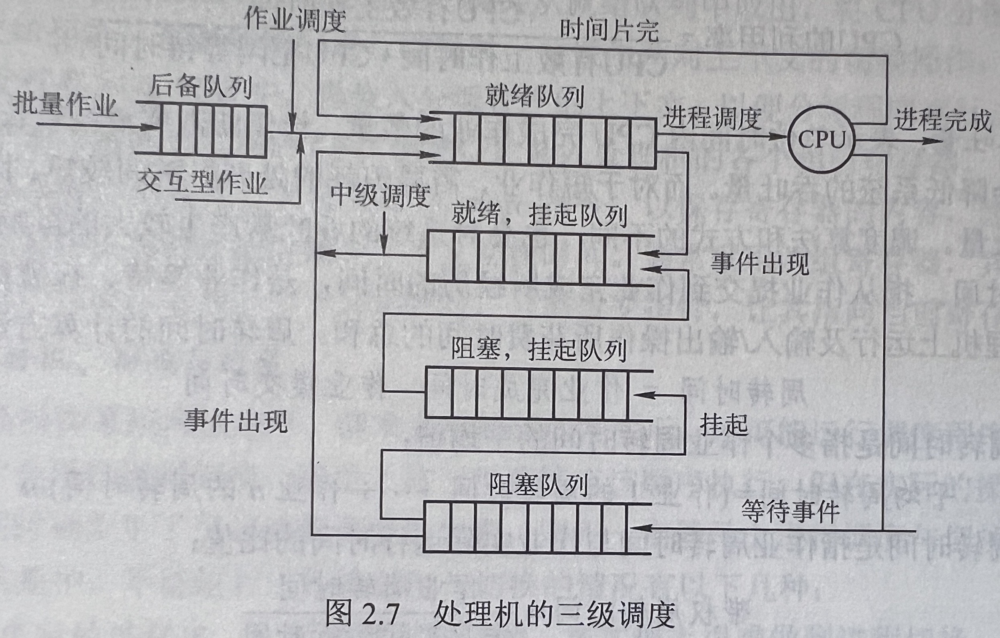

1.   高级调度(作业调度)

     调度的对象是外存中等待的作业，行为是将作业由外存调度到内存中。

     按照一定的原则从外存上处于后备队列的作业中挑选一个或多个，给它们分配内存、输入/输出设备等必要的资源，并建立相应的进程，以使它们获得竞争处理机的权利。

     一个作业只会有一次调入和一次调出，两次的时间差就是作业执行完毕所花费的时间，所以这种调度的频率是最低的。

     >   多道批处理系统中大多配有作业调度，而其他系统中通常不需要配置作业调度。

2.   中级调度(内存调度)

     该调度的对象是暂时不能运行的进程，行为是将目标进程的相关数据在内存和外存间移动。

     引入中级调度的目的是提高内存利用率和系统吞吐量。

     中级调度实际上是存储器管理中的对换功能。

     >   七状态模型：引入挂起状态。
     >
     >   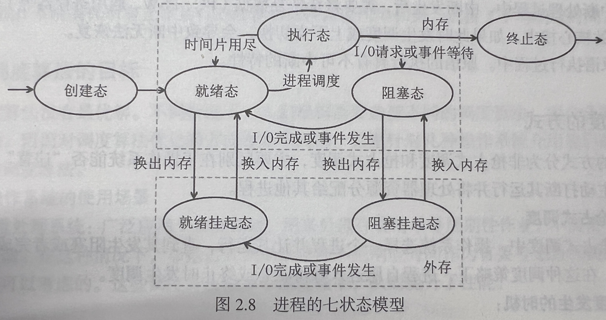

3.   低级调度(进程调度)

     调度的对象是进程(或内核级线程)，行为是决定将处理器资源先分配给哪个进程。

     进程调度是最基本的一种调度，是发生频率最高的调度，多道批处理、分时和实时系统中，都要实现进程调度。

#### 三级调度的联系

1.   作业调度为进程活动做准备，进程调度使进程正常活动起来。
2.   中级调度将暂时不能运行的进程挂起，中级调度处于作业调度和进程调度之间。
3.   作业调度次数少，中级调度次数略多，进程调度频率最高。
4.   进程调度是最基本的，不可或缺。

## 2.2.2 调度的时机

#### 调度可以发生的场合

1.   创建一个新进程之后。
2.   进程退出后。
3.   进程时间片用尽。
4.   可抢占式系统中进程进入就绪队列。
5.   阻塞发生时。
6.   I/O中断发生时。

#### 调度不能发生的场合

1.   中断处理过程中。
2.   原语执行过程中。
3.   进程在操作系统内核临界区中。

## 2.2.3 调度的方式

#### 非抢占式调度

在非抢占式调度中，操作系统选择一个进程并让其运行，直到其发生阻塞或者完成任务释放资源为止。

1.   调度发生的时机：
     1.   进程运行完毕，放弃处理器的使用权。
     2.   进程发生某种事件而无法继续运行，放弃处理器使用权。
     3.   进程发生阻塞需要等待继续运行的条件，放弃处理器使用权。
2.   非抢占式调度的优点：
     1.   调度算法设计更简单，调度成本更低。
     2.   高吞吐的调度策略。

>   调度行为本身，是一个白白消耗系统资源的行为，因为调度程序占用处理器资源这一行为对作业的完成是没有任何贡献的。抢占式调度会触发更多次的调度，因而系统整体的吞吐量会变低。
>
>   非抢占式调度适用于大多数的批处理系统，但它不能用于分时系统和大多数的实时系统。

#### 抢占式调度

抢占式调度算法中，系统可以根据某种调度的原则，暂停一个进程的执行并将处理器资源分给另一个进程。

1.   抢占遵循的常用原则：
     1.   优先级。优先级高的进程可以抢占优先级低的进程，这个抢占行为可以发生在进程调度的时机上。
     2.   短进程优先。请求处理器时间短的进程，可以抢占请求时间长的进程。
     3.   时间片轮转原则。每个进程依次占用处理器资源，一个进程耗尽当前分配的时间片后，其他就绪进程可以在进程调度发生时抢占。
2.   抢占式调度的优点：
     1.   抢占式调度方法，可以防止一个进程长时间独占处理器的恶意行为。
     2.   与非抢占式调度方法相比，处理器利用率更高。
     3.   抢占式调度的等待时间和响应时间更短，用户体验好，有利于实时系统和分时系统。
     4.   每次中断后都需要考虑调度，这使得操作系统更加灵活。
     5.   操作系统确保所有正在运行的进程的处理器使用率相同，改善了平均响应时间。

## 2.2.4 调度算法的目标

#### 操作系统的使用场景

1.   批处理系统：非抢占式调度策略和不把响应时间作为首要考虑目标的抢占式调度算法都是可以考虑的。这些调度算法减少了调度频率，从而提升了性能。
2.   个人电脑上的操作系统：用户需要快速得到响应，因此应该优先考虑抢占式的、响应时间短的调度算法。
3.   有时限的系统(例如股票交易系统、航天器自动控制系统等)：为了保证任务在规定时间内完成，往往考虑抢占式的调度算法，即当一个高优先进程进入就绪队列后，系统会优先调度高优先级进程运行。

#### 调度算法的指标

1.   公平：相似的进程应该得到相似的服务。

2.   资源利用率：为了提高计算机的资源利用率，应该尽可能让计算机的各种资源都处于忙碌状态。计算公式：
     $$
     CPU利用率=\frac{CPU有效工作时间}{CPU有效工作时间+CPU空闲时间}
     $$

3.   平衡性：平衡指处理器密集型作业和I/O密集型作业的调度平衡，为了保证计算机的各个资源都尽可能处于忙碌状态，需要平衡地调度这两种类型地作业。

4.   周转时间：周转时间指一个作业从被提交开始，知道作业完成为止所消耗的时间，其中包括了作业等待高级调度的时间、作业在就绪队列等待的时间以及作业的运行和I/O耗时。

     作业的周转时间短意味着用户可以更快地拿到结果，从操作系统的角度考虑，会希望平均周转时间最短，因为这能直接反映出操作系统更高的效率。

     1.   周转时间$T$：作业从被提交开始，到完成消耗的时间。$T=t_{finish}-t_{arrive}$
     2.   平均周转时间$\overline{T}$：多个作业周转时间的平均值。$\overline{T}=(T_1+T_2+\cdots+T_n)/n$
     3.   带权周转时间$W$：一个作业的周转时间$T$和改作业实际运行时间之比。$W=\frac{T}{t_s}$
     4.   平均带权周转时间$\overline{W}$：多个作业带权周转时间的平均值。$\overline{W}=(W_1+W_2+\cdots+W_n)/n$

5.   系统吞吐率：吞吐率指单位时间内完成的作业数，收到运行作业长度的影响。

6.   响应时间：用户提交请求开始，直到系统首次对该作业做出响应所花费的时间。

7.   等待时间：等待时间指一个进程在队列中等待各种资源的时间。$等待时间=周转时间-运行时间$。

## 2.2.5 调度的实现

#### 调度的主要任务

1.   保存处理器的现场信息。
2.   按照进程调度算法确定下一个被分配处理器的进程。
3.   将处理器资源分配给进程。

#### 进程调度机制

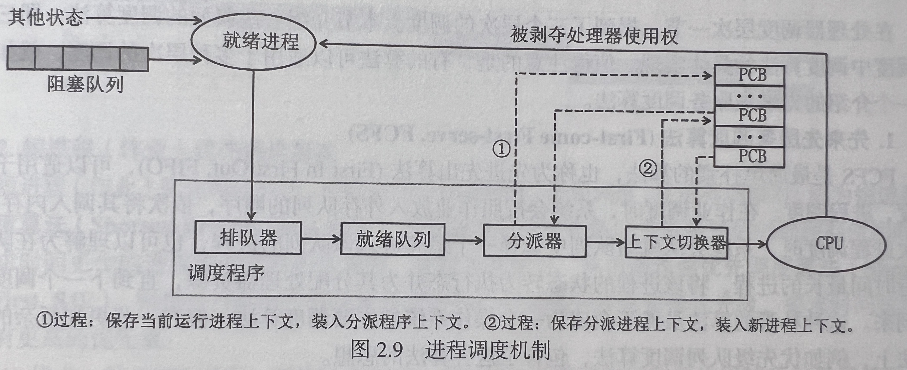

1.   排队器

     在实现进程调度的系统中，根据不同进程的不同状态，维护着多个进程队列。

     排队器的作用，就是在进程状态转换为就绪态时，将其插入就绪队列中。

2.   分派器

     根据进程调度程序所选择的进程，将其从就绪队列取出并将处理器资源分配给该进程。

3.   上下文切换器

     在分配处理器给新进程时，需要进行上下文切换。

>   在上下文切换时，需要执行大量load和store指令，以保存寄存器的内容，因此会花费比较多的时间。

#### 闲逛进程

闲逛进程是一种没有明确工作，用于解决调度中可能发生的特殊情况的进程。

闲逛进程的优先级最低，没有就绪进程时才会运行闲逛进程，只要有进程就绪，就会立即让出处理机。

闲逛进程不需要CPU之外的资源，它不会被阻塞。

>   Unix操作系统下PID为0的进程就是闲逛进程。

#### 两种线程的调度

1.   用户级线程调度：由于内核并不知道线程的存在，所以内核还是和以前一样，选择一个进程，并给予时间控制。由进程中的调度程序决定哪个线程运行。
2.   内核级线程调度：内核选定一个特定线程运行，通常不用考虑该线程属于哪个进程。对被选择的线程赋予一个时间片，如果超过了时间片，就会强制挂起该线程。

>   用户级线程的线程切换在同一进程中进行，仅需少量的机器指令；
>
>   内核级线程的线程切换需要完整的上下文切换、修改内存映像、使高速缓存失效，这就导致了若干数量级的延迟。

## 2.2.6 典型调度算法

#### 先来先服务(FCFS)调度算法

FCFS调度算法是一种最简单的调度算法，也称先进先出算法(FIFO)，它既可用于作业调度，又可用于进程调度。

在作业调度中，算法每次从后备作业队列中选择最先进入该队列的一个或几个作业，将它们调入内存，分配必要的资源，创建进程并放入就绪队列。

在进程调度中，FCFS调度算法每次从就绪队列中选择最先进入该队列的进程，将处理机分配给它，使之投入运行，直到运行完成或因某种原因而阻塞时才释放处理机。

>   优点：逻辑简单，对长作业比较有利，有利于CPU繁忙型作业。
>
>   缺点：效率差，无法实现人机交互，未考虑到不同进程间的差异性，更加偏向处理器密集型进程和长进程。

>   ❓为什么FCFS算法偏向长进程和处理器密集型进程？
>
>   💡长进程排队并使用处理器直到作业完成或阻塞，可以使用处理器更长时间；I/O密集型进程碰到I/O操作时会陷入阻塞而重新排队，而处理器密集型进程碰到的阻塞少，排队次数少，等待时间也会少。

#### 短作业优先(SJF)调度算法

短作业优先调度算法是指对短作业优先调度的算法。

短作业优先(SJF)调度算法从后备队列中选择一个或若干个估计运行时间最短的作业，将它们调入内存运行。

短进程优先(SPF)调度算法从就绪队列中选择一个估计运行时间最短的进程，将处理器分配给它，使之立即执行，直到完成或发生某事件而阻塞时，才释放处理机。

>   优点：
>
>   -   较FCFS而言，性能有了提升。
>   -   SPF的平均等待时间和平均周转时间是**最优**的。
>
>   >    🚫实际上SPF/SJF是十分理想的调度算法，但现实中难以实现：
>   >
>   >   1.   进程难以准确预估运行所需时间。
>   >   2.   程序可以谎报运行所需时间而恶意竞争处理器使用权。
>
>   缺点：
>
>   -   算法需要进程预估其运行时间。
>   -   这个算法是偏向短进程的。
>   -   这个算法仅仅通过进程耗时的长短来定义进程优先级，未考虑进程间的差异性。

根据**是否可以抢占**，短进程调度算法分为以下两种：

1.   非抢占式短进程优先调度算法：调度时，会选择当前就绪队列中要求处理器时间最少的进程，为其分配处理器。该进程运行期间，不会被抢占，直到进程主动放弃处理器。
2.   抢占式短进程优先调度算法：调度时，会选择当前就绪队列中要求处理器时间最少的进程，为其分配处理器。如果在该进程运行过程中，就绪队列中出现了要求时间更短的进程，则这个要求时间更短的进程会抢占处理器资源，当前运行的进程状态会由执行态变为就绪态。

#### 优先级调度算法(PSA)

优先级调度算法既可用于作业调度又可用于进程调度。

在该算法下，作业的优先级由外界赋予，系统只需要根据外界赋予的优先级来进行调度即可。

**根据是否可以抢占，优先级调度算法可以分为以下两种：**

-   非抢占式优先级调度算法
    -   必须等待当前进程运行完才会执行下一个进程，不论下一个进程优先级有多高。
-   抢占式优先级调度算法
    -   如果出现比当前运行的进程优先级更高的进程，立刻将当前进程转为就绪态，更高优先级的进程抢占处理器。

**根据优先级是否可以动态变化，分为以下两种：**

-   静态优先级

    -   指各个进程的优先级在调度程序运行之初就已经确定，整个运行期间不会改变。

    >   设计优先级的依据：
    >
    >   1.   系统进程的优先级一般高于用户进程的优先级
    >   2.   I/O密集型进程高于处理器密集型进程
    >   3.   对资源要求少的进程优先级高于对资源要求多的进程
    >   4.   用户自定义的优先级

-   动态优先级

    -   指在调度程序运行的过程中，各个进程的优先级是动态变化的。

#### 高响应比优先调度算法(HRRN)

高响应比优先调度算法，可以适用于作业调度、进程调度。

该算法根据公式来确定进程的优先级。公式如下：
$$
优先级=\frac{等待时间+要求服务时间}{要求服务时间}
$$
由于等待时间是变化的，所以优先级也会动态变化，随着进程的等待时间增加，进程的优先级就会变高，更容易被调度。

>   1.   作业的等待时间相同时，要求服务时间越短，响应比越高，有利于短作业，类似于SJF
>   2.   要求服务时间相同时，作业的响应比由其等待时间决定，等待时间越长，其响应比越高，类似与FCFS
>   3.   对于长作业，作业的响应比可以随等待时间的增加而提高，当其等待时间足够长时，也可获得处理机，克服了“饥饿”现象。

#### 时间片轮转调度算法(RR)

时间片轮转调度算法主要适用于分时系统。

在这种算法中，系统将所有就绪进程按FCFS策略排成一个就绪队列，调度程序总是选择就绪队列中的第一个进程执行，但仅能运行一个时间片。在使用完一个时间片后，即使进程没有运行完成，也必须释放处理机给下一个就绪进程，而被剥夺的进程返回到就绪队列的队尾重新排队，等候再次运行。

>   -   RR算法的调度时机：
>       -   一个时间片耗尽，在时钟中断发生时，调度程序调度下一个就绪进程上处理器运行，将当前进程放回到就绪队列末尾。
>       -   一个时间片未耗尽，但进程已完成工作，或因其他原因放弃处理器资源，调度程序会选择下一个就绪程序进行进程调度。

#### 多级队列调度算法

多级队列调度算法，可以适用于进程调度。

该算法在系统中设置多个就绪队列，将不同类型或性质的进程固定分配到不同的就绪队列，每个队列可实施不同的调度算法。

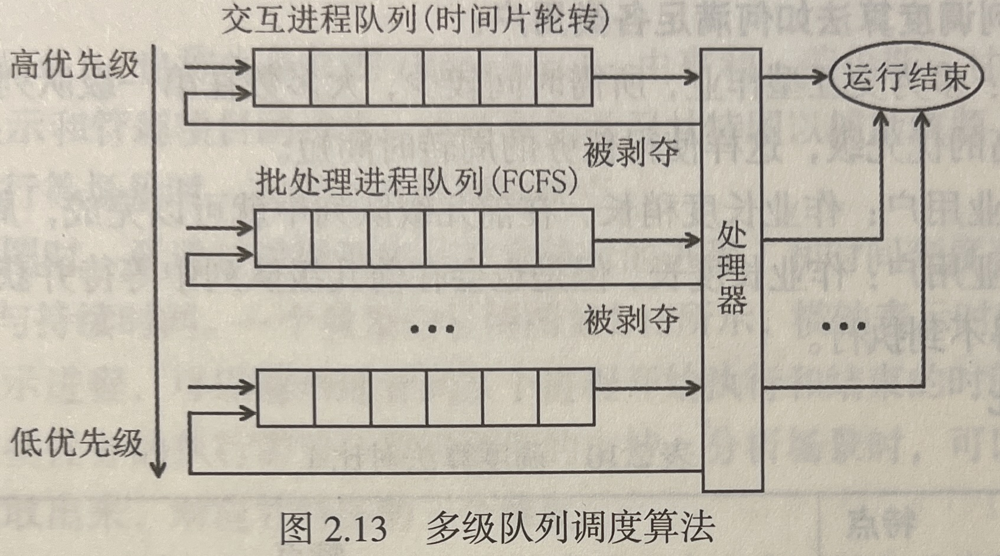

#### 多级反馈队列调度算法

多级反馈队列调度算法，可以适用于进程调度，这种调度算法能够较好地满足各类进程对于处理器资源的需求，是公认较好的一种调度算法。

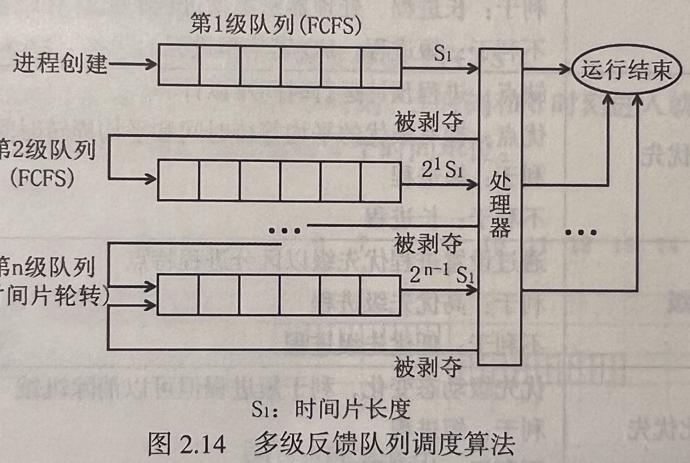

多级反馈队列调度算法的实现思想如下：

1.   设置多个就绪队列，并为每个队列赋予不同的优先级。
2.   赋予各个队列的进程运行时间片的大小各不相同。在优先级越高的队列中，每个进程的时间片就越小。
3.   每个队列都采用FCFS算法。当一个作业的进程被创建并分配资源后，先将其加入第一个队列的末尾，依据FCFS算法等待分配时间片。
4.   按照队列优先级调度。如果当前使用处理器资源的进程来自第i级队列，而此时第一级队列中进入了新的就绪进程，那么会立即进行抢占式进程调度，并将此时正在运行的程序返回i级队列队尾。

多级反馈队列调度算法如何满足各类用户：

-   终端型用户：多为交互作业，所需时间较少，大多数在第一级队列中就能快速完成，而第一级队列具有最高的优先级，这样使得任务的周转时间短。
-   短批处理作业用户：作业长度稍长，在前几级队列中就可以完成，周转时间较短。
-   长批处理作业用户：作业长度长，但是也会在前几级队列中等待并获得时间片，执行部分程序，不会长时间得不到执行。

#### 调度算法对比

|              | 特点                                                         |
| ------------ | ------------------------------------------------------------ |
| 先来先服务   | 优点：逻辑简单<br />缺点：完全不考虑进程特点<br />利于：长进程、处理器密集进程<br />不利于：短进程、I/O密集型进程 |
| 短进程优先   | 优点：拥有最优的平均等待时间和平均周转时间<br />缺点：进程预计运行时间难以计算<br />利于：短进程<br />不利于：长进程 |
| 优先级       | 通过设置进程优先级以区分进程特点<br />利于：高优先级进程<br />不利于：低优先级进程 |
| 高响应比优先 | 优先级动态变化，利于短进程但可以消除饥饿<br />利于：短进程<br />不利于：长进程 |
| 时间片轮转   | 公平的将处理器分配给每个进程                                 |
| 多级反馈队列 | 能较好满足各类进程对处理器的需求<br />长进程、I/O密集型进程随着运行会逐步下沉到低优先级队列 |

|              | 是否可抢占 | 是否会导致饥饿 | 算法考虑因素               |
| ------------ | ---------- | -------------- | -------------------------- |
| 先来先服务   | 否         | 否             | 等待时间(进程到达时间)     |
| 短进程优先   | 均可       | 是             | 进程预计运行时间           |
| 优先级       | 均可       | 是             | 进程优先级                 |
| 高响应比优先 | 均可       | 否             | 进程预计运行时间+等待时间  |
| 时间片轮转   | 是         | 否             | 所有进程公平分时使用处理器 |
| 多级反馈队列 | 是         | 否             | FCFS+时间片轮转算法        |

# 2.3 进程同步

## 2.3.1 进程同步的基本概念

进程同步的任务是采取有效措施来管理多个进程的运行，避免进程不受控制地争夺系统资源而导致混乱局面的出现——每个进程的运行结果存在不可再现性，以及程序的执行存在不确定性。

## 2.3.2 临界资源与临界区

#### 临界资源

同一时刻只能由一个进程使用的资源称为临界资源。

#### 临界区

程序中访问临界资源的那一部分代码称为临界区。

进程的运行是异步并发的，为了避免与推进顺序有关的错误，进程必须互斥访问临界区，来获得临界资源的使用权。

对临界资源的访问的正确使用，可把临界资源的访问过程分为4个部分：

1.   进入区。为了进入临界区使用临界资源，在进入区要检查可否进入临界区，若能进入临界区，则应设置正在访问临界区的标志，以阻止其他进程同时进入临界区。
2.   临界区。进程中访问临界资源的那段代码，又称临界段。
3.   退出区。将正在访问临界区的标志清除。
4.   剩余区。代码中的其余部分。

```c
while(1) {
    进入区;
    临界区;
    退出区;
    剩余区;
}
```

## 2.3.3 同步与互斥

进程同步机制的主要任务是协调几个相互协作的进程的执行顺序，使并发执行的进程能够共享系统资源，并按照一定的规则相互制约，保证程序按序执行。

#### 互斥关系

互斥关系，又称进程的**间接相互制约关系(程序-资源-程序模式)**。当一个进程进入临界区使用临界资源时，另一个进程必须等待，当占用临界资源的进程退出临界区后，另一进程才允许去访问此临界资源。

#### 同步关系

同步关系，又称进程的**直接相互制约关系(程序-程序模式)**。指为完成某种任务而建立的两个或多个进程，这些进程因为需要在某些位置上协调它们的工作次序而等待、传递信息所产生的制约关系。

>    💡在多道程序环境中，由于互斥和同步这两种制约关系的存在，进程在执行过程中，是否能获得处理器以及以何种速度向前推进，并不由进程本身控制，这也就是进程的异步性。这可能导致进程以不正确的顺序访问共享资源，也可能造成进程每次的运行结果不一致。这些错误往往与时间有关，因此称为“时间相关的错误”。为了防止此类错误，必须协调进程的执行顺序，确保它们按顺序执行。

## 2.3.4 同步机制设计准则

#### 空闲让进

如果一个进程请求进入一个临界区，而此时没有其他进程在该临界区内，应立即允许该进程进入临界区，以便有效使用临界资源。

#### 忙则等待

如果已经有一个进程进入临界区，正在访问临界资源，那么其他希望进入临界区的进程应在临界区外等待，确保进程互斥访问临界资源。

#### 有限等待

对于请求访问临界资源的进程，必须保证它能在**有限时间**内进入对应的临界区。否则，进程长时间得不到所需的资源，造成“无限等待”的局面，即使最终得到临界资源，也失去了意义。

#### 让权等待

若一个进程无法进入临界区，应立即释放处理器，避免出现“忙等”，以提高处理器利用率。

## 2.3.5 实现临界区互斥的基本方法

### 软件同步机制

有以下几种软件方法可以实现临界区的互斥：

1.   设置共享变量`turn`，让进程轮流进入临界区(单标志法)，轮到的进程能进入临界区
2.   用整形数组`flag`进行标记(双标志法)，进程检查其余进程是否希望进入临界区，若没有其他进程希望进入临界区，则该进程能进入临界区
3.   将前两种方式结合起来使用的`Peterson算法`

#### 单标志法

考虑在程序中设置一个共享的整形变量标志`turn`，表示程序进入临界区的权限，可以取值为0或1。

当`turn`取值为0时，进程$P_0$可以进入临界区；取值为1时，进程$P_1$可以进入临界区。

当进程$P_0$退出临界区时，将`turn`置为1；当进程$P_1$退出临界区时，将`turn`置为0。

```C
//进程P0
while(1) {
    //若turn等于本进程编号，准入
    while(turn != 0);
    临界区;
    turn = 1;//准许对方进入临界区
    剩余区;
}

//进程P1
while(1) {
    //若turn等于本进程编号，准入
    while(turn != 1);
    临界区;
    turn = 0;//准许对方进入临界区
    剩余区;
}
```

该算法只适用于进程交替进入临界区的情况，违背了**空闲让进**准则。

#### 双标志先检查法

双标志先检查法将共享变量`turn`改为整型数组`flag[2]`，进程$P_i$在进入临界区前，将`flag[i]`置为1，表示其正在使用临界资源，退出后将`flag[i]`置为0，表示其已经退出临界区。

```C
while(1) {
    while(flag[j]);		//检查对方进程是否在使用临界资源
    flag[i] = 1;		//表示本进程已进入临界区
    临界区;
    flag[i] = 0;		//表示本进程已退出临界区
    剩余区;
}
```

双标志先检查法相对于单标志法，满足了空闲让进的准则，但是不能保证进程对临界资源的互斥使用，违背了**忙则等待**准则。

#### 双标志后检查法

双标志后检查法调整了赋值语句`flag[i] = 1`和`while`所在的标志检测语句的顺序，先设置标志，再进行准入检测，避免了两个进程同时进入临界区的情况。

```c
while(1) {
    flag[i] = 1;
    while(flag[j]);
    临界区;
    flag[i] = 0;
    剩余区;
}
```

双标志后检查法能保证不同进程不能同时进入临界区，但是违背了**有限等待**准则。

两个进程几乎同时都想进入临界区时，它们分别将自己的标志值`flag`设置为1，并且同时检测对方的状态，发现对方也要进入临界区时，双方互相谦让，结果谁也进不了临界区，从而导致“饥饿”现象。

#### Peterson算法

Peterson算法将单标志法和双标志后检查法结合起来，既设置`flag`标志，用于表明进程是否希望进入临界区，又设置共享变量`turn`，用于规定进程进入临界区的顺序。

在进入临界区前，进程$P_i$既检查另一个进程$P_j$的标志`flag[j]`，又检查共享变量`turn`。

```c
while(1) {
    flag[i] = 1;		//flag[i]置为1，表示本进程希望进入临界区
    turn = j;			//将turn设置为对方编号(礼让)
    while(flag[j] && turn == j);
    //只要flag[j]为0(进程j无意进入临界区)
    //或turn为i(轮到进程i)就可以进入临界区
    临界区;
    flag[i] = 0;
    剩余区;
}
```

Peterson算法满足互斥、空闲让进、有限等待。

<details>
    <summary>互斥条件：</summary>
    假设进程P<sub>i</sub>和进程P<sub>j</sub>都通过了进入区，而没有达到剩余区，由于<code>flag[i]=flag[j]=1</code>，<code>turn=i</code>且<code>turn=j</code>，i和j不相等，两个进程无法同时进入临界区，实现了对临界资源的互斥使用。
</details>

<details>
    <summary>空闲让进条件：</summary>
    假设进程P<sub>j</sub>不打算进入临界区，那么<code>flag[j]=0</code>，进程P<sub>i</sub>能直接跳出<code>while(flag[j]&&flag==j)</code>语句的循环过程，不会造成单标志法的"有空不让进"的局面。<br>
    又假设进程P<sub>i</sub>、P<sub>j</sub>都希望进入临界区，那么turn就发挥作用了，轮到哪个进程，哪个进程就能进入临界区。
</details>

<details>
    <summary>有限等待条件：</summary>
    假设进程P<sub>j</sub>在临界区内，而进程P<sub>i</sub>因执行while循环而等待，<code>turn</code>已经被进程P<sub>i</sub>设置为j，而在P<sub>j</sub>退出临界区后，会把<code>flag[i]</code>设置为0。所以在P<sub>j</sub>退出临界区后，P<sub>i</sub>必然能进入临界区。<br>
    临界区代码的执行时间一般是有限的，故Peterson算法满足有限等待。
</details>

Peterson算法的缺点在于只能处理两个进程之间的临界区问题，但是实际问题通常不止两个并发进程，因此需要信号量机制和管程机制。此外，Peterson算法同样不满足让权等待。

#### 四种软件同步机制方法对比

| 方法                  | 简述                                                         | 缺点                         |
| --------------------- | ------------------------------------------------------------ | ---------------------------- |
| 单标志法              | 引入<code>turn</code>，循环检查直到<code>turn=本进程编号</code> | 只能交替进入，违背“空闲让进” |
| 双标志<b>先</b>检查法 | 引入<code>flag[2]</code>，先检查对方是否进入临界区           | 会同时进入，违背“忙则等待”   |
| 双标志<b>后</b>检查法 | 引入<code>flag[2]</code>，先设置自身<code>flag</code>，再检查 | 同时希望进入时违背“有限等待” |
| Peterson算法          | 引入<code>turn</code>和<code>flag[2]</code>，进入临界区前检查两次 | 违背让权等待，不适用于多进程 |

### 硬件同步机制

#### 关中断方法

>   在单核环境中，多个进程不能并行执行，但调度器可以安排多个进程在处理器上穿插运行，避免造成竞争风险。

可以通过关中断方法来解决临界区问题，如果在进入临界区之前禁用中断，并在退出临界区后重新启用，那么运行临界区代码的进程就不能被中断，确保在任何时候只有一个进程在执行临界区。如果一个进程在执行过程中需要进入临界区，它可以禁用中断并执行临界区代码，从而满足空闲让进要求。

```c
while(1) {
    关中断;
    临界区;
    开中断;
    剩余区;
}
```

关中断是实现互斥最简单的方法之一。

缺点：

-   滥用关中断权会产生严重的后果，只适用于操作系统的内核进程，不适用于用户进程。
-   并发环境中关中断会限制程序交替运行，导致处理器时间被浪费，影响系统执行效率。
-   对多处理器环境不适用，除非对所有处理器统一关中断，否则，在一个处理器上关中断不能阻止进程在其他处理器上绕过中断指令，执行相同的临界区代码。

#### 硬件指令代码

>   在处理临界区问题时，可以把`flag`看作一把锁，“锁开”对应进入，“锁关”对应等待，初始状态为“锁开”。
>
>   每个希望进入临界区的进程必须先测试锁的开与关，若“锁关”，则进程必须等待，若“锁开”，则进程必须立即对其锁定，防止其他进程进入临界区。
>
>   显然，为了防止几个进程同时测试一把锁的开与关，测试和解锁的操作必须是连续的原子操作，不能单独进行。

**TSL(TestAndSetLock)指令**

```c
boolean TSL (boolean *lock) {
    boolean old = *lock;
    *lock = TRUE;		//上锁
    return old;
}
```

`lock`变量的值为`FALSE`对应未上锁，`lock`变量的值为`TRUE`则对应上锁，`TSL`函数的返回值与`lock`变量的值相同。

```c
do {
    ...
    while TSL(&lock);
   	临界区;
    lock = FALSE;
    剩余区;
}while (TRUE);
```

当`lock`变量的值为`FALSE`时，`TSL`函数才会返回`FALSE`，进程可以离开`while`循环体，并进入临界区，同时将`lock`变量的值设为`TRUE`。

`TestAndSetLock`指令满足**空闲让进**：当临界区空闲，`lock`变量的值一定为`FALSE`，`TSL`函数也会返回`FALSE`，由于`TSL`是硬件原子指令，其执行由硬件实现，一气呵成，不会有多个进程同时访问lock变量，必然只存在一个进程可以顺利离开`while`循环体。

**Swap指令**

该指令又称**exchange指令**，用于交换a和b中的内容。

```c
void Swap(boolean *a, boolean *b) {
    boolean temp = *a;
    *a = *b;
    *b = temp;
}
```

对于每个临界资源，`Swap`指令为其设置一个全局布尔变量`lock`，其初值为`FALSE`。

在每个进程中还会设置一个局部布尔变量`key`，其初值为`TRUE`。

```c
do {
    key = TRUE;
    do {
        Swap(&lock, &key);
    } while (key != FALSE);
    临界区;
    lock = FALSE;
    剩余区;
} while (TRUE);
```

实现临界区互斥的硬件方法的优点：

-   可以保证共享变量的完整性和正确性，且简单有效。
-   可以使用于以共享内存方法通信的多处理器环境，并支持运行任意数量的进程。
-   可用于复杂的多临界区并发问题，可以为每个临界区定义相应的变量。

实现临界区互斥的硬件方法的缺点：

-   不满足**让权等待**，会发生“忙等”，不能有效利用处理器时间。
-   可能导致“饥饿”，存在一种小概率事件，因为轮转是随机的，可能有进程在每一次分配CPU的时候都得不到调度，在临界区外无限期等待。
-   可能导致死锁。
-   难以应用于复杂的多进程同步问题。

#### 关中断方法和硬件指令方法的对比

| 方法              | 简述                             | 缺点                             |
| ----------------- | -------------------------------- | -------------------------------- |
| 关中断方法        | 进入临界区前关中断，退出再开中断 | 只能运行在内核态，且会降低效率   |
| TSL指令、Swap指令 | 测试和解锁成为连续的原子操作     | 违背让权等待，可能导致死锁、饥饿 |

## 2.3.6 互斥锁

解决临界区最简单的工具就是**互斥锁**。一个进程在进入临界区时应获得锁；在退出临界区时释放锁。

函数`acquire()`获得锁，函数`release()`释放锁。

每个互斥锁有一个布尔变量`available`，表示锁是否可用。如果锁是可以用的，调用`acquire()`会成功，且锁不再可用。当一个进程视图获取不可用的锁时，会被阻塞，直到锁被释放。

```c
acquire() {
    while (!available)
        ;						//忙等待
    available = false;			//获得锁
}

release() {
    available = true;			//释放锁
}
```

`acquire()`和`release()`的执行必须是原子操作，因此互斥锁通常采用硬件机制来实现。

互斥锁常用于多处理器系统，一个线程可以在一个处理器上等待，不影响其他线程的执行。

## 2.3.7 信号量

>   信号量机制是一种功能较强的机制，可用来解决互斥与同步问题，它只能被两个标准的原语`wait(S)`和`signal(S)`访问，也称作“P操作”和“V操作”。

信号量用于为一组合作进程提供可靠的支持，其基本原理是在几个进程之间使用简单的信号来实现同步。在这个过程中，一个进程可以被阻塞在某个特定位置，直到它收到一个特殊的信号，方可继续运行。

`P(S)`表示申请一个资源S，若资源不够则阻塞等待；`V(S)`表示释放一个资源S，若有进程在等待该资源，则唤醒一个进程。

### 信号量的类型

#### 整型信号量

整型信号量把信号量定义为一个用于表示资源数目的整数S，对于S的访问，只能通过原语实现。

```c
wait(S) {
    while (S <= 0);
    S = S - 1;
}

signal(S) {
    S = S + 1;
}
```

在整型信号量机制中的`wait`操作，只要信号量$S\le0$，就会不断测试。因此，该机制并未遵循**“让权等待”**的准则，而是使进程处于“忙等”的状态。

#### 记录型信号量

记录型信号量是一种不存在“忙等”现象的进程同步机制。

除了需要一个用于代表资源数目的整型变量`value`外，再增加一个进程链表`L`，用于链接所有等待该资源的进程。

```c
//记录型信号量结构体
typedef struct {
    int value;
    struct process *L;
} semaphore;
```

相应的`wait(S)`和`signal(S)`的操作如下

```c
void wait(semaphore S) {		//相当于申请资源
    S.value--;					//表示进程请求一个该类资源
    if (S.value < 0) {			//如果S<0，表示该类资源已经分配完毕
        add this process to S.L;
        block(S.L);				//自我阻塞，放弃处理机，并插入该类资源的等待队列S.L
    }
}

void signal(semaphore S) {		//相等于释放资源
	S.value++;					//使系统中可供分配的该类资源数增1
    if (S.value <= 0) {			//若+1后仍是S.value <= 0，则表示仍有等待该资源的进程被阻塞
        remove a process P from S.L;
        wakeup(P);				//因此需要调用wakeup原语，将S.L中的第一个等待进程唤醒
    }
}
```

#### 互斥量

互斥量在记录型信号量的基础上，规定信号量的值只能为0或1，且加锁和解锁必须在同一个进程进行。

```c
struct semaphore {
    enum {0, 1} s;			//枚举类型，s的值只能为0或1
    queueType blocked_process_queue;		//用于记录被阻塞进程的队列
}Mutex;
```

能且仅能通过以下三个操作对互斥量进行访问：

1.   初始化`semaphore`结构体。此时`Mutex.s`的值不再表示系统中的资源数量，而是表示某个临界区在此时能否访问。若s为0，表示不能访问；若s为1，表示可以访问。

2.   可以通过P原语实现对`Mutex.s`的减一

     ```c
     void P(semaphore Mutex) {
         if (Mutex.s == 1)
             Mutex.s = 0;
         else
             阻塞该进程并将其放入阻塞队列中;
     }
     ```

3.   可以通过V原语实现对`Mutex.s`的加一

     ```c
     void V(semaphore Mutex) {
         if (Mutex.blocked_process_queue.empty())
             Mutex.s = 1;
         else
             从阻塞队列中选择并唤醒一个进程;
     }
     ```

### 信号量的应用

#### 利用信号量实现进程互斥

使用互斥量实现两个进程$P_A$和$P_B$的互斥。当$P_A$和$P_B$需要互斥访问某一临界资源时，每个进程在访问临界区前需对互斥量`mutex`执行P操作，在退出临界区后需对互斥量`mutex`执行V操作。

```c
semaphore mutex = 1;	//互斥量的初始值为1
Process_A {
    while(ture) {
        P(mutex);		//加锁
        访问临界区;
        V(mutex);		//解锁
        剩余区;
    }
}

Process_B {
    while(true) {
        P(mutex);		//加锁
        访问临界区;
        V(mutex);		//解锁
        剩余区;
    }
}
```

#### 利用信号量实现进程同步

使用信号量来实现两个进程$P_A$和$P_B$的同步。假设$P_A$和$P_B$要协同修改一个文件，$P_A$进程先修改，之后$P_B$进程继续修改，则在两个进程中分别执行P/V操作。

```c
semaphore S = 0;			//同步信号量的初始值为0
Process_A {
    修改文件;
    V(S);				//表示修改完成
}

Process_B {
    P(S);				//判断是否修改完成
    修改文件;
}
```

>   💡同步与互斥的关系总结：
>
>   -   同步是协作关系：多个协作进程在工作中相互等待或通信的制约关系。
>   -   互斥是竞争关系：当一个进程进入临界区访问临界资源时，另一进程必须等待，当访问临界资源的进程退出临界区后，另一个进程才被允许访问该临界资源。
>   -   进程互斥是进程同步的一种特殊情况，互斥的目的也是让多个进程协调推进。
>   -   互斥信号量的初始值一般为1。

#### 利用信号量实现前驱关系

使用信号量实现多个进程间的前驱关系。


如图，为保证$S_1\rightarrow S_2，S_1\rightarrow S_3$的前驱关系，应分别设置信号量`a1, a2`。

```c
semaphore a1=a2=b1=b2=c=d=e=0;			//初始化信号量
S1() {
	...;
    V(a1); V(a2);						//S1已经运行完成
}
S2() {
    P(a1);								//检查S1是否运行完成
    ...;
    V(b1); V(b2);						//S2已经运行完成
}
S3() {
    P(a2);								//检查S1是否运行完成
    ...;
    V(c);								//S3已经运行完成
}
S4() {
    P(b1);								//检查S2是否运行完成
    ...;
    V(d);								//S4已经运行完成
}
S5() {
    P(b2);								//检查S2是否运行完成
    ...;	
    V(e);								//S2已经运行完成
}		
S6() {
    P(c);								//检查S3是否运行完成
    P(d);								//检查S4是否运行完成
    P(e);								//检查S5是否运行完成
    ...;
}
```

