# 3.1 基本内存管理

## 3.1.1 基本概念

### 1. 内存管理

内存管理主要包括以下内容：

-   **内存的分配与回收：**采取不同的分配与回收策略，记录内存的使用情况，使计算机系统可以合理高效地利用内存资源。
-   **地址转换：**由于进程的逻辑地址与其在内存中的物理地址可能存在不一致，系统需要对进程的地址进行转换，即将进程的逻辑地址转换为物理地址。
-   **内存空间的逻辑扩充：**采用虚拟存储器技术将内存从逻辑上进行扩充，从而高效利用内存并解决了大程序无法装入内存的问题。
-   **内存共享：**但多个进程共用同一程序文件时，只在内存中保留一个副本，并让共享进程都能访问这一部分内存。
-   **内存保护：**采用界地址保护和存取访问控制等方式，控制进程只能访问自己有权访问的内存部分，从而防止用户进程对操作系统的干扰或用户进程之间的互相干扰。

### 2. 多层结构存储系统

### 3. 内存空间结构

内存由一系列大小相同的存储单元组成，存储单元从0开始依次编址，一般来说编址单位可以是字节或字。

内存中常见的单位换算：$1T=2^{10}G=2^{20}M=2^{30}K=2^{40}$

内存空间通常被划分为**系统区**和**用户区**。系统区仅供操作系统使用，位于内存的低址部分。

### 4. 进程的内存映像

进程的内存映像是指系统在内存中存放可执行程序文件的方式。

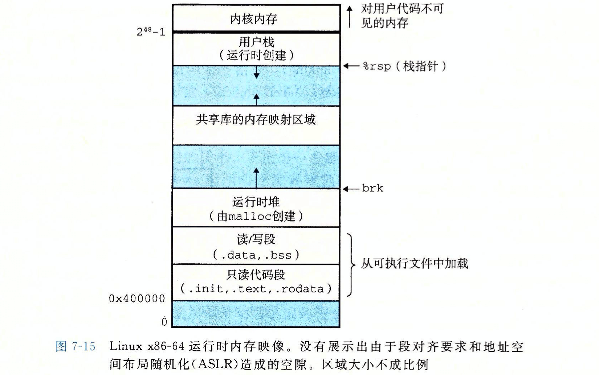

进程在内存中的存储情况主要被分为以下四个部分：

-   **代码段：**即程序的二进制代码，代码段是只读的，可以被多个进程共享。
-   **数据段：**即程序运行时加工处理的对象，包括全局变量和静态变量。
-   **进程控制块(PCB)：**存放在系统区。操作系统通过PCB来控制和管理进程。
-   **堆：**用来存放动态分配的变量。通过调用`malloc`函数动态地向**高地址**分配空间。
-   **栈：**用来实现函数调用。从用户空间的最大地址往**低地址**方向增长。

### 5. 逻辑地址和物理地址

**逻辑地址**宽泛来讲是指与当前数据在内存中的实际物理分配地址无关的访问地址，逻辑地址的范围称作逻辑地址空间。(注意：在计算机中讲逻辑地址就等同于在讲相对地址)

**相对地址**是逻辑地址的一种特例，指当前存储单元相对于程序开始处的存储单元的位置。

**物理地址**又称绝对地址，是指数据在内存中存放的实际位置，物理地址的范围称作物理地址空间。

系统需要使用物理地址来访问内存中的程序数据，所以在进行访存时需要进行**地址变换**。

地址变换指的是将数据的逻辑地址转换为物理地址的这一过程，也叫**地址重定位**。

### 6. 重定位

**重定位**是指将程序文件装入到与其文件内部地址空间不一致的外部地址空间时，需要完成的地址修改过程。

这个过程可能发生在程序文件装入、内存置换和紧凑等过程中。

重定位可分为**静态重定位**和**动态重定位**。

-   静态重定位：程序文件在被装入内存时，一次性完成地址的修改，重定位在程序运行前就已经完成。
-   动态重定位：在CPU访问文件时使用动态地址变换机构这类硬件来自动完成地址变换，重定位发生在程序执行时。

### 7. 程序的装入和链接

从源程序到执行进程主要需经过三个步骤：编译、链接和装入，源程序经过编译成为一组目标模块(在此时形成逻辑地址)，然后经过不同的链接和装入过程成为执行进程。

-   编译：由编译程序将用户源代码编译成若干目标模块。
-   链接：由链接程序将编译后形成的一组目标模块及它们所需的库函数链接在一起，形成一个完整的装入模块。
-   装入：由转入程序将装入模块装入内存运行。

#### 程序的装入

-   绝对装入方式：绝对装入方式是指在预先知道装入位置时，在编译过程中就将逻辑地址转换为物理地址。

-   可重定位装入方式：可重定位装入方式是指在装入的过程中，根据装入位置将装入模块中的逻辑地址修改为物理地址。

-   动态运行时装入方式：动态运行时装入是指模块被装入内存后不更改其中的逻辑地址，逻辑地址转换为物理地址的过程被推迟到模块执行时。系统需要提供一个基址寄存器(记录程序起始地址)来支持这一地址变换过程，即$物理地址=基址寄存器中的程序起始地址+逻辑地址$。

    >   ❗采用动态运行时装入方式，程序在装入内存后，所有地址依然是逻辑地址；只有在程序执行时，才会进行逻辑地址到物理地址的转换。

#### 程序的链接

-   **静态链接方式：**将编译获得的目标模块在装入前链接成一个完整的装配模块后，再将其装入内存。
-   **装入时动态链接：**目标模块一边装入内存一边进行链接。
-   **运行时动态链接：**在运行前不将目标模块链接成整体，而是在程序运行过程中需要用到某一模块时，再将该模块跳入内存进行链接。

### 8. 内存保护

内存保护是指设置一定的机构来保证进程在未被允许的情况下，不能访问分配给其他进程的内存空间，从而保护进程数据不受外界干扰，实现存储安全。

通常的内存保护机构有以下两种：

-   一对上下限寄存器，分别记录当前作业的起始地址和尾址。CPU访存时验证访问地址是否处于二者之间。
-   一个**重定位寄存器**(或基址寄存器)和**界地址寄存器**。重定位寄存器记录作业的起始位置，界地址寄存器记录作业的长度。CPU访存时比较访问地址是否处于起始地址和尾址之间。

### 9. 内存共享

内存共享是指当多个用户进程需要用到同一个程序文件时，只在内存中保留该程序文件的一个副本，令共享该程序文件的进程都指向其所在的内存空间。

由于进程运行时可能会对程序文件进行修改，这会造成不同进程之间的互相影响。所以被共享的内容应当是那些不会被修改的部分，这部分代码被称为**可重入代码**(纯代码)。

通常可以将程序分为**指令部分I**和**数据部分D**，其中的指令部分通常不会被修改。若程序能做到I和D的分离，将有利于进行内存共享。

## 3.1.2 连续分配管理方式

>   连续分配管理方式指系统为需要运行的程序分配一片连续的内存空间，并将其装入到这片空间中。
>
>   这类方式需要将程序文件完整地放入到内存的一片连续空间里，即意味着对于单个程序，其文件的物理地址是相邻的。

### 1. 单一连续分配

单一连续分配方式是指系统将用户区整体分配给一个进程单独使用，该方式只适用于单道程序环境。

在单用户单任务的操作系统中，机器由一个用户独占，不存在其他用户的干扰，所以可以不设置存储器保护措施，该方式安全性较高且容易实现。

单一连续分配方式下操作系统不能并发，CPU有大量时间处于空闲状态，机器运作效率低下。

-   优点：无外部碎片，无需内存保护，安全性较高且容易实现。
-   缺点：由内部碎片，存储器利用率低，操作系统效率低。

### 2. 固定分区匹配

固定分区分配方式是指在初始化时将内存空间分割成固定大小的区域，担忧程序需要运行时，系统从内存中寻找一片合适的空闲分区分配给该程序。等程序运行结束后，系统再将这片区域回收，并从待运行程序队列中选择一个合适大小的程序装入。

#### 分区方法

-   **分区大小相等：**所有用户空间的内存分区大小是一样的，这种方式灵活性较差。
-   **分区大小不等：**根据用户运行程序大小的统计分布规律来决定用户空间的分区大小比例。

#### 内存分配方法

-   需要的数据结构：为了实现固定分区分配方法，系统需建立一张**分区说明表**，用以记录用户空间的区域分配情况。

    -   分区说明表包括分区号、分区大小、起始地址和分配状态四个表项。

    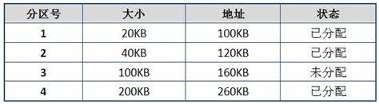

-   程序装入过程：

    -   当待运行程序队列为空时，系统检查分区说明表，为队头程序寻找一片合适大小的空闲分区，然后将其分配给该程序。
    -   对于等分区的方式来说，然后一个可以装下该程序的区域都是等效的合适分区。
    -   对于不等分区的方式来说，常用策略是每次都选择可以装入该程序的最小分区。

-   优缺点分析：

    -   优点：固定分区策略不存在外部碎片且实现简单，是系统开销很小的一种多道程序系统内存分配方式。
    -   缺点：
        -   预先划分区域会导致一些大程序无法装入。
        -   会产生较多的内部碎片。

>   程序在装入某个分区后，可能不会占据满该分区的所有空间，被浪费的这部分分区内部空间就被称之为**内部碎片**。

### 3. 动态分区分配

动态分区分配时在进程装入内存时，根据进程的实际需要，动态地为止分配内存，并使分区的大小正好适合进程的需要。

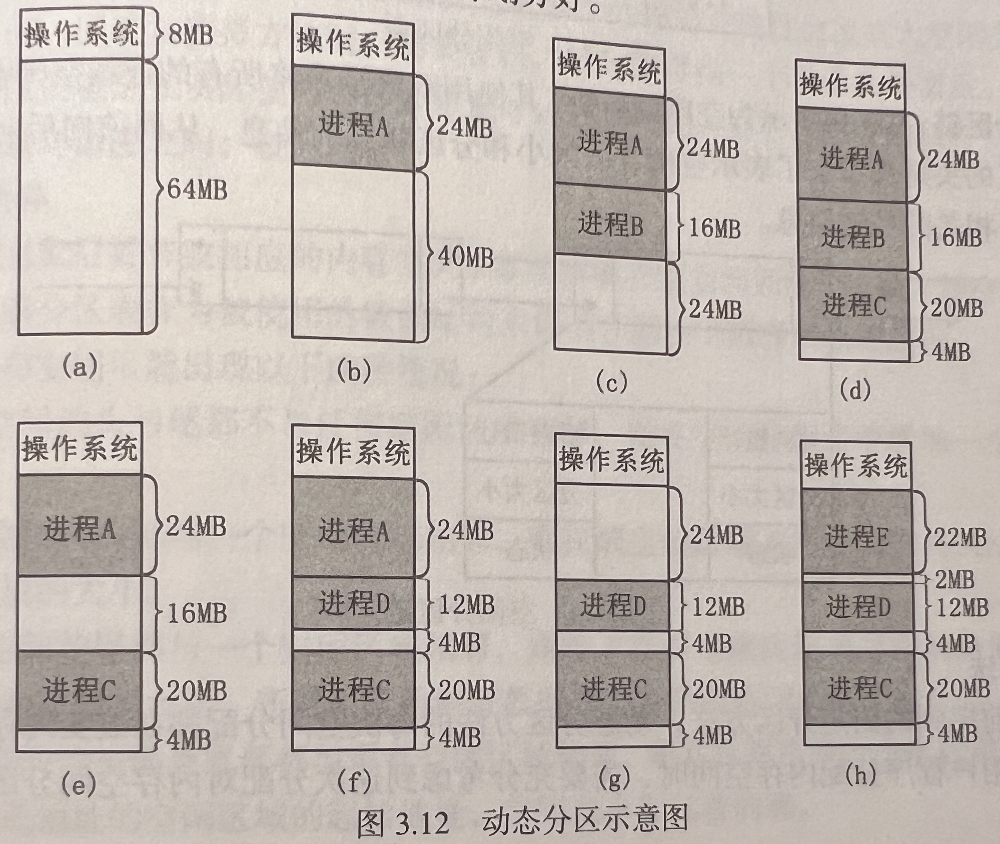

#### 外部碎片和紧凑

-   动态分区随着时间的推移，内存中会产生越来越多小的内存块，内存的利用率也随之下降。这些小的内存块称为**外部碎片**，它存在于所有分区的外部，这与固定分区中的**内部碎片**正好相对。
-   克服外部碎片可以通过**紧凑**技术来解决，即操作系统不时地对进程进行移动和整理。但这需要动态重定位寄存器的支持，且相对费时。

#### 需要的数据结构

-   **空闲分区表：**在系统中设置一个空闲分区表来管理内存，一个连续的空闲空间占用一个表目。表中包括分区号、分区大小、分区起始地址、分区状态等表项。

    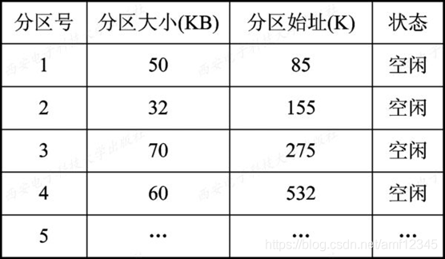

-   **空闲分区链：**使用双向链表将所有的连续空闲空间串起来。空闲分区的头尾都添加了表示空闲分区大小和分区状态的信息，从而前向后向查找都可以快速获得相关的控制信息。

    

#### 分配算法

-   首次适应算法(First Fit, FF)
    -   FF算法是指将空闲分区按照地址升序排序，每一次都从头向后查找，在第一个足以容纳该程序的连续空间中划分出程序所需的空间。
    -   优点：保留了高址空间的大连续空间，利于后续到来的大程序装入。
    -   缺点：频繁在低址部分划分空间，容易在这部分区域留下较多的外部碎片。每次查找都从低址开始，查找开销偏大。
-   循环首次适应算法(Next Fit, NF)
    -   NF算法是指将空闲分区按照地址升序排序，设置一个查找指针从头向后查找，随后的每一次查找都从上次查找后指针的停留位置开始。
    -   优点：该方法可以在一定程度上缓解首次适应算法的两个弊端。
    -   缺点：该方法会将本可以保存在内存末尾的大空闲区域分裂为小空闲区域，会造成缺少大空闲分区的状况，整体效果通常不如首次适应算法。
-   最佳适应算法(Best Fit, BF)
    -   BF算法是指将空闲分区按大小升序排列，依次查找，选择第一个可以容纳程序的空间分配出去。
    -   该方法选取最小的可以容纳程序的空闲分区进行匹配。
    -   优点：能留下更多大分区以满足大进程需求。
    -   缺点：该方式从整体空间的利用效率来看不一定是真正的最佳(会留下许多小空间分区)；该算法需要对空闲分区按大小排序，开销大。
-   最坏适应算法(Worst Fit, WF)
    -   WF算法指选取所有空闲分区中最大的分区来分配给程序，若最大的空闲分区不够大，则分配失败。
    -   优点：可以减少外部碎片的产生。
    -   缺点：
        -   使得内存中缺少大空闲分区。
        -   需要对空闲分区按大小排序，开销大。

#### 回收内存

回收的内存空间会出现以下四种情况：

-   回收空间的头与尾都不与任何空闲区域相邻，则在空闲分区表中增加一个表项来记录该回收空间。
-   回收空间的头部与一个空闲区域相邻，则在该空闲区域表目中的空间大小数据项里加上所回收空闲区域的大小。
-   回收空间的尾部与一个空闲区域相邻，则除了在该空闲区域表目中的空间大小数据项上加上所回收空间区域的大小，还要将起始地址数据项改为回收空间的起始地址。
-   回收空间的头部及尾部都与现有空闲区与相邻，则要合并这两个空闲区域的表项，新表项的起始地址为低地址的空闲区域的起始地址，空间大小为三者的和。

## 3.1.3 非连续分配管理方式

非连续分配管理方式是指将一个完整的程序分割开，放入不相邻的空闲分区中。

非连续分配管理方式有效地解决了连续存储方式中存在的内存浪费问题，不过需要存储额外的索引信息，所以存储密度更低。

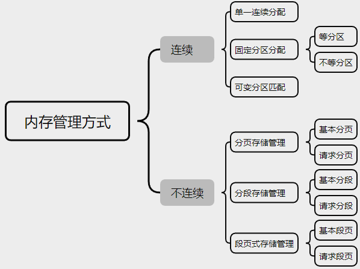

## 3.1.4 基本分页存储管理

>   分页思想：把主存空间划分为大小相等且固定的块，块相对较小，作为主存的基本单位。每个进程也以块为单位进行划分，进程在执行时，以块为单位逐个申请主存中的块空间。

### 1. 分页存储的基本概念

#### 页面和页面大小

进程中的块称为**页**或**页面**，内存中的块称为**页框**或**页帧**。

外存也以同样的单位进行划分，直接称为**块**或**盘块**。

进程在执行时需要申请主存空间，即要为每个页面分配主存中的可用页框(即页与页框一一对应)。

>   ❗页面大小一般设置为2的指数倍
>
>   如果页面设置过大会导致内部碎片的增加，而页面设置过小则会使得一个程序占据过多的页面，使页表变得庞大，降低存储密度。

#### 地址结构

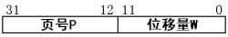

地址结构包括：

-   第一部分为页号P，后一部分为页内偏移量W。
-   地址长度为32位，其中0\~11位为页内地址，即每页大小为4KB；12~31位为页号，即最多允许2^20^页。

>   ❗地址结构决定了虚拟内存的寻址空间有多大。

#### 页表

页表记录页面在内存中对应的物理块号，页表一般存放在内存中。

在配置页表后，进程执行时，通过查找该表，即可找到每页在内存中的物理块号。

页表内包含一系列大小固定的页表项，页表项中记录了进程某一页对应的页框号，页号则隐含在页表项相对页表起始地址的偏移量中。

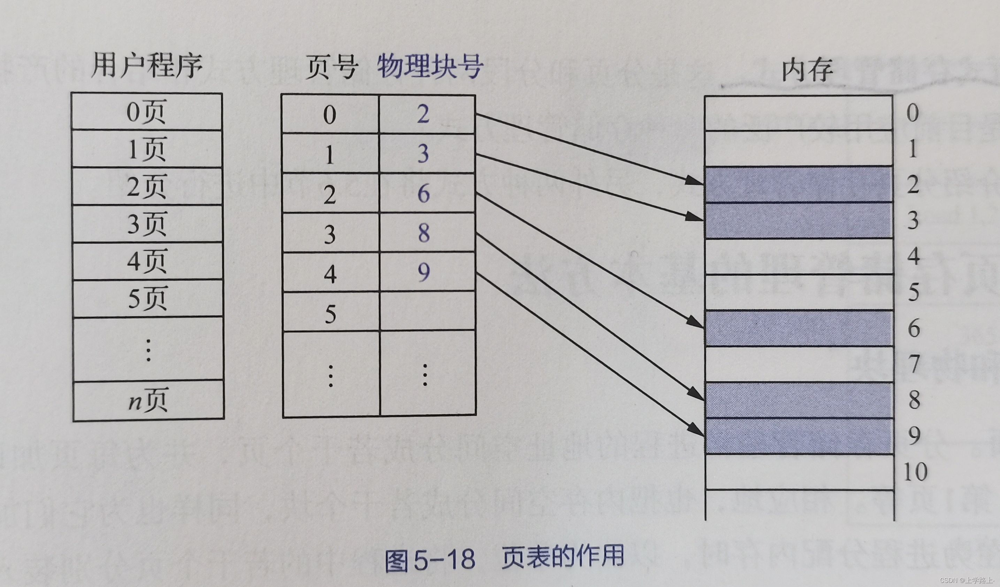

### 2. 基本地址变换机构

地址变换机构的任务是将逻辑地址转换为内存中的物理地址。地址变换是借助于页表实现的。

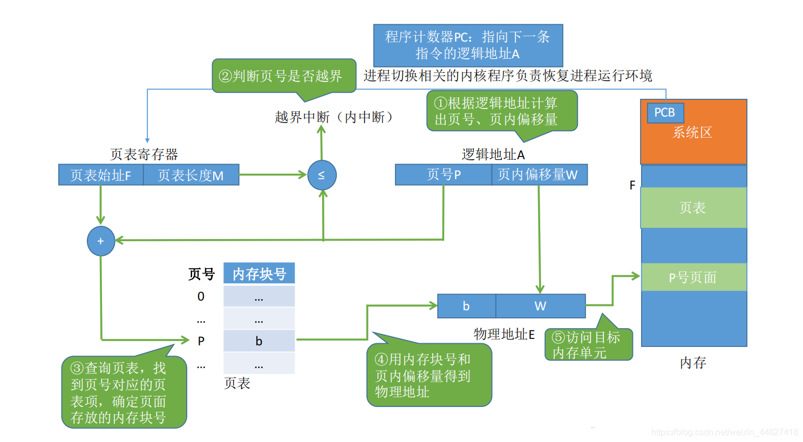

在系统中通常设置一个**页表寄存器**(PTR)，存放页表在内存的起始地址$F$和页表长度$M$。

进程未执行时，$F$和$M$都存放在本进程的PCB中，当进程被调度执行时，才将$F$和$M$装入PTR中。

设页面大小为$L$，逻辑地址A到物理地址E的变换过程如下：

1.   计算页号$P(P=A/L)$和页内偏移量$W(W=A\%L)$。

2.   比较页号$P$和页表长度$M$，若$P\geq M$，则产生越界中断，否则继续执行。

3.   页表中页号$P$对应的$页表项地址=页表起始地址F+页号P\times 页表项长度$，取出该页表项内容$b$，即为物理块号。

     >   ❗页表长度是指一共有多少页，页表项长度是指页地址占多大的存储空间。

4.   计算$E=b\times L + W$，用得到的物理地址$E$去访问内存。

>   ⚠️分页管理方式存在的两个主要问题：
>
>   -   每次访存操作都需要进行逻辑地址到物理地址的转换，**地址转换过程必须足够快，否则访存速度会降低**。
>   -   每个进程引入页表，用于存储映射机制，页表不能太大，否则内存利用率会降低。

### 3. 具有快表的地址变换机构

为了提高访问效率，系统在内存中设置一个具有并行查找能力的高速缓存来存储页表，这个存储器被称之为快表(TLB或相联存储器)。

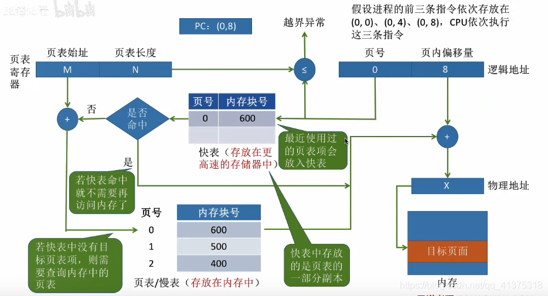

在具有快表的分页机制中，地址的变换过程如下：

-   CPU给出逻辑地址后，由硬件进行地址转换，将页号送入高速缓存寄存器，并将此页号与快表中的所有页号进行比较。
-   若找到匹配的页号，说明说要访问的页表项在快表里，则直接从中取出该页对应的页框号，与页内偏移量拼接形成物理地址。
-   若未找到匹配的页号，则需要访问主存中的页表，读出页表项后，应同时将其存入快表，以便后面可能的再次访问。若快表已满， 则须按特定的算法淘汰一个旧页表项。

### 4. 两级和多级页表

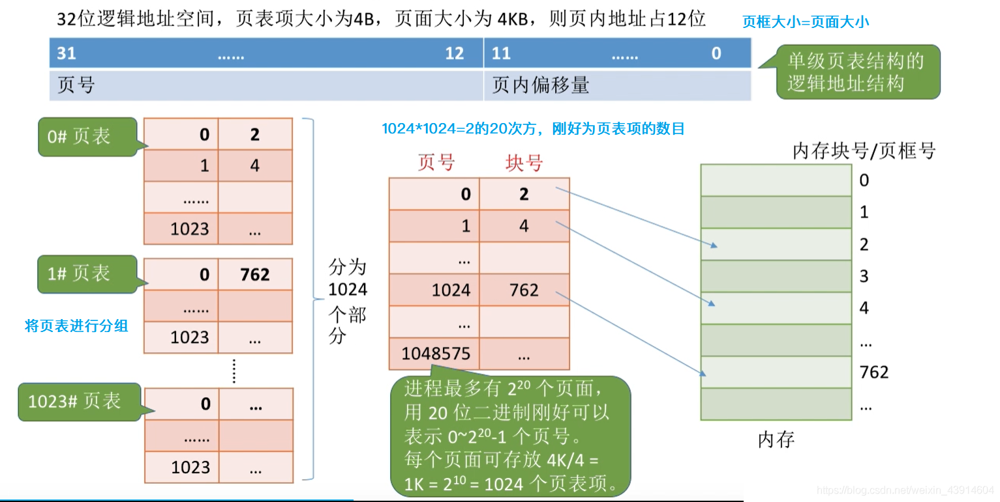

## 3.1.5 基本分段存储管理

### 1. 分段存储管理方式的特点

分段系统是指将程序划分为大小不等的块，这些块称为**段**。

分段存储管理方式具有以下特点：

-   方便编程
-   信息共享
-   信息保护
-   动态增长
-   动态链接

### 2. 分段系统的基本原理

#### 地址结构

分段系统与分页系统类似，其地址结构有段号和段内地址两部分组成。

在页式系统中，逻辑地址的页号和页内偏移量对用户是透明的，但在段式系统中，段号和段偏移量必须由用户显式提供，在高级程序设计语言中，这个工作由编译系统完成。

#### 段表

由于段与段之间的大小并不相等，所以想要记录一个段的信息必须要有两个变量，通常以段长和起始地址作为变量。

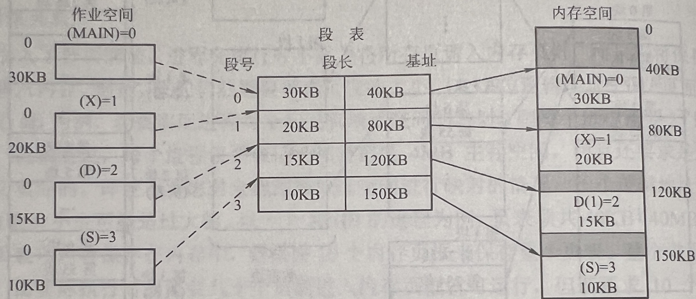

段表项中包含该段在内存中的起始地址和段长两个数据项，而其段号为该表项在段表中所处的位置次序。

#### 地址变换机构

分段存储管理方式的地址转换过程如下：

-   从逻辑地址$A$中去除前几位为段号$S$，后几位为段内偏移量$W$。
-   比较段号$S$和段表长度$M$，若$S\geq M$，则产生越界中断，否则继续执行。
-   段表中段号$S$对应的$段表项地址=段表起始地址F+段号S\times段表项长度$，取出该段表项的前几位得到段长$C$。若$段内偏移量\geq C$，则产生越界中断，否则继续执行。
-   取出段表项中该段的起始地址$b$，计算$E=b+W$，用得到的物理地址$E$去访问内存。

#### 段的共享与保护

在分段系统中，**段的共享**是通过两个作业的段表中相应表项指向被共享的段的同一个物理副本来实现的。

当一个作业正从共享段中读取数据时，必须防止另一个作业修改此共享段中的数据。不能修改的代码称为**纯代码**或**可重入代码**，这样的代码和不能修改的数据可以共享，而可修改的代码和数据不能共享。

分段管理的保护方法主要有两种：**存取控制保护**和**地址越界保护**。

地址越界保护将段表寄存器中的段表长度与逻辑地址中的段号比较，若段号大于段表长度，则产生越界中断；再将段表项中的段长和逻辑地址中的段内偏移进行比较，若段内偏移大于段长，也会产生越界中断。枫叶管理只需要判断页号是否越界，页内偏移是不可能越界的。

## 3.1.6 段页式管理

在段页式系统中，作业的地址空间首先被分为若干逻辑段，每段都有自己的段号，然后将每段分成若干大小固定的页。

对内存空间的管理仍然和分页存储管理一样，将其分成若干和页面大小相同的存储块，对内存的分配以存储块为单位。

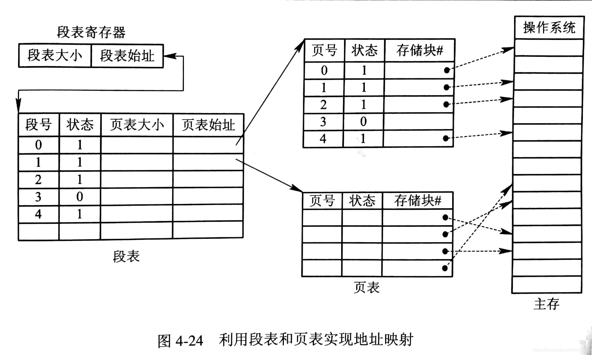

#### 地址结构

段页式存储方式的地址结构由高位部分的段号、中间部分的页号和地位部分的页内偏移量三个部分共同组成。

#### 地址变换机构

段页式存储方式需要为整个进程提供一个段表，并为每一个段提供一个页表。

地址变换过程如下：

-   用虚拟地址中的段号部分到段表中进行查询，获得该段号对应页表的首地址。
-   通过该首地址找到相应的页表。
-   用虚拟地址中的页号部分到页表中进行查询，获得该页号所对应的内存块号。
-   使用该内存块号与虚拟地址中页内偏移量凭借获得对应的物理地址。

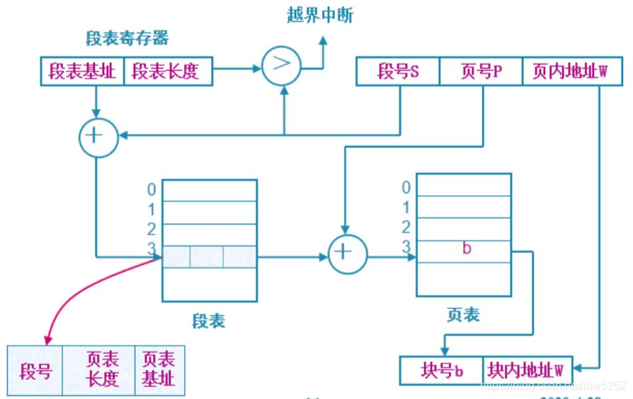

# 3.2 虚拟内存管理

## 3.2.1 虚拟存储器概述

### 1. 传统存储管理方式的特征

-   一次性：作业必须一次性全部装入内存后，才会开始运行。
    -   当作业很大而不能全部被装入内存时，将使该作业无法运行。
    -   当大量作业要求运行时，由于内存不足以容纳所有作业，只能少数作业先运行，导致多道程序的下降。
-   驻留性：作业被装入内存后，就一直驻留在内存中，其任何部分都不会被换出，直至作业运行结束。

### 2. 虚拟存储器概念

虚拟存储器是一种从逻辑上扩充内存的方法，具有请求调入功能和置换功能。

-   **请求调入：**在采用非连续存储管理方式的基础上，只调入程序文件的一部分页面进入内存，当进程需要用到未调入内存的程序文件时，再从磁盘中调入。
-   **内存置换：**当请求调入遇到内存已满的情况时，系统需要从内存中选择一部分暂时用不上的页面调出，腾出的空间用来调入当前需要的页面。

### 3. 局部性原理

>   从广义上讲，快表、页高速缓存及虚拟内存技术都属于**高速缓存**技术，这个技术所依赖的原理就是**局部性原理**。局部性原理既适用于程序结构，又适用于数据结构。

局部性原理表现在以下两个方面：

-   **时间局部性：**程序中的某条指令一旦执行，不久后该指令可能再次执行；某数据被访问过，不久后该数据可能再次被访问。产生的原因是程序中存在着大量的循环操作。
-   **空间局部性：**一旦程序访问了某个存储单元，在不久后，其附近的存储单元也将被访问，即程序在一段时间内所访问的地址，可能集中在一定的范围之内。

### 4. 虚拟存储器的三大特征

-   多次性：是指无须在作业运行时一次性地全部装入内存，而允许被分成多次调入内存运行，即只需将当前要运行的那部分程序和数据装入内存即可开始运行。以后每当要运行到尚未调入的那部分程序时，再将它调入。
-   对换性：无须在作业运行时一直常驻内存，在进程运行期间，允许将那些暂不使用的程序和数据从内存调至外存的对换区，待以后需要时再将它们从外存调至内存。
-   虚拟性：从逻辑上扩充内存的容量，使用户所看到的内存容量远大于实际的内存容量。

### 5. 虚拟内存技术的实现

>   虚拟内存技术允许将一个作业分多次调入内存
>
>   采用连续分配方式时，会使相当一部分内存都处于暂时或“永久”的空闲状态，造成内存资源的严重浪费，而且也无法从逻辑上扩大内存容量。

虚拟内存的实现有以下三种方式：

-   请求分页存储管理
-   请求分段存储管理
-   请求段页式存储管理

不管哪种方式，都需要有一定的硬件支持。一般需要的支持有以下几个方面：

-   一定容量的内存和外存。
-   页表机制(或段表机制)，作为主要的数据结构。
-   中断机构，当用户程序要访问的部分尚未调入内存时，则产生中断。
-   地址变换机构，逻辑地址到物理地址的变换。

## 3.2.2 请求分页管理方式

请求分页存储管理方式是虚拟存储器的最常用实现方法，该方法是指在分页管理的基础上，增加**请求调入**和**内存置换**两个功能。

### 1. 请求页表机制

请求页表在传统页表的基础上增加了**状态位**、**访问字段**、**修改位**和**外存地址**四个新字段，用于支持请求调入和内存置换的功能实现。

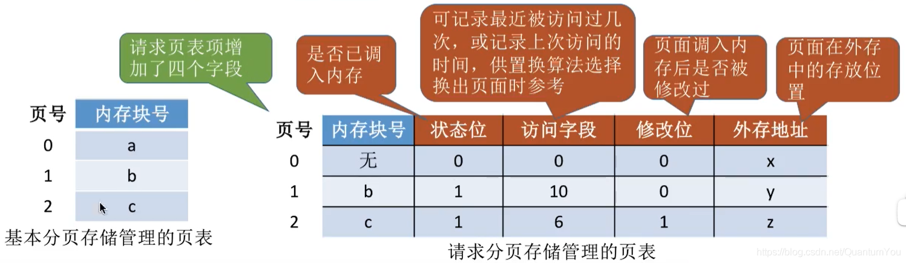

### 2. 缺页中断机构

CPU访问的页面不存在于内存中时，会产生缺页中断来调入相应页面。缺页中断作为中断的一种，与一般中断具有相同的流程。

缺页中断的特别之处：

-   CPU在每条指令的执行周期结束之后，才会去处理一般中断；而缺页中断触发时，CPU就会开始对其进行处理。
-   在一条指令的执行过程中缺页中断能被多次触发，所以相关硬件机构需要能记录多次中断的CPU状态，以便结束之后能被恢复。

### 3. 地址变换机构

请求分页系统的地址变换与传统分页系统的主要区别就在于加入了缺页中断流程。

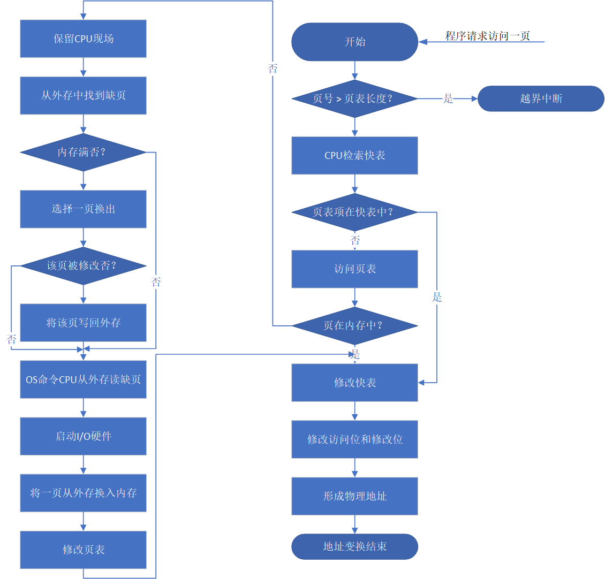

请求分页形成物理地址的流程如下：

-   系统按照传统分页管理方式进行地址转换，若快表命中，则可直接从快表中取出该页面的页框号，若快表未命中则检查页表。
-   检查页表时若页面存在于内存中，则在页表中取出相应页框号。
-   检查页表时若页面不在内存，则需要进行缺页中断处理。当页面被成功调入内存后，系统获得页框号并修改快表。
-   最后将页框号和页内偏移量拼接成相应的而物理地址。

## 3.2.3 页框分配

### 1. 驻留集大小

驻留集指系统为进程分配的页框的集合，分配驻留集需要考虑以下几点：

-   分配给一个进程的页框越少，驻留在主存中的进程就越多，从而可以提高CPU的利用率。
-   若一个进程在主存中的页面过少，则尽管有局部性原理，缺页率仍相对较高。
-   若分配的页框过多，则由于局部性原理，对该进程的缺页率没有太明显的影响。

>   ⚠️缺页率：系统访问内存时缺页的次数与总访问次数的比值。

### 2. 内存分配策略

内存分配策略分为固定分配和可变分配两种，**固定分配**是一种事先的估算分配，可以是对每一个进程都分配同样的页框数量，也可以是根据进程大小来分配不同的页框数量。

由于影响进程所需页框数的因素过多，要事先获得合适的页框数十分困难，所以**可变分配**在大多数时候更加有效。可变分配是在初始分配结束后，观察进程的运行情况，再据此对分配数量做调整。

当进程的所有页框被占满时就需要进行页面置换，分为全局置换和局部置换两种。**局部置换**是指置换操作只能作用在隶属于本程序的物理块上，而**全局置换**是指置换操作可作用在系统所保留的空闲物理块及任意用户程序下属的物理块上。

将分配与置换组合一下会有三种策略：

-   **固定分配局部置换：**为每个进程分配固定数量页框，页面置换也只在这些页框上进行。

    >   由于全局置换一定会导致进程所拥有的页框数量变化，所以不存在固定分配全局置换的策略。

-   **可变分配局部置换：**该方式与固定分配局部置换在置换权限方面相同，二者都只能在进程所拥有的页框中进行置换，这可以有效保护进程之间互不干扰。

-   **可变分配全局置换：**系统可以维护一个空闲页框队列，每当有程序发生缺页时就为其分配一个空闲页框。当不存在空闲页框时，就从整个内存空间中选出一个合适的页面换出。

### 3. 物理块调入算法

采用固定分配策略时，将系统中的空闲物理块分配给各个进程，可采用下述三种算法：

-   **平均分配算法：**将系统中所有可供分配的物理块平均分配给各个进程。
-   **按比例分配算法：**根据进程的大小按比例分配物理块。
-   **优先权分配算法：**为重要和紧迫的进程分配较多的物理块。

>   💡通常将可分配的物理块分成两部分：一部分按比例分配给各个进程，另一部分根据优先权分配。

### 4. 调入页面的时机

为确定系统将进程运行时所缺的页面调入内存的时机，可采取以下两种调页策略：

-   **预调页策略：**根据局部性原理，相邻的页面很有可能在接下来被使用。所以可以在缺页中断时，将当前所需页面的相邻页面也一并调入。
-   **请求调入策略：**该策略每次缺页中断只调入一个页面，I/O频率较高。但其不存在无用调入页且实现简单，所以目前虚拟存储器大多用此策略。

>   💡预调入实际上就是运行前的调入，请求调页实际上就是运行期间调入。

### 5. 从何处调入页面

请求分页系统中的外存分为两部分：用于存放文件的文件区和用于存放对换页面的对换区。

对换区采用连续分配方式，而文件区采用离散分配方式，因此对换区的I/O速度明显快于文件区。

当发生缺页请求时，系统从何处调入页面就分为三种情况：

-   **系统拥有足够的对换区空间：**可以全部从对换区调入所需页面，以提高调页速度。
-   **系统缺少足够的对换区空间：**凡是不会被修改的文件都直接从文件区调入；而当换出这些页面时，由于它们未被修改而不必再将它们换出。
-   **UNIX方式：**未运行过的页面都存放在文件区并直接从文件区调入，换出的页面才放入对换区，后续再次用到时则从对换区调入。

### 6. 如何调入页面

-   当进程所访问的页面不在内存中时，便向CPU发出缺页中断，中断响应后便转入缺页中断处理程序。
-   该程序通过查找页表得到该页的物理块，此时如果内存未满，则启动磁盘I/O，将所缺页调入内存，并修改页表。
-   如果内存已满，则先按某种置换算法从内存中选出一页准备换出；
    -   如果该页未被修改过，则无须将该页写回磁盘；
    -   如果该页已被修改，则必须将该页写回磁盘，然后将所缺页调入内存，并修改页表中的响应表项。
-   调入完成后，进程就可以利用修改后的页表形成所要访问数据的内存地址。

## 3.2.4 页面置换算法

置换页面的完整过程可以概括为以下三步：

-   根据当前为该进程分配的页框数和其已使用页框数，判断是否页框已满。根据相关策略，确定是否置换。

    当所有页框已被使用时：

    -   若为可变分配，则额外分配页框。
    -   若为固定分配，则需要置换。

-   确定置换范围：

    -   局部置换，只能从属于当前进程的页面选取。
    -   全局置换，既可以从当前进程页面中选取，也可从其他用户进程页面中选取。

-   按照一定的页面置换方法，选取一个合适的页面。

### 1. 最佳置换算法(OPT)

最佳置换算法选择的被淘汰页面是以后永不使用的页面，或者是在最长时间内不再被访问的页面，以保证获得最低的缺页率。

❗由于人们目前无法预知进程在内存下的若干页面中哪个是未来最长时间内不再被访问的，因而该算法无法实现，但可以利用这个算法去评价其他算法。

### 2. 先进先出页面置换算法(FIFO)

FIFO算法是指每次置换都将最早被调入的页面调出内存。该算法是基于队列实现的，存在Belady异常。即在一定情况下，增加为进程分配的页框数，缺页率反而会增加。

| 页面走向 | 4    | 3    | 2    | 1    | 4    | 3    | 5    | 4    | 3    | 2    | 1    | 5    |
| -------- | ---- | ---- | ---- | ---- | ---- | ---- | ---- | ---- | ---- | ---- | ---- | ---- |
| 物理块1  | 4    | 4    | 4    | 4    | 4    | 4    | 4    | 4    | 4    | 4    | 1    | 1    |
| 物理块2  |      | 3    | 3    | 3    | 3    | 3    | 3    | 3    | 3    | 3    | 3    | 3    |
| 物理块3  |      |      | 2    | 2    | 2    | 2    | 2    | 2    | 2    | 2    | 2    | 2    |
| 物理块4  |      |      |      | 1    | 1    | 1    | 5    | 5    | 5    | 5    | 5    | 5    |
| 是否缺页 | Y    | Y    | Y    | Y    | N    | N    | Y    | N    | N    | N    | Y    | N    |

❗FIFO没有利用上局部性原理，其性能极差，所以几乎不会被使用。

### 3. 最近最久未使用置换算法(LRU)

选择最近最长时间未访问过的页面予以淘汰，它认为过去一段时间内未访问过的页面，在最近的将来可能也不会被访问。

该算法为每个页面设置一个访问字段，用来记录页面自上次被访问以来所经历的时间，淘汰页面时选择现有页面中值最大的予以淘汰。

| 页面走向        | 4    | 3    | 2    | 1    | 4    | 3    | 5    | 4    | 3    | 2    | 1    | 5    |
| --------------- | ---- | ---- | ---- | ---- | ---- | ---- | ---- | ---- | ---- | ---- | ---- | ---- |
| 物理块1（表尾） | 4    | 4    | 4    | 4    | 3    | 2    | 1    | 1    | 1    | 5    | 4    | 3    |
| 物理块2         |      | 3    | 3    | 3    | 2    | 1    | 4    | 3    | 5    | 4    | 3    | 2    |
| 物理块3         |      |      | 2    | 2    | 1    | 4    | 3    | 5    | 4    | 3    | 2    | 1    |
| 物理块4（表头） |      |      |      | 1    | 4    | 3    | 5    | 4    | 3    | 2    | 1    | 5    |
| 是否缺页        | Y    | Y    | Y    | Y    | N    | N    | Y    | N    | N    | Y    | Y    | Y    |

❗LRU算法的性能较好，但需要寄存器和栈的硬件支持。LRU是堆栈类的算法。理论上可以证明，堆栈类算法不可能出现Belady异常。FIFO算法基于队列实现，不是堆栈类算法。

### 4. 最少使用置换算法(LFU)

LFU算法是指将最近使用次数最少的页面置换出内存。

LFU算法与LRU算法的思想相同，其区别只在于，LRU关注的是某一页面上一次使用的时间，而LFU关注的是页面在最近一段时间内的使用频率。

### 5. 简单的时钟置换算法(CLOCK)

时钟置换算法将所有页面链接成一个循环队列，每个页面置一个访问位，每次该页面被访问到，都将访问位设为1。当发生置换时，查询指针前进一位。若所指向的页面访问位为0，则换出该页。若访问位为1，则将其置为0，且查询指针前进一位。循环往复直到找到第一个访问位为0的页面换出，实际上一次换出最多进行两轮扫描。

CLOCK算法是LRU的一种近似算法，它并不追求严格的最近最久未使用，可以认为是将最近较久未访问的页面换出。CLOCK算法实现起来相对较简单，不需要太多的硬件支持。

### 6. 改进的时钟算法(CLOCK)

将一个页面换出时，若该页已被修改过，这要将该页写回磁盘，若该页未被修改过，则不必将它写回磁盘。

在**改进型CLOCK算法**中，增加了置换位代价——修改位。

改进后的CLOCK算法按照如下的优先级来选择调出页面(P表示访问位，M表示修改位) ：

-   (P = 0, M = 0)：最近未被访问且未被修改，优先级最高。
-   (P = 0, M = 1)：最近未被访问但被修改，优先级次之。
-   (P = 1, M = 0)：最近有被访问但未被修改，优先级第三。
-   (P = 1, M = 1)：最近有被访问且被修改，优先级最低。

在实际的实现中，系统要寻找的是属于第一类或第二类的页面，然后将其换出，最多扫描四轮。具体流程如下：

-   第一轮，寻找第一类，找到第一个即换出，未找到则进行第二轮。
-   第二轮，寻找第二类，找到第一个即换出，并且每次查找失败都将该页面的访问位置为0，若未找到则进行第三轮。
-   第三轮，寻找第一类，找到第一个即换出，未找到则进行第四轮。
-   第四轮，寻找第二类，找到第一个即换出，这一轮是一定能找到的。

### 7. 页面置换算法总结

|    方法     | 概述                                                         | 优缺点                                                       |
| :---------: | ------------------------------------------------------------ | ------------------------------------------------------------ |
|     OPT     | 置换时把将来不会再使用或者最长时间不再使用的页面调出。       | 性能最好，但是无法实现，可作为衡量算法性能的标杆。           |
|    FIFO     | 置换时将最早被调入的页面调出内存。                           | 实现简单，但性能较差且存在Belady异常。                       |
|     LRU     | 置换时将最长时间未被使用的页面置换出内存。                   | 性能较好，接近OPT。但是实现复杂，需要特定的硬件支持。        |
|    CLOCK    | 循环扫描页面，将首个访问位=0的页面置换出内存。遇见访问位=1的页面时，将其访问位置为0。 | 实现简单，效果略差于LRU。未考虑页面是否修改，写磁盘次数多于改进型CLOCK。 |
| 改进型CLOCK | 看[改进的时钟算法](### 6. 改进的时钟算法)                    | 实现简单，效果好于CLOCK但依旧略差于LRU。                     |

### 3.2.5 内存映射文件

内存映射文件是指进程通过发起一个系统调用，实现从进程对应磁盘文件到其虚拟内存空间中某部分的映射。这一机制可以提升系统的I/O效率，从而减少虚拟存储器带来的I/O开销。

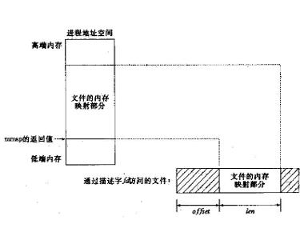

在一般的I/O操作中，从磁盘调入的文件会先写入到交换缓冲区，然后再统一由CPU写入到用户区。

内存映射文件的具体步骤：

-   进程通过系统调用将文件映射到其虚拟内存空间的一部分，但实际上并未将这一文件调入到物理内存。
-   进程需要访问该文件的内容时查询页表，发现映射的文件并未调入物理内存，产生缺页异常。
-   从交换缓冲区寻找所需页面，若无则从磁盘调入相应页面。
-   此后进程可使用指针直接对该文件进行操作，若写操作产生了脏数据，系统会自动在一段时间后将其写回磁盘。

## 3.2.6 虚拟存储器性能分析

### 1. 访问内存的有效时间

#### 不考虑快表

考虑一级页表，设访问内存时间为$\alpha$，处理缺页中断的时间为$\beta$。

-   **若所访问的页面在内存中：**
    -   系统第一次访问内存中页表，获得访问页的物理地址，用时$\alpha$
    -   第二次访问内存，获得访问页，用时$\alpha$
    -   $EAT=\alpha+\alpha$
-   **若所访问的页面不在内存中：**
    -   访问内存中页表，发现访问页未调入内存，用时$\alpha$
    -   进行缺页中断处理，用时$\beta$
    -   获得物理地址后进行第二次访问内存，获得访问页，用时$\alpha$
    -   $EAT=\alpha+\beta+\alpha$
-   引入缺页率概念，若缺页则时间的计算应当是第二种情况，反之是第一种。
    -   可以计算出系统的EAT计算公式为(设缺页率为$f$)：$EAT=(1-f)\times(\alpha+\alpha)+f\times(\alpha+\beta+\alpha)$
    -   化简如下：$EAT=2\alpha+f\times\beta$
    -   即至少会有两次对内存的的访问，而缺页中断只有在出现缺页时需要。

#### 考虑快表的情况

设访问快表的时间为$\epsilon$。

-   **访问页在内存且其页表项在快表中：**
    -   访问快表，获得访问页的物理地址，用时$\epsilon$
    -   访问内存。获得访问页，用时$\alpha$
    -   $EAT=\epsilon+\alpha$
-   **访问页在内存，但其页表项未被调入快表：**
    -   系统访问快表，未命中，用时$\epsilon$
    -   访问内存中的页表，获得物理地址，用时$\alpha$
    -   第二次访问快表对其进行修改，用时$\epsilon$
    -   第二次访问内存，获得访问页，用时$\alpha$
    -   $EAT=\epsilon+\alpha+\epsilon+\alpha$
-   **访问页不在内存中，自然快表也不能命中：**
    -   系统访问快表，未命中，用时$\epsilon$
    -   访问内存页表，发现访问页未被调入内存，用时$\alpha$
    -   进行缺页中断处理，用时$\beta$
    -   页面被调入后修改快表，用时$\epsilon$
    -   使用获得的物理地址访问内存获得访问页，用时$\alpha$
    -   $EAT=\epsilon+\alpha+\beta+\epsilon+\alpha$
-   考虑快表命中率$\rho$和虚拟存储器缺页率$f$后，系统$EAT$计算如下：
    -   $EAT=\rho\times(\epsilon+\alpha)+(1-\rho)\times(1-f)\times(\epsilon+\alpha+\beta+\epsilon+\alpha)+(1-\rho)\times f \times\beta$
    -   化简：$EAT=\epsilon+\alpha+(1-\rho)\times(\epsilon+\alpha)+(1-\rho)\times f \times\beta$

## 3.2.7 抖动和工作集

### 1. 抖动

在页面置换过程中，一种最糟糕的情形是，刚刚换出的页面马上又要换入主存，刚刚换入的页面马上又要换出主存，这种频繁的页面调入行为被称为**抖动**或**颠覆**。

>   系统发生抖动的根本原因是，系统中同时运行的进程太多，由此分配给每个进程的物理块太少，不能满足进程正常运行的基本要求，致使每个进程在运行时频繁地出现缺页，必须请求系统将所缺页面调入内存。

抖动是进程运行时出现的严重问题，必须采取相应措施解决它。

### 2. 工作集

工作集是指在某段时间间隔内，进程要访问地页面集合。基于局部性原理，可以用最近访问过的页面来确定工作集。

工作集可以记为一个二元函数$w(t, \Delta)$，$t$表示当前的时刻，$\Delta$表示一段时间间隔，通常将这一段时间称为工作集的“窗口尺寸”，即$t$在$t$时刻接下来的$\Delta$长度的时间里，进程实际需要访问页面的集合。

### 3. 抖动的预防方法

-   采取局部置换策略。
-   利用工作集概念(即调入新作业时，需要利用工作集理论来确认该次调入是否会对系统缺页率产生较大影响。)
-   选择暂停进程：发现系统缺页率过高时，将一些进程暂停，释放内存空间并将其交给缺页率较高的进程使用。
