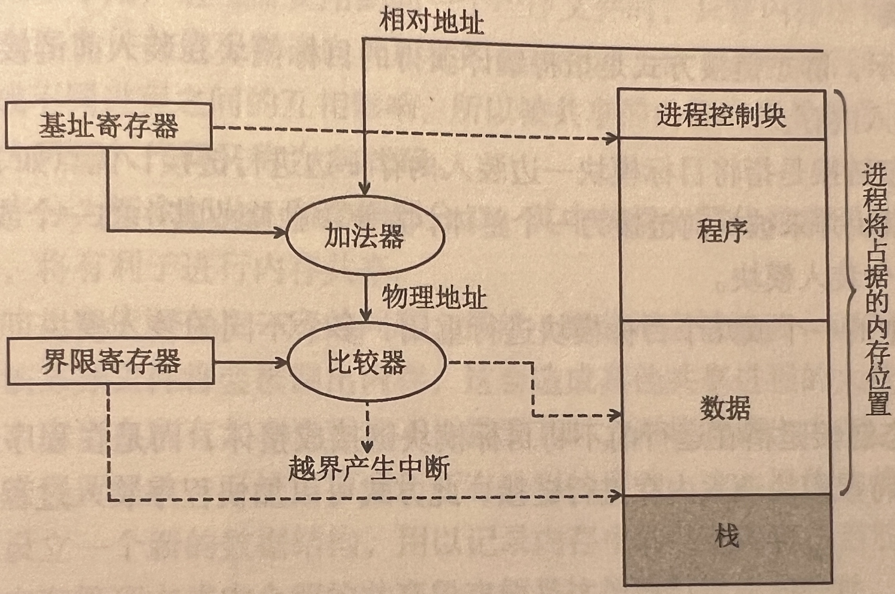

# 3.1 基本内存管理

## 3.1.1 基本概念

### 1. 内存管理

内存管理主要包括以下内容：

-   **内存的分配与回收：**采取不同的分配与回收策略，记录内存的使用情况，使计算机系统可以合理高效地利用内存资源。
-   **地址转换：**由于进程的逻辑地址与其在内存中的物理地址可能存在不一致，系统需要对进程的地址进行转换，即将进程的逻辑地址转换为物理地址。
-   **内存空间的逻辑扩充：**采用虚拟存储器技术将内存从逻辑上进行扩充，从而高效利用内存并解决了大程序无法装入内存的问题。
-   **内存共享：**但多个进程共用同一程序文件时，只在内存中保留一个副本，并让共享进程都能访问这一部分内存。
-   **内存保护：**采用界地址保护和存取访问控制等方式，控制进程只能访问自己有权访问的内存部分，从而防止用户进程对操作系统的干扰或用户进程之间的互相干扰。

### 2. 多层结构存储系统

### 3. 内存空间结构

内存由一系列大小相同的存储单元组成，存储单元从0开始依次编址，一般来说编址单位可以是字节或字。

内存中常见的单位换算：$1T=2^{10}G=2^{20}M=2^{30}K=2^{40}$

内存空间通常被划分为**系统区**和**用户区**。系统区仅供操作系统使用，位于内存的低址部分。

### 4. 进程的内存映像

进程的内存映像是指系统在内存中存放可执行程序文件的方式。

进程在内存中的存储情况主要被分为以下四个部分：

-   **代码段：**即程序的二进制代码，代码段是只读的，可以被多个进程共享。
-   **数据段：**即程序运行时加工处理的对象，包括全局变量和静态变量。
-   **进程控制块(PCB)：**存放在系统区。操作系统通过PCB来控制和管理进程。
-   **堆：**用来存放动态分配的变量。通过调用`malloc`函数动态地向**高地址**分配空间。
-   **栈：**用来实现函数调用。从用户空间的最大地址往**低地址**方向增长。

### 5. 逻辑地址和物理地址

**逻辑地址**宽泛来讲是指与当前数据在内存中的实际物理分配地址无关的访问地址，逻辑地址的范围称作逻辑地址空间。(注意：在计算机中讲逻辑地址就等同于在讲相对地址)

**相对地址**是逻辑地址的一种特例，指当前存储单元相对于程序开始处的存储单元的位置。

**物理地址**又称绝对地址，是指数据在内存中存放的实际位置，物理地址的范围称作物理地址空间。

系统需要使用物理地址来访问内存中的程序数据，所以在进行访存时需要进行**地址变换**。

地址变换指的是将数据的逻辑地址转换为物理地址的这一过程，也叫**地址重定位**。

### 6. 重定位

**重定位**是指将程序文件装入到与其文件内部地址空间不一致的外部地址空间时，需要完成的地址修改过程。

这个过程可能发生在程序文件装入、内存置换和紧凑等过程中。

重定位可分为**静态重定位**和**动态重定位**。

-   静态重定位：程序文件在被装入内存时，一次性完成地址的修改，重定位在程序运行前就已经完成。
-   动态重定位：在CPU访问文件时使用动态地址变换机构这类硬件来自动完成地址变换，重定位发生在程序执行时。

### 7. 程序的装入和链接

从源程序到执行进程主要需经过三个步骤：编译、链接和装入，源程序经过编译成为一组目标模块(在此时形成逻辑地址)，然后经过不同的链接和装入过程成为执行进程。

-   编译：由编译程序将用户源代码编译成若干目标模块。
-   链接：由链接程序将编译后形成的一组目标模块及它们所需的库函数链接在一起，形成一个完整的装入模块。
-   装入：由转入程序将装入模块装入内存运行。

#### 程序的装入

-   绝对装入方式：绝对装入方式是指在预先知道装入位置时，在编译过程中就将逻辑地址转换为物理地址。

-   可重定位装入方式：可重定位装入方式是指在装入的过程中，根据装入位置将装入模块中的逻辑地址修改为物理地址。

-   动态运行时装入方式：动态运行时装入是指模块被装入内存后不更改其中的逻辑地址，逻辑地址转换为物理地址的过程被推迟到模块执行时。系统需要提供一个基址寄存器(记录程序起始地址)来支持这一地址变换过程，即$物理地址=基址寄存器中的程序起始地址+逻辑地址$。

    >   ❗采用动态运行时装入方式，程序在装入内存后，所有地址依然是逻辑地址；只有在程序执行时，才会进行逻辑地址到物理地址的转换。

#### 程序的链接

-   **静态链接方式：**将编译获得的目标模块在装入前链接成一个完整的装配模块后，再将其装入内存。
-   **装入时动态链接：**目标模块一边装入内存一边进行链接。
-   **运行时动态链接：**在运行前不将目标模块链接成整体，而是在程序运行过程中需要用到某一模块时，再将该模块跳入内存进行链接。

### 8. 内存保护

内存保护是指设置一定的机构来保证进程在未被允许的情况下，不能访问分配给其他进程的内存空间，从而保护进程数据不受外界干扰，实现存储安全。

通常的内存保护机构有以下两种：

-   一对上下限寄存器，分别记录当前作业的起始地址和尾址。CPU访存时验证访问地址是否处于二者之间。
-   一个**重定位寄存器**(或基址寄存器)和**界地址寄存器**。重定位寄存器记录作业的起始位置，界地址寄存器记录作业的长度。CPU访存时比较访问地址是否处于起始地址和尾址之间。

### 9. 内存共享

内存共享是指当多个用户进程需要用到同一个程序文件时，只在内存中保留该程序文件的一个副本，令共享该程序文件的进程都指向其所在的内存空间。

由于进程运行时可能会对程序文件进行修改，这会造成不同进程之间的互相影响。所以被共享的内容应当是那些不会被修改的部分，这部分代码被称为**可重入代码**(纯代码)。

通常可以将程序分为**指令部分I**和**数据部分D**，其中的指令部分通常不会被修改。若程序能做到I和D的分离，将有利于进行内存共享。

## 3.1.2 连续分配管理方式

>   连续分配管理方式指系统为需要运行的程序分配一片连续的内存空间，并将其装入到这片空间中。
>
>   这类方式需要将程序文件完整地放入到内存的一片连续空间里，即意味着对于单个程序，其文件的物理地址是相邻的。

### 1. 单一连续分配

单一连续分配方式是指系统将用户区整体分配给一个进程单独使用，该方式只适用于单道程序环境。

在单用户单任务的操作系统中，机器由一个用户独占，不存在其他用户的干扰，所以可以不设置存储器保护措施，该方式安全性较高且容易实现。

单一连续分配方式下操作系统不能并发，CPU有大量时间处于空闲状态，机器运作效率低下。

-   优点：无外部碎片，无需内存保护，安全性较高且容易实现。
-   缺点：由内部碎片，存储器利用率低，操作系统效率低。

### 2. 固定分区匹配

固定分区分配方式是指在初始化时将内存空间分割成固定大小的区域，担忧程序需要运行时，系统从内存中寻找一片合适的空闲分区分配给该程序。等程序运行结束后，系统再将这片区域回收，并从待运行程序队列中选择一个合适大小的程序装入。

#### 分区方法

-   **分区大小相等：**所有用户空间的内存分区大小是一样的，这种方式灵活性较差。
-   **分区大小不等：**根据用户运行程序大小的统计分布规律来决定用户空间的分区大小比例。

#### 内存分配方法

-   需要的数据结构：为了实现固定分区分配方法，系统需建立一张**分区说明表**，用以记录用户空间的区域分配情况。

    -   分区说明表包括分区号、分区大小、起始地址和分配状态四个表项。

    

-   程序装入过程：

    -   当待运行程序队列为空时，系统检查分区说明表，为队头程序寻找一片合适大小的空闲分区，然后将其分配给该程序。
    -   对于等分区的方式来说，然后一个可以装下该程序的区域都是等效的合适分区。
    -   对于不等分区的方式来说，常用策略是每次都选择可以装入该程序的最小分区。

-   优缺点分析：

    -   优点：固定分区策略不存在外部碎片且实现简单，是系统开销很小的一种多道程序系统内存分配方式。
    -   缺点：
        -   预先划分区域会导致一些大程序无法装入。
        -   会产生较多的内部碎片。

>   程序在装入某个分区后，可能不会占据满该分区的所有空间，被浪费的这部分分区内部空间就被称之为**内部碎片**。

### 3. 动态分区分配

动态分区分配时在进程装入内存时，根据进程的实际需要，动态地为止分配内存，并使分区的大小正好适合进程的需要。

#### 外部碎片和紧凑

-   动态分区随着时间的推移，内存中会产生越来越多小的内存块，内存的利用率也随之下降。这些小的内存块称为**外部碎片**，它存在于所有分区的外部，这与固定分区中的**内部碎片**正好相对。
-   克服外部碎片可以通过**紧凑**技术来解决，即操作系统不时地对进程进行移动和整理。但这需要动态重定位寄存器的支持，且相对费时。

#### 需要的数据结构

-   **空闲分区表：**在系统中设置一个空闲分区表来管理内存，一个连续的空闲空间占用一个表目。表中包括分区号、分区大小、分区起始地址、分区状态等表项。

    

-   **空闲分区链：**使用双向链表将所有的连续空闲空间串起来。空闲分区的头尾都添加了表示空闲分区大小和分区状态的信息，从而前向后向查找都可以快速获得相关的控制信息。

    

#### 分配算法

-   首次适应算法(First Fit, FF)
    -   FF算法是指将空闲分区按照地址升序排序，每一次都从头向后查找，在第一个足以容纳该程序的连续空间中划分出程序所需的空间。
    -   优点：保留了高址空间的大连续空间，利于后续到来的大程序装入。
    -   缺点：频繁在低址部分划分空间，容易在这部分区域留下较多的外部碎片。每次查找都从低址开始，查找开销偏大。
-   循环首次适应算法(Next Fit, NF)
    -   NF算法是指将空闲分区按照地址升序排序，设置一个查找指针从头向后查找，随后的每一次查找都从上次查找后指针的停留位置开始。
    -   优点：该方法可以在一定程度上缓解首次适应算法的两个弊端。
    -   缺点：该方法会将本可以保存在内存末尾的大空闲区域分裂为小空闲区域，会造成缺少大空闲分区的状况，整体效果通常不如首次适应算法。
-   最佳适应算法(Best Fit, BF)
    -   BF算法是指将空闲分区按大小升序排列，依次查找，选择第一个可以容纳程序的空间分配出去。
    -   该方法选取最小的可以容纳程序的空闲分区进行匹配。
    -   优点：能留下更多大分区以满足大进程需求。
    -   缺点：该方式从整体空间的利用效率来看不一定是真正的最佳(会留下许多小空间分区)；该算法需要对空闲分区按大小排序，开销大。
-   最坏适应算法(Worst Fit, WF)
    -   WF算法指选取所有空闲分区中最大的分区来分配给程序，若最大的空闲分区不够大，则分配失败。
    -   优点：可以减少外部碎片的产生。
    -   缺点：
        -   使得内存中缺少大空闲分区。
        -   需要对空闲分区按大小排序，开销大。

#### 回收内存

回收的内存空间会出现以下四种情况：

-   回收空间的头与尾都不与任何空闲区域相邻，则在空闲分区表中增加一个表项来记录该回收空间。
-   回收空间的头部与一个空闲区域相邻，则在该空闲区域表目中的空间大小数据项里加上所回收空闲区域的大小。
-   回收空间的尾部与一个空闲区域相邻，则除了在该空闲区域表目中的空间大小数据项上加上所回收空间区域的大小，还要将起始地址数据项改为回收空间的起始地址。
-   回收空间的头部及尾部都与现有空闲区与相邻，则要合并这两个空闲区域的表项，新表项的起始地址为低地址的空闲区域的起始地址，空间大小为三者的和。

## 3.1.3 非连续分配管理方式

非连续分配管理方式是指将一个完整的程序分割开，放入不相邻的空闲分区中。

非连续分配管理方式有效地解决了连续存储方式中存在的内存浪费问题，不过需要存储额外的索引信息，所以存储密度更低。

## 3.1.4 基本分页存储管理

>   分页思想：把主存空间划分为大小相等且固定的块，块相对较小，作为主存的基本单位。每个进程也以块为单位进行划分，进程在执行时，以块为单位逐个申请主存中的块空间。

### 1. 分页存储的基本概念

#### 页面和页面大小

进程中的块称为**页**或**页面**，内存中的块称为**页框**或**页帧**。

外存也以同样的单位进行划分，直接称为**块**或**盘块**。

进程在执行时需要申请主存空间，即要为每个页面分配主存中的可用页框(即页与页框一一对应)。

>   ❗页面大小一般设置为2的指数倍
>
>   如果页面设置过大会导致内部碎片的增加，而页面设置过小则会使得一个程序占据过多的页面，使页表变得庞大，降低存储密度。

#### 地址结构

地址结构包括：

-   第一部分为页号P，后一部分为页内偏移量W。
-   地址长度为32位，其中0\~11位为页内地址，即每页大小为4KB；12~31位为页号，即最多允许2^20^页。

>   ❗地址结构决定了虚拟内存的寻址空间有多大。

#### 页表

页表记录页面在内存中对应的物理块号，页表一般存放在内存中。

在配置页表后，进程执行时，通过查找该表，即可找到每页在内存中的物理块号。

页表内包含一系列大小固定的页表项，页表项中记录了进程某一页对应的页框号，页号则隐含在页表项相对页表起始地址的偏移量中。

### 2. 基本地址变换机构

地址变换机构的任务是将逻辑地址转换为内存中的物理地址。地址变换是借助于页表实现的。

在系统中通常设置一个**页表寄存器**(PTR)，存放页表在内存的起始地址$F$和页表长度$M$。

进程未执行时，$F$和$M$都存放在本进程的PCB中，当进程被调度执行时，才将$F$和$M$装入PTR中。

设页面大小为$L$，逻辑地址A到物理地址E的变换过程如下：

1.   计算页号$P(P=A/L)$和页内偏移量$W(W=A\%L)$。

2.   比较页号$P$和页表长度$M$，若$P\geq M$，则产生越界中断，否则继续执行。

3.   页表中页号$P$对应的$页表项地址=页表起始地址F+页号P\times 页表项长度$，取出该页表项内容$b$，即为物理块号。

     >   ❗页表长度是指一共有多少页，页表项长度是指页地址占多大的存储空间。

4.   计算$E=b\times L + W$，用得到的物理地址$E$去访问内存。

>   ⚠️分页管理方式存在的两个主要问题：
>
>   -   每次访存操作都需要进行逻辑地址到物理地址的转换，**地址转换过程必须足够快，否则访存速度会降低**。
>   -   每个进程引入页表，用于存储映射机制，页表不能太大，否则内存利用率会降低。

### 3. 具有快表的地址变换机构

为了提高访问效率，系统在内存中设置一个具有并行查找能力的高速缓存来存储页表，这个存储器被称之为快表(TLB或相联存储器)。

在具有快表的分页机制中，地址的变换过程如下：

-   CPU给出逻辑地址后，由硬件进行地址转换，将页号送入高速缓存寄存器，并将此页号与快表中的所有页号进行比较。
-   若找到匹配的页号，说明说要访问的页表项在快表里，则直接从中取出该页对应的页框号，与页内偏移量拼接形成物理地址。
-   若未找到匹配的页号，则需要访问主存中的页表，读出页表项后，应同时将其存入快表，以便后面可能的再次访问。若快表已满， 则须按特定的算法淘汰一个旧页表项。

### 4. 两级和多级页表

## 3.1.5 基本分段存储管理

### 1. 分段存储管理方式的特点

分段系统是指将程序划分为大小不等的块，这些块称为**段**。

分段存储管理方式具有以下特点：

-   方便编程
-   信息共享
-   信息保护
-   动态增长
-   动态链接

### 2. 分段系统的基本原理

#### 地址结构

分段系统与分页系统类似，其地址结构有段号和段内地址两部分组成。

在页式系统中，逻辑地址的页号和页内偏移量对用户是透明的，但在段式系统中，段号和段偏移量必须由用户显式提供，在高级程序设计语言中，这个工作由编译系统完成。

#### 段表

由于段与段之间的大小并不相等，所以想要记录一个段的信息必须要有两个变量，通常以段长和起始地址作为变量。

段表项中包含该段在内存中的起始地址和段长两个数据项，而其段号为该表项在段表中所处的位置次序。

#### 地址变换机构

分段存储管理方式的地址转换过程如下：

-   从逻辑地址$A$中去除前几位为段号$S$，后几位为段内偏移量$W$。
-   比较段号$S$和段表长度$M$，若$S\geq M$，则产生越界中断，否则继续执行。
-   段表中段号$S$对应的$段表项地址=段表起始地址F+段号S\times段表项长度$，取出该段表项的前几位得到段长$C$。若$段内偏移量\geq C$，则产生越界中断，否则继续执行。
-   取出段表项中该段的起始地址$b$，计算$E=b+W$，用得到的物理地址$E$去访问内存。

#### 段的共享与保护

在分段系统中，**段的共享**是通过两个作业的段表中相应表项指向被共享的段的同一个物理副本来实现的。

当一个作业正从共享段中读取数据时，必须防止另一个作业修改此共享段中的数据。不能修改的代码称为**纯代码**或**可重入代码**，这样的代码和不能修改的数据可以共享，而可修改的代码和数据不能共享。

分段管理的保护方法主要有两种：**存取控制保护**和**地址越界保护**。

地址越界保护将段表寄存器中的段表长度与逻辑地址中的段号比较，若段号大于段表长度，则产生越界中断；再将段表项中的段长和逻辑地址中的段内偏移进行比较，若段内偏移大于段长，也会产生越界中断。枫叶管理只需要判断页号是否越界，页内偏移是不可能越界的。

## 3.1.6 段页式管理

在段页式系统中，作业的地址空间首先被分为若干逻辑段，每段都有自己的段号，然后将每段分成若干大小固定的页。

