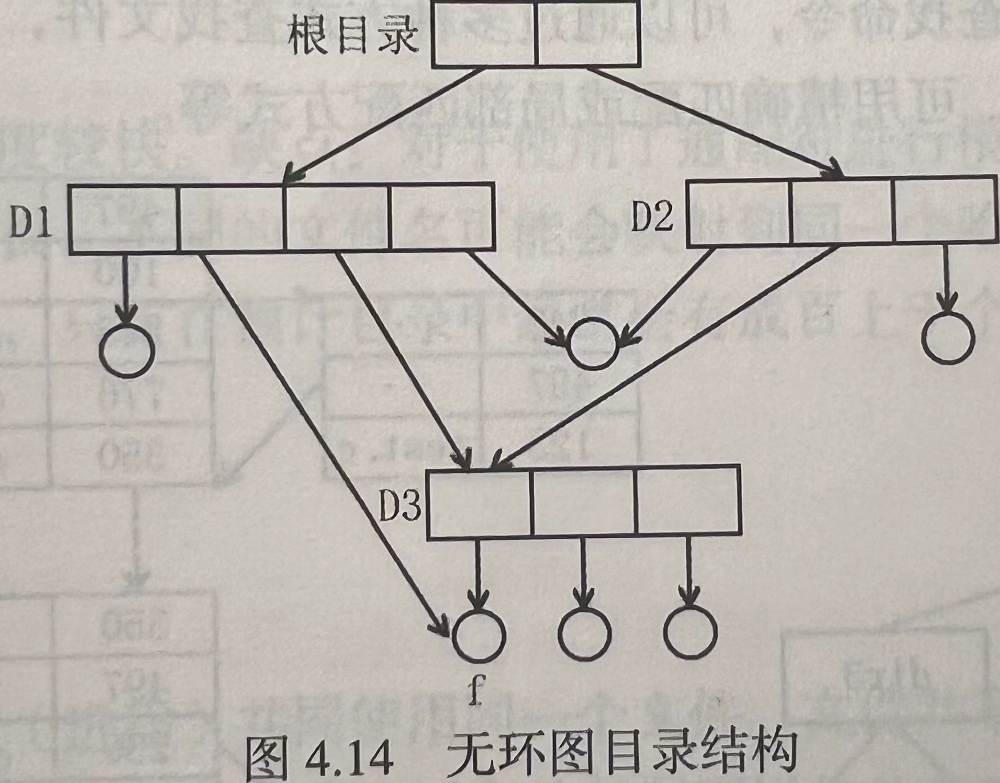

# 4.1 文件系统基础

## 4.1.1 文件的基本概念

**文件**是以硬盘为载体的存储在计算机上的信息集合，文件可以是文本文档、图片、程序等。

在系统运行时，计算机以进程为基本单位进行资源的调度和分配；

而在用户进行的输入、输出中，则以文件为基本单位。

从用户角度看，文件是输入输出的基本单位。文件是逻辑外存的最小分配单元，数据只有通过文件才能写到外存。

**文件系统**是操作系统中负责存取和管理信息的模块，它采用统一方法对系统和用户的信息进行存储、检索、更新、共享和保护，并为用户提供一整套行之有效的文件使用及操作方法。

文件系统使用**文件**和**树形目录**的抽象逻辑概念代替了硬盘和光盘等物理设备使用的数据块的概念，用户不必关心数据实际保存在哪个存储介质的什么位置上，只需记住该文件的所属目录和文件名就能操作文件。

通常把数据组成分为数据项、记录和文件三级。

-   数据项：数据项是基本的数据单元，是文件系统中最低级的数据组织形式，分为以下两种类型：
    -   基本数据项：用于描述一个对象的某种属性的字符集，是数据中可命名的最小逻辑数据单位，又称为字段。
    -   组合数据项：由多个基本数据项组成，简称组项。
-   记录：记录是一组相关的数据项的集合，用于描述一个对象在某方面的属性。
-   文件：文件是由创作者所定义的、具有文件名的一组相关元素的集合，可分为以下两种：
    -   有结构文件：文件由若干个相关记录组成
    -   无结构文件：长度以字节为单位的字符流

## 4.1.2 文件元数据和索引节点

### 1. 文件元数据

-   **文件元数据**又称**文件属性**。
-   文件属性在不同系统中差别很大，但通常都包括如下属性：
    -   **名称：**文件名称唯一，以容易读取的形式保存。
    -   **类型：**被支持不同类型的文件系统所使用。
    -   **创建者：**文件创建者的ID。
    -   **所有者：**文件当前所有者的ID。
    -   **位置：**指向设备和设备上文件的指针。
    -   **大小：**文件当前大小，也可包含文件允许的最大值。
    -   **保护：**对文件进行保护的访问控制信息。
    -   **创建时间、最后一次修改时间和最后一次存取时间：**文件创建、上次修改和上次访问的相关信息，用于保护和跟踪文件的使用。
-   操作系统通过**文件控制块**(FCB)来维护文件元数据。

### 2. 文件控制块

文件控制块是操作系统为每个文件建立的唯一数据结构，用于管理、控制和按名存储文件，其中包含了全部文件属性。一个文件由两部分组成：**FCB**和**文件数据**。文件和FCB一一对应。

-   每当创建一个文件时，系统就要为其建立一个FCB，用来记录文件的属性信息；
-   每当存取文件时，先找到其FCB，再通过FCB内的属性找到文件的物理位置就能存取。

### 3. 索引结点

>    操作系统再查找文件时只是用文件名进行查找，仅当文件名匹配时才会读取文件的其他信息。因此在有的系统中采用了文件名和文件描述信息分开存放的办法，即将文件描述信息放到一个单独的数据结构中，这个数据结构称为**索引结点**。

-   索引结点(简称i结点)，是一种记录了文件描述信息的数据结构，是文件的唯一标识，和文件一一对应。除了文件名以外的所有文件信息，都存在索引结点中。

#### 磁盘索引结点包含的信息

-   文件主标识符：拥有该文件的个人或小组的标识符。
-   文件类型：包括普通文件、目录文件或特别文件。
-   文件存取权限：各类用户对该文件的存取权限。
-   文件物理地址：每个索引结点中含有13个地址项，它们以直接或间接方式给出数据文件所在盘块的编号。
-   文件长度：以字节为单位的文件长度。
-   文件链接计数：在本文件系统中所有指向该文件的文件名的指针计数。
-   文件存取时间：本文最近被进程存取的时间、最近被修改的时间及索引结点最近被修改的时间。

#### 内存索引结点的信号

-   索引节点编号：用于标识内存索引结点。
-   状态：指示i结点是否上锁或被修改。
-   访问计数：每当有一进程要访问此i结点时，将访问计数加1，访问结束减1
-   逻辑设备号：文件所属文件系统的逻辑设备号。
-   链接指针：设置分别指向空闲链表和散列队列的指针。

## 4.1.3 文件的操作

>   介绍文件操作前，首先介绍两个重要的数据结构。

#### 系统打开文件表

系统打开文件表是一个维护所有进程打开文件的系统级描述符表，表项中描述了一个打开文件的所有信息。

系统打开文件表中内容如下：

-   索引节点指针，指向文件的索引节点的指针。
-   文件偏移量，表示文件上次读写位置，又称读写指针。
-   文件访问模式，如只读模式、只写模式或读写模式。
-   文件打开计数，表示当前有多少个进程打开了这个文件。

#### 文件描述符表(用户打开文件表)

文件描述符表是一个用来记录用户进程当前打开的所有文件的进程级描述符表，存储在PCB中。

表项索引值为**文件描述符**，是一个非负整数，每个文件描述符对应一个指针，指针指向系统打开文件表的一个表项。

### 1. 建立文件

建立文件的系统调用格式为：`fd = create(filename, mode)`，其中`filename`是指向所要创建的文件路径名的字符串指针，`mode`是文件存取权限，如可读、可写、可执行等，创建成功后返回文件描述符`fd`。

建立文件的操作如下：

1.   先在文件系统中为文件找到空间，然后为新文件分配磁盘索引节点、内存索引节点和FCB，并把文件名和磁盘索引节点指针组成新的目录项，记录到当前目录的目录文件中；
2.   设置文件内存索引结点的信息；
3.   为新文件分配用户打开文件表项和系统打开文件表项，为后者设置初值，最后返回文件描述符`fd`。

>   💡上述步骤中都有打开文件的功能，因此，创建文件后无需再次打开文件。

### 2. 删除文件

删除文件的系统调用格式为：`unlink(filename)`，调用成功返回0，失败返回-1。

删除文件时，应删除文件目录中相应的目录项，然后把该文件占用的存储空间释放。

删除文件要求用户对文件具有“写”操作权。

### 3. 打开文件

打开文件系统调用的格式为：`fd = open(filename, mode)`，其中`mode`表示文件打开方式。

打开文件后，文件的读写和关闭都不再以文件路径为参数，而是以打开文件返回的**文件标识符**`fd`为参数，即必须打开文件后，才可以进行文件读写和关闭操作。

打开文件的操作如下：

1.   检索目录，要求打开的文件必须已经被创建，因此应在文件目录中存在对应的表项，否则会出错。
2.   比较参数`mode`和内存索引节点中在建立文件时所记录的访问权限，如果非法，则此次打开操作失败。
3.   打开合法时，为文件分配用户打开文件表项，并为后者设置初值，通过指针建立表项与内存索引节点之间的联系，再把文件描述符`fd`返回给调用者。

>   💡打开文件不会将文件内容调入内存，只会将FCB写入内存，只有进程希望获取文件内容时才会从磁盘读取文件内容。

>   💡多个进程同时打开同一个文件时，可以任意对文件进行读写操作，操作系统并不保证写的互斥性，进程可以通过系统调用对文件加锁，从而实现对文件内容的保护。

### 4. 关闭文件

关闭文件的系统调用格式为`close(fd)`，`fd`表示文件描述符，调用成功返回0，失败返回-1。

关闭文件操作如下：

1.   根据`fd`找到用户打开文件表项，再找到系统打开文件表项，将该文件从用户打开文件表目上删除；
2.   把对应系统打开文件表项中的文件打开计数减1，如果其值不为0，说明还有其他进程正在共享它，不用释放此表项直接返回，否则释放此表项并找到相应的内存索引结点。
3.   把内存索引结点中引用计数减1，如果其值不为0，说明还有其他进程正在使用此文件，直接返回，否则将内存索引节点复制到相应的磁盘索引节点中，释放此内存索引节点。

>   💡关闭文件以及读、写文件之前需要先打开文件，获取文件描述符，关闭和读、写文件使用文件描述符而不是文件路径名作为参数。

>   💡系统打开文件表中文件打开计数和索引结点中的引用计数不同，前者反映多少进程通过同一个读写指针共享文件，后者反映多少进程共享文件。

### 5. 读文件

读文件的系统调用格式为：`n = read(fd, buf, count)`，表示从文件描述符`fd`表示的文件中的当前文件偏移量开始，读取`count`个字节的数据，并把它们放到数据区`buf`中，返回实际读入的字节数，它可能会小于请求的字节数，因为一旦读到文件末尾系统调用就返回。

### 6. 写文件

写文件的系统调用格式为：`n = write(fd, buf, count)`，表示把缓冲区`buf`的前`count`个字节写入`fd`表示的文件中的当前文件偏移量开始的位置，成功时返回写入的字节数，错误时返回-1。

## 4.1.4 文件的保护

文件的保护是指操作系统提供的对文件的保护机制，使得文件：

-   拒绝来自未经授权的用户和组的访问；
-   限制授权用户和组的访问类型。

文件保护可以通过限制文件的**访问类型**和**访问控制**等方式实现。

### 1. 访问类型

文件的访问类型用来控制不同用户对文件的读、写、执行等权限，可加以控制的访问类型主要有以下几种：

-   **读取：**从文件中读取。
-   **写入：**向文件中写入。
-   **执行：**加载文件到内存并执行它。
-   **附加：**在文件末尾写入新的信息。
-   **删除：**删除文件，并释放空间以重新利用。
-   **列表：**列出文件的名称和属性。

### 2. 访问控制

访问控制是指对访问者向受保护资源进行访问操作的控制管理。

在文件系统中，通常采用访问控制矩阵、访问控制表、访问权限表以及口令和密码等方式实现访问控制。

#### 访问控制表

访问控制最常用的是**访问控制表**(ACL)。

>   访问控制表原理：给每个文件和目录配置一个访问控制表，表中记录每个用户的名称及其允许的访问类型。当用户请求访问特定文件时，操作系统会首先检查访问控制表中当前用户的访问权限。如果该用户属于可访问的，则允许访问；否则会发生保护冲突，并且用户被拒绝访问。

-   优点：可以对每个单一用户设定其所允许的访问类型，能够进行复杂的访问方法。
-   缺点：系统用户量大、控制功能多导致维护困难，长度不可预计。

使用精简的访问列表可以解决访问控制表的问题，访问列表采用三种用户类型：

-   所有者：创建文件的用户。
-   组：共享文件且需要类似访问的一组用户。
-   其他：系统内的其他所有用户。

#### 口令和密码

口令和密码是另外两种访问控制方法，都是防止文件被未授权用户窃取，并没有控制对文件的访问类型。

-   口令是由用户在建立文件时所设定的字符串，其保存在文件元数据中。
    -   任何用户请求访问时，都必须提供正确的口令，否则无法访问文件。
    -   优点：简单、便于存储。
    -   缺点：直接存储在系统内部且是静态的，易被破解。
-   密码是一种对文件加密的算法，是指将文件中的数据通过一种变换手段，变为除有密钥的人以外其他人所不能读懂的信息编码。
    -   优点：比口令安全，保密性强。
    -   缺点：加密和解密需要花费时间。

>   💡俗称的“密码”其实是口令，而密码指的是加密算法。

>   ⚠️注意两个问题：
>
>   -   现代操作系统常用的文件保护方法：将访问控制列表与用户、组和其他成员访问控制方案一起组合使用。
>   -   对于多级目录结构而言，不仅需要保护单个文件，而且需要保护子目录内的文件，即需要提供目录保护机制。目录操作与文件操作并不相同，因此需要不同的保护机制。

## 4.1.5 文件的逻辑结构

文件的逻辑结构是指从用户的角度触发所观察到的文件的组织形式，它独立于文件的物理特性。

从用户的角度而言，文件的逻辑记录是进行存取操作的基本单位。

### 1. 无结构文件(流式文件)

无结构文件中的内容是一串字符流/字节流，又称流式文件，其长度以字节为单位，通过读、写指针来指出下一个要访问的字符。

在系统中运行的大量源程序、可执行文件、库函数等，所采用的就是无结构的文件形式。

### 2. 有结构文件(记录式文件)

有结构文件通常由若干个记录组成，又称记录式文件。记录是文件内独立的最小信息单位。

记录的长度可分为定长和不定长两类：

-   定长记录：指文件中所有记录的长度都是相同的，同时所有数据项的相对位置也是固定的。定长记录处理方便，易于控制，在数据处理中被广泛采用。
-   变长记录：指文件中各记录的长度都不同。有两种情况会造成变长记录：
    -   包含一个或多个可变长度的数据项；
    -   包含可变数目的定长数据项。

按照文件的组织方式，可把有结构文件分为四类：顺序文件、索引文件、索引顺序文件和直接文件。

#### 顺序文件

-   顺序文件，指由记录按某种顺序排列所形成的文件，可以顺序存储或以链表形式存储。

-   顺序文件中的记录通常是定长的。

-   顺序文件按排列方式可分为**串结构**和**顺序结构**两种情况：

    -   串结构：串结构文件中的记录按存入时间先后进行排序，记录顺序与关键字无关。检索时必须从头开始逐个查找，效率不高。

    -   顺序结构：顺序结构文件中的记录按用户指定的关键字排序。检索时可以采用折半查找算法进行查找，效率较高。

>   💡对于顺序文件的物理存储情况
>
>   若是顺序存储的文件，则逻辑相邻物理上也相邻；
>
>   若是链式存储的文件，逻辑相邻物理上不一定相邻。

-   优点：对于批量存取的场合，即每次对文件读或写一大批记录时，顺序文件存取效率最高；此外，对于磁带这类顺序存储设备，也只有顺序文件才能被存储并能有效地工作。
-   缺点：对于交互应用的场合，查找或修改单个记录的效率很差；增加或删除记录比较困难。

#### 索引文件

-   将变长记录文件中的记录提取出来，建立一张索引表，查找速度就会变快，由此提出了索引文件的概念。

-   索引文件是指除了文件本身外，另建立一张索引表，索引表和主文件一起构成的文件。其中索引表记录文件中每一条记录的指针和记录的长度，按关键字排序，因此其本身也是一个定长记录的顺序文件。
-   优点：把对变长记录顺序文件的顺序查找转变为对定长记录索引文件的顺序查找，从而加快查找速度。
-   缺点：由于需要配置索引表，且每个记录都要有一个索引项，增加了存储开销。

#### 索引顺序文件

-   索引顺序文件中，对文件记录进行分组，然后为每组的第一条记录在索引表中建立一个索引项。其中，分组的组间关键字必须有序，组内关键字可以是无序的。

-   索引顺序文件分组的最好情况是，$N$条记录分为$\sqrt{N}$组，每组有$\sqrt{N}$条记录。
-   顺序查找索引表平均需要查找$\sqrt{N}/2$次，再在组内顺序查找也平均需要查找$\sqrt{N}/2$次，即总共需要查找$\sqrt{N}$次。
-   若采用折半查找算法查找索引表，查找索引表平均需要查找$(log_2N)/2$次，共需查找$(log_2N+\sqrt{N})/2$次。
-   优点：极大地减少了访问单条记录的时间，同时保留了文件的顺序特性。
-   缺点：配置索引表同样需要增加存储开销。

#### 直接文件或散列文件

-   直接文件可以根据给定的关键字直接获得指定记录的物理地址。
-   散列文件属于直接文件的一种，它利用Hash函数将关键字转换为相应记录的地址。
-   直接文件常在要求快速访问时使用，且记录的长度是固定的，通常一次只访问一条记录。

#### 总结

| 逻辑结构     | 查找方式                         | 平均查找次数                      |
| ------------ | -------------------------------- | --------------------------------- |
| 顺序文件     | 顺序查找(不定长)或折半查找(定长) | $N/2$或$log_2N$                   |
| 索引文件     | 直接查找                         | 1                                 |
| 索引顺序文件 | 组间顺序或折半查找，组内顺序查找 | $\sqrt{N}$或$(log_2N+\sqrt{N})/2$ |
| 直接文件     | 直接查找                         | 1                                 |

## 4.1.6  文件的物理结构

文件的物理结构是指系统将文件存储在外存上所形成的一种存储组织形式，是用户不可见的，包括文件分配方式和对磁盘空闲块的管理。

文件分配方式指的是文件物理空间的分配，即如何为文件分配磁盘块。常用的文件分配方法有以下三种。

### 1. 连续分配

连续分配为每个文件分配一组相邻的磁盘块，文件中的逻辑记录顺序和物理记录顺序完全一致，由此所形成的文件结构称为顺序文件结构。

文件的连续分配可用首块磁盘地址和文件所占盘块数来定义。文件的目录项中记录该文件第一个记录所在的盘块号和文件长度。如果文件占$n$块，并从位置$b$开始，则文件将占有$b, b+1,b+2,\cdots,b+n-1$，如果要访问文件的第$i$块，可以直接访问文件的第$i$块，可以直接访问块$b+i$。因此，连续分配支持**顺序访问**和**随机访问**。

对连续分配的文件进行插入操作时，如果前后有足够的空间，可以向前向后移动。

连续分配的优点：

-   支持顺序访问和直接访问，对于顺序文件，可以根据文件的逻辑地址直接找到物理地址。
-   顺序读/写时速度最少，连续分配的文件，其所占用的盘块可能位于同一条或相邻磁道上，磁头在磁道上移动的距离少，访问速度块。

连续分配的缺点：

-   必须为一个文件分配连续的存储空间，由内存的连续分配可知，反复增删文件后会产生外部碎片。
-   建立文件之前需要预先确定文件的长度，对于动态增长的文件，很难为其分配空间。
-   不能灵活地删除和插入记录，例如若磁盘需要拓展时后面没有相邻的空闲盘块，则需要将文件整体迁移到一组大小合适的连续磁盘块处。

### 2. 链接分配

链接分配是采用离散的方式，为文件分配多个不连续的盘块，通过指针将这些盘块链接成一个链表，由此所形成的文件结构称为链接文件结构。

链接分配的优点：

-   消除了磁盘的外部碎片，提高了外存的利用率。
-   插入、删除和修改记录都非常容易。
-   创建文件时无需说明文件的大小，文件可以动态增长。

#### 隐式链接

采用隐式链接时，文件的目录项记录指向文件第一个盘块和最后一个盘块的指针，除最后一个盘块外，每个盘块都含有指向下一个盘块的指针。

隐式链接的缺点：

-   只适合顺序访问，对于随机访问极其低效。
-   指针需要占用一定的磁盘空间。
-   可靠性较差，任何一个指针丢失或损坏，都会导致文件数据丢失。

#### 显式链接

显式链接相当于把隐式链接中的每个盘块末尾的、指向下一个盘块的指针提取出来，存放在一张链接表中，该表称为**文件分配表(FAT)**，一个磁盘中仅设置一张，存放在磁盘固定位置。

FAT所有文件共用，开机时将其从磁盘读入内存并常驻内存，因此查找FAT的过程是在内存中进行的。

显式链接的优点：

-   由于查找记录的过程是在内存中进行的，因而减少了访问磁盘次数，提高了访问速度。

显式链接的缺点：

-   必须把整个FAT放在内存中，对于大容量磁盘，其FAT的表项很多，因而内存开销非常大。

### 3. 索引分配

链接分配依然存在以下问题：

-   链接分配不能有效支持直接访问
-   FAT需要占用较大的内存空间

再打开某个文件时，只需将该文件对应盘块的编号调入内存即可，完全没有必要将整个FAT调入内存。为此，索引分配将每个文件所有盘块号都集中放在一起构成**索引块(表)**。

索引分配的优点：

-   支持随机访问，可以直接从索引块中读取想要的盘块号。
-   方便文件扩展。
-   不会产生外部碎片。

索引分配的缺点：

-   需要系统分配索引块，增加了存储空间的开销，对于只占用一两块的小文件，也需要分配一个完整的索引块。
-   存取文件需要两次访问外存，首先读取索引块，再访问具体的磁盘块，降低了文件的存取速度。

索引分配方式存在的问题：

-   索引块太大，每个文件需要一个索引块，浪费空间；
-   索引块太小，一个索引块存储的盘块数目有限，无法支持大文件。

通过以下机制处理索引分配方式的问题：

-   **链接方案：**将多个索引块链接起来，每个索引块包括指向下一个索引块的指针。
-   **多级索引：**为文件的索引再建立一个索引块，称为二级索引。
    -   第一级的表项指向第二级索引块，第二级的表项指向问价你的物理盘块号。
    -   优点：加快了对大型文件的查找速度。
    -   缺点：随着索引级数的增加，访问磁盘的次数也变多。
-   **混合索引：**既采用直接地址，又采用直接索引和多级索引的分配方式。

#### 混合索引分配

对于小文件，只需要一个索引块，并不需要多级索引，而大文件又必须采用多级索引。

在UNIX System V的索引结点中设有13个地址项，即`iddr(0) ~ iddr(12)`。

-   直接地址：
    -   在索引结点中设置10个直接地址项(直接盘块号)，`iddr(0) ~ iddr(9)`。
    -   直接地址项中存放的是文件数据所在盘块的盘块号。
    -   每个盘块4KB，当文件不大于40KB时，可以直接从索引结点中读取文件的全部盘块号。
-   一次间接地址:
    -   大、中型文件只用直接地址并不能满足需求，因此提供间接地址，`iddr(10)`。
    -   一次间接地址中记录文件的一次间接块号，一次间接块就是索引块，其中记录文件的物理盘块号。
    -   一次间接地址块中可以存放1K个盘块号，可以表示$1K\times4KB=4MB$大小的文件。
    -   如果同时采用直接和一次间接方式，允许文件的最大长度为$4MB+40KB$。
-   多次间接地址：
    -   如果文件大于$4MB+40KB$，需要采用二次间接地址分配方式，用`iddr(11)`。
    -   系统此时在二次间址块中记录所有一次间址块的盘号。
    -   二次间址允许文件最大长度$4GB+4MB+40KB$。同理，三次间址允许最大文件为$4TB+4GB+4MB+40KB$。

### 4. 文件分配方式比较

| 分配方式 | 如何分配                                                     | 目录项内容                                                   | 访问数据           |
| -------- | ------------------------------------------------------------ | ------------------------------------------------------------ | ------------------ |
| 顺序分配 | 分配连续磁盘块                                               | 起始块号，块数                                               | 需要访问磁盘1次    |
| 隐式链接 | 除最后一个盘块，每个盘块都有指向下一个盘块的指针             | 起始块号，结束块号                                           | 需要访问磁盘n次    |
| 显式链接 | 建立FAT，记录每个盘块的下一块，FAT开机后常驻内存             | 起始块号                                                     | 需访问磁盘1次      |
| 索引分配 | 为文件建立索引表。文件太大，可以采用链接方案、多级索引、混合索引 | 链接方案记录第一个索引块块号； 多级/混合索引记录顶级索引块号 | m级需访问磁盘m+1次 |

文件分配方式优缺点

| 分配方式 | 优点                                                | 缺点                                         |
| -------- | --------------------------------------------------- | -------------------------------------------- |
| 顺序链接 | 顺序存取速度快，支持随机访问                        | 会产生碎片，不利用文件扩展                   |
| 隐式链接 | 消除外部碎片，支持文件扩展                          | 只适合顺序访问，不适合随机访问               |
| 显式链接 | 消除外部碎片，支持文件扩展，可以通过FAT进行随机访问 | FAT占用外存和内存                            |
| 索引分配 | 支持随机访问，支持文件扩展                          | 索引块占用存储空间，访问文件需要先访问索引块 |

# 4.2 目录

## 4.2.1 目录的基本概念

目录相当于一种索引，指出文件名和物理地址之间的映射关系。目录是文件控制块的有序集合，一个目录项就是一个文件控制块。

目录的功能包括：

-   实现“按名存取”：用户无需关心文件实际保存在硬盘的哪个数据块上，只需记住这个文件的所属目录和文件名即可访问。
-   提高对目录的检索速度：通过设计合理的目录结构加快对目录的检索速度，这是在设计一个大、中型文件系统时所追求的主要目标。
-   文件共享：在多用户系统中，应允许多个用户共享一个文件，在外存中仅需保留一份文件副本，以节省存储空间，提高文件利用率。
-   允许文件重名：允许对不同的文件采用相同的名字，通过不同的目录来实现。

## 4.2.2 目录结构

目录结构影响文件的存取速度，也影响文件的共享性和安全性，因此目录结构对文件系统非常重要。

### 1. 单级目录结构

单级目录结构在整个文件系统中只建立一张目录表，每个文件占一个目录项。

-   优点：结构简单，且能快速定位文件。
-   缺点：只能实现按名存取功能，存在检索速度慢的问题，且不允许文件重名和文件共享，只适用于当用户系统。

### 2. 两级目录结构

两级文件目录将目录分成主文件目录和用户文件目录，以解决单级文件目录存在的缺点。

**主文件目录**(MFD)中的目录项包括用户名和指向该用户目录的指针，**用户文件目录**(UFD)包括该用户所有文件的文件控制块。

-   优点：提高了目录的检索速度，允许不同的用户文件重名，还支持不同用户使用不同的文件名访问系统中同一个共享文件。
-   缺点：缺乏灵活性，用户不能对自己的文件进行分类管理。

### 3. 树形目录结构

树形目录可以类比数据结构中的树的概念，树根是根目录，从根向下，每个树枝是子目录，树叶是文件。

#### 当前目录

当前目录是指进程当前所在的目录，又称工作目录，每次进程对文件的访问都基于当前目录进行，因此加快了文件的检索速度。

每个目录在创建时都含有两个特殊的目录项“.”和“..”，“.”表示当前目录，“..”表示父目录。

>   根目录中“..”也指向它自己。

#### 路径名

路径名是指从根目录或当前目录开始，到文件所在目录之间的所有目录名与文件名依次地用分隔符连接起来形成的字符串。在树形目录结构中，使用路径名唯一标识文件。

>   ❗在UNIX中，路径各部分之间用“/”分隔，在Windows中用“\”分隔。

从根目录开始的路径名称为**绝对路径名**，从当前目录开始的路径称为**相对路径名**。

-   树形目录的优点：层次结构清晰，解决了文件重名和文件共享问题，能够有效地进行文件的管理和保护。
-   树形目录的缺点：查找文件需要按路径名逐级访问中间节点，增加了磁盘访问次数，影响查询速度，不便于实现文件共享。

### 4. 无环图目录结构

无环图目录结构通过在树形目录结构的基础上添加指向同一文件或子目录的有向边，使得整个目录成为一个有向无环图。无环图目录结构允许文件和子目录有多个父目录，不同用户的目录可以指向同一个文件或子目录。

无环图目录结构方便了文件共享，但也带来了文件系统管理和维护的复杂性。

## 4.2.3 目录的操作

-   搜索：当用户使用一个文件时，需要搜索目录，以找到该文件的对应目录项。
-   创建文件：当创建一个新文件时，需要在目录中增加一个目录项。
-   删除文件：当删除一个文件时，需要在目录中删除相应的目录项。
-   创建目录：在树形目录结构中，用户可创建自己的用户文件目录，并可再创建子目录。
-   删除目录：有两种方式：
    -   不删除非空目录，删除时要先删除目录中的所有文件，并递归地删除子目录。
    -   可删除非空目录，目录中地文件和子目录同时被删除。
-   移动目录：将文件或子目录在不同的父目录之间移动，文件的路径名也会随之改变。
-   显示目录：用户可以请求显示目录的内容，如显示该用户目录中的所有文件及属性。
-   修改目录：某些文件属性保存在目录中，因而这些属性的变化需要改变相应的目录项。

## 4.2.4 目录实现

### 1. 线性表

线性表是最简单的目录实现方法，是指包括文件名和数据块指针的线性列表。

线性表中查找文件的方法是线性查找。

优点：实现比较简单。

缺点：查找速度慢。

### 2. 哈希表

哈希表是指目录中建立一张表项为`<文件名，目录项指针>`的哈希表，创建文件时，将用户提供的文件名转换为一个哈希值，保存在哈希表中。查找时，将文件名映射为哈希值，利用该哈希值到目录中区查找。

优点：查找速度较快。

缺点：

-   对于使用了通配符进行模糊查找的文件名，无法采用哈希查找，只能采用线性查找。
-   不同的文件名可能会映射到同一个哈希值，需要采取措施解决冲突。
-   哈希表需要复杂的管理，只有在预计目录中经常会有成百上千个文件时，才考虑使用哈希表实现目录。

## 4.2.5 文件共享

文件共享是指多个用户共同使用同一个文件。文件共享使得在外存中仅需保留共享文件的一份副本，节省大量存储空间，减少因文件复制而增加的I/O操作次数。

### 1. 基于索引结点的共享方式——硬链接

硬链接是一种基于索引结点的共享方式，在这种共享方式中，文件目录只存放文件名和指向索引结点的指针，需要共享文件时，将用户目录项中的指针指向该索引结点，且将该索引结点的链接计数加1。

索引结点中的链接计数`count`，又称引用计数，表示链接到本索引结点上的用户目录项的数目。由于任何用户对文件进行的修改操作都会引起索引结点内容的改变，并且对其他用户可见，因此文件也就能共享给其他用户。

### 2. 利用符号链接实现文件共享——软链接

符号链接又称软链接，是一类特殊的文件，其包含有一条以绝对路径或者相对路径的形式指向其他文件或者目录的引用。

-   一个符号链接文件仅包含一个文本字符串，其被操作系统解释为一条指向另一个文件或者目录的路径。
-   它是一个独立文件，其存在并不依赖于目标文件。
-   如果删除一个符号链接，它指向的目标文件不受影响。
-   如果目标文件被移动、重命名或者删除，任何指向它的符号链接仍然存在，且不会改变，但是这些符号链接将会指向一个不复存在的文件。

符号链接优点：

-   不影响原文件。
-   方便网络共享。

符号链接缺点：

-   读取文件开销大。
-   额外耗费磁盘空间。

# 4.3 文件系统

## 4.3.1 文件系统结构

文件系统是操作系统中负责存取和管理信息的模块，它采用统一方法管理文件。

文件布局是文件系统的重要部分，维护着文件逻辑位置到物理位置的映射关系。

文件系统有两个截然不同的设计问题：

-   如何定义文件系统的用户接口，这个任务涉及文件及其属性、所允许的文件操作、组织文件的目录结构。
-   创建算法和数据结构，以便映射逻辑文件系统到物理外存设备。

文件系统本身通常由许多不同的层组成，下层为上层提供服务，上层使用下层的功能，上下层之间只需关心二者的接口而无需关注对方的内部结构和实现方法。

## 4.3.2 文件系统布局

### 1. 文件系统在磁盘中的结构

文件系统存放在磁盘上，多数磁盘划分为一个或多个分区，每个分区中有一个独立的文件系统。

文件系统可能包括如下信息：

-   主引导记录(MBR)：位于磁盘的0号扇区，用来引导计算机，MBR后面是分区表，该表给出每个分区的起始和结束地址。
-   引导块：MBR执行引导块中的程序后，该程序负责启动该分区中的操作系统。
-   超级块：包含文件系统的所有关键信息，在计算机启动时，或者在该文件系统首次使用时，超级块会被读入内存。
-   文件系统中空闲块的信息。

### 2. 文件系统在内存中的结构

内存中的信息用于管理文件系统并通过缓存来提高性能。这些数据在安装文件系统时被加载，在文件系统操作期间被更新，在卸载时丢弃。

-   内存中的安装表，包含每个已安装文件系统分区的有关信息。
-   内存中的目录结构的缓存包含最近访问目录的信息。
-   整个系统的打开文件表，包含每个打开文件的FCB副本及其他信息。
-   每个进程的打开文件表，包含一个指向整个系统的打开文件表中的适当条目的指针，以及其他信息。
-   对磁盘读写时，缓冲区保存文件系统的块。

## 4.3.3 外存空闲空间管理办法

除文件分配表外，还需设置一个**磁盘分配表**，用于记录空闲磁盘块的情况。

### 1. 空闲表法

空闲表法为磁盘上所有的空闲区，表项包括序号、该空闲区的第一个盘块号、该区的空闲盘块数等信息，按起始盘块号递增顺序排列。空闲表法常用于连续文件。

空闲盘区的分配采用首次适应算法、最佳适应算法和最坏适应算法。分配时，顺序地检索空闲表表项，直至找到合适的空闲区，将其分配给用户，并修改空闲表。回收时，把空闲区位置及其长度填入空闲区表，并合并邻接项。

空闲表法优点：分配速度快，访问磁盘的I/O频率低。

### 2. 空闲链表法

空闲链表法是将所有空闲盘区链接在一起，形成一条空闲链。

#### 空闲盘块链

-   空闲盘块链是指将磁盘上所有的空闲盘块链接起来形成的链表，其中指向第一个空闲盘块的指针保存在磁盘的特殊位置，同时也将其缓存在内存中，每一个盘块都有后继盘块的指针。
-   分配时，从链首开始依次摘下适当数目的空闲盘块分配给用户。回收时，将回收的盘块依次链接在空闲盘块链的末尾。
-   优点：
    -   分配和回收盘块操作简单；
    -   便于文件动态增长和收缩。
-   缺点：
    -   每次申请一块盘块都要读取空闲盘块并取得指针，申请多块需要多次读盘；
    -   由于它是以盘块为单位，相应的空闲盘块链可能会很长。

#### 空闲盘区链

-   空闲盘区链是指将磁盘上所有的空闲盘区链接起来形成的链表，其中空闲盘区包括若干个相邻的盘块，每个盘区保存有下一个空闲盘区的指针和本盘区盘块数的信息。
-   分配盘区的方法与内存的动态分区分配类似，通常采用首次适应算法。回收时，要将回收的盘区与相邻接的空闲盘区相合并。
-   优点：分配和回收的效率较高，且空闲盘区链较短。
-   缺点：分配与回收的过程比较复杂。

### 3. 位示图法

#### 位示图的概念

位示图利用二进制的一位来表示磁盘中的一个盘块的使用情况，磁盘上所有盘块都对应在位示图中。

盘块的分配：

-   顺序扫描位示图，从中找出一个或一组其值为0的二进制位。
-   将找到的一个或一组二进制位，转换成与之对应的盘块号。
-   修改位示图，令`map[i,j] = 1`。

盘块的回收：

-   将回收盘块的盘块号转换成位示图中的行号和列号。
-   修改位示图，令`map[i,j] = 0`。

### 4. 成组链接法

成组链接法结合了空闲表和空闲链表两种方法。

#### 空闲盘块的组织

-   在成组链接法中，将空闲块分成若干组，每100个空闲块块为一组，每组的第一空闲块记录了下一组空闲块号和空闲块总数。
-   第一组称为空闲盘块号栈(专用块)，分配和回收时采用栈的方式取出和存入盘块，其中除空闲块计数的第一行是栈底，最后一行是栈顶。

#### 空闲盘块的分配与回收

-   操作系统启动时，将磁盘专用块复制到主存系统工作区中，然后进行对空闲盘块的分配和回收。
-   分配空闲盘块时，先把专用块中的空闲块计数减1，从专用块的栈顶取出一个空闲盘块的指针，将与之对应的盘块分配给用户。
-   回收空闲盘块时，把块号记录在专用块的栈顶，将专用块的空闲计数加1。

## 4.3.3 虚拟文件系统

### 1. 虚拟文件系统的概念

虚拟系统文件实质上是一种存在于内存中、支持多种具体文件系统的运行环境，它向用户进程提供了一个简单的，统一的文件系统接口。

虚拟文件系统的关键思想就是抽象出所有文件系统都共有的部分，并且将这部分代码单独放在一层，通过调用底层的实际文件系统来具体管理数据。

虚拟文件系统的功能包括：

-   记录所安装的文件系统类型。
-   建立设备与文件系统之间的联系。
-   实现面向文件的通用操作。
-   涉及特定文件系统的操作时，映射到具体文件系统中。

### 2. 虚拟文件系统的结构

VFS包含两个不同的接口：

-   上层提供给用户进程的接口
    -   上层的接口使得用户可以直接使用标准UNIX文件系统调用来操作文件，无需考虑具体文件系统的特性和物理存储介质。
-   下层提供给实际文件系统的接口
    -   下层的接口用以进行具体文件系统的转换，实现各种文件系统的细节。

VFS是面向对象的方案，VFS的对象简单实现为C语言的包含数据和函数指针的结构，其中函数指针指向操作这些数据的文件系统的实现函数。

VFS主要的4个对象如下：

-   **超级块对象：**表示一个已挂载的特定文件系统。
    -   超级块存储了描述特定文件系统的信息。
    -   超级块对象通常对应于磁盘上特定扇区的文件系统超级块或文件系统控制块。
-   **索引结点对象：**表示一个特定的文件。
    -   索引结点存放具体文件的一般信息。
    -   每个索引结点对象都有一个索引结点号，唯一标识文件系统中的指定文件。
-   **目录项对象：**表示一个特定的目录项。
    -   目录项对象存放目录项与对应文件进行链接的信息，包含一个指向索引结点的指针和超级块，还包括一个指向父目录的指针和指向子目录的指针。
    -   目录项对象为访问文件和目录提供了方便。
-   **文件对象：**表示一个进程打开的一个文件。
    -   文件对象在系统调用`open()`时创建，在系统调用`close()`时销毁。

VFS使用三个缓存来提升性能：

-   **索引结点缓存：**每个目录和文件都由一个VFS索引结点表示，访问目录或文件会访问其索引结点，因此索引结点高速缓存中存储最近访问过的索引结点，可加快访问速度。
-   **目录缓存：**目录缓存中存储完整的目录名称和其索引结点号之间的映射，可加快列出目录的过程。
-   **缓冲区高速缓存：**缓冲区高速缓存中存放文件的具体数据，当需要相同的数据时，可从高速缓存中读取，而不是磁盘。

### 3. 虚拟文件系统的工作过程

当系统启动时，根文件系统在VFS中注册，当装载其他文件系统时，它们也必须在VFS中注册。

文件系统注册需要向VFS提供一个包含VFS所需要的函数地址的列表，这样VFS就知道如何执行此文件系统的功能。

## 4.3.4 文件系统挂载

文件系统在用于系统的进程之前必须先安装，也称**挂载**。

挂载是指由操作系统使一个存储设备上的文件和目录可供用户通过计算机的文件系统访问的一个过程。挂载机制使不同类型的文件系统可以挂载在系统的文件树的任何位置。

>   💡不止是硬件设备目录挂载到根目录上合二为一称作挂载。在一个文件系统中挂载另一个文件系统也非常常见。

