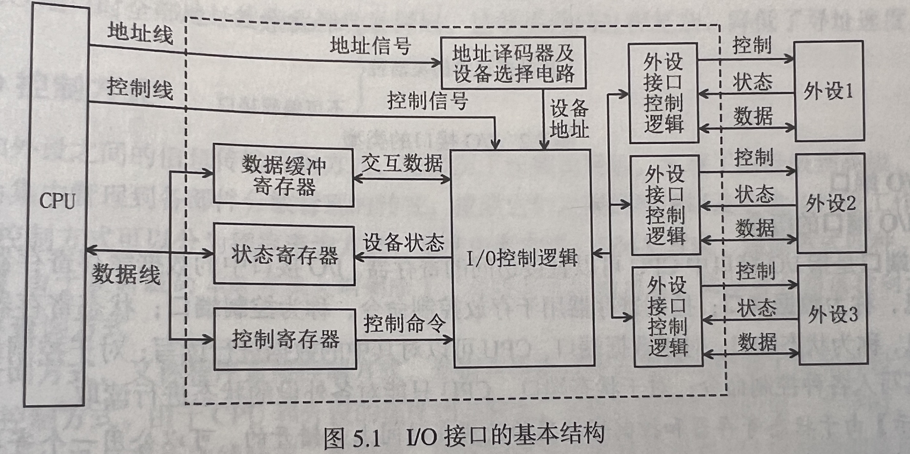
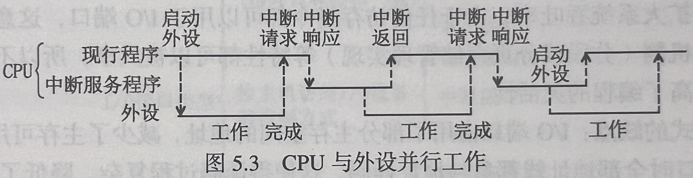
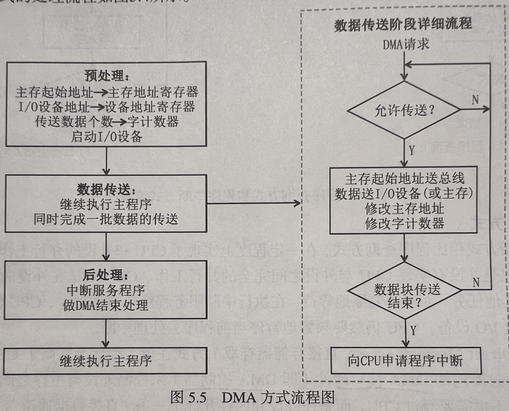
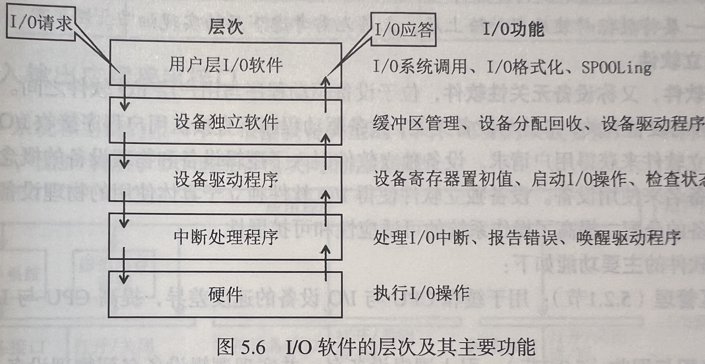
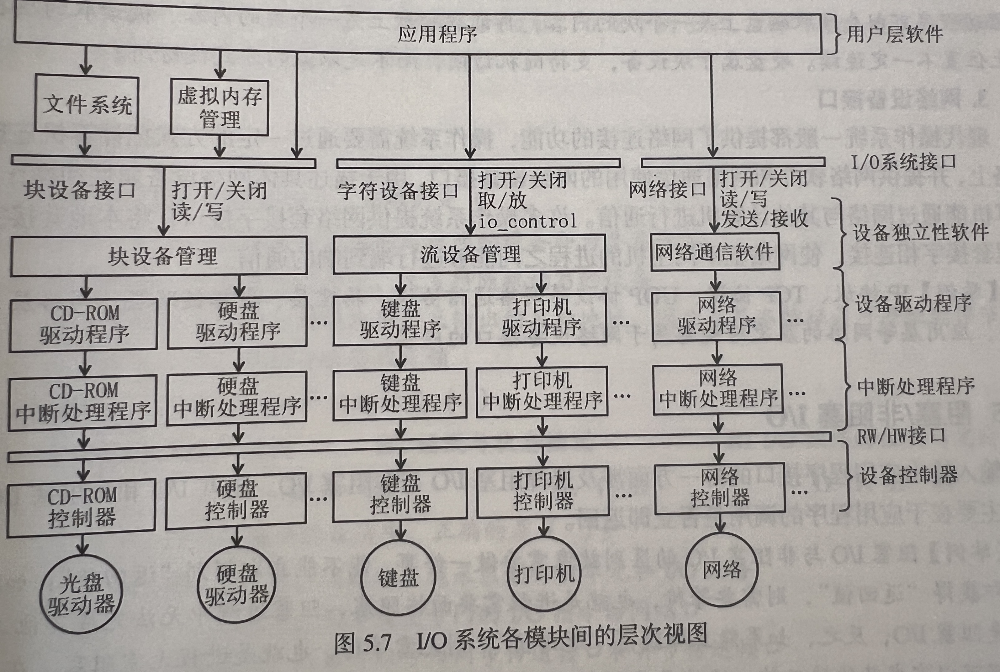

# 5.1 I/O管理概述

## 5.1.1 I/O设备

>  I/O 设备管理包含了很多领域的不同设备及与设备相关的应用程序，因此很难有一个通用且一致的设计方案。

### 1. I/O设备的基本概念

**I/O设备：**可以将数据输入到计算机，或者可以接收计算机输出数据的外部设备，属于计算机中的硬件设备。

### 2. I/O设备的分类

**按使用特性分类**

- 存储设备：用于存储信息的设备。
- 输入输出设备：输入设备向计算机输入数据信息，输出设备用于计算机向外输出数据信息。
  - 网络适配器、调制解调器等网络设备既属于输入设备也属于输出设备。

**按传输速率分类**

- 低速设备：传输速率仅为每秒几字节到数百字节的设备。
- 中速设备：传输速率为每秒数千字节到数十万个字节的设备。
- 高速设备：传输速率为每秒数十万字节到千兆字节的设备。

**按信息交换单位分类**

- 字符设备：以字符为信息交换单位的设备，每次可以交换一个或多个字符，传输速度较低，通常采用中断驱动方式。
- 块设备：以数据块为信息交换单位的设备，每次可以交换一个或多个数据块的信息，传输速度较高，且支持对存储的信息进行寻址和随机读写。

**按设备的共享属性分类**

- 独占设备：同一时刻只能由一个进程占用的设备。
- 共享设备：同一时间段内允许多个进程同时访问的设备。
- 虚拟设备：通过SPOOLing等技术，把原本独占设备改造为逻辑上的共享设备，并可以把一个物理设备变换为多个对应的逻辑设备。

### 3. I/O接口

>  I/O设备通常由机械部件和电子部件组成：
>
> - 机械部件负责执行真正的I/O行为，CPU需要通过电子部件间接控制和管理机械部件的执行；
> - 其中的电子部件就是I/O接口，又称I/O控制器、设备控制器。

#### I/O接口的功能

I/O接口是主机和外设之间进行信息传输的“桥梁”，因此它在主机侧和外设侧各提供了一个接口：

- 主机侧的接口称为**内部接口**，它通过系统总线和CPU、内存相连，数据的传输方式只能是并行传输；
- 外设侧的接口称为**外部接口**，它通过USB、串/并行电缆等各种接口电缆与外设相连，数据的传输方式可以是串行或并行方式。

I/O接口的主要功能如下：

- **数据缓冲**：讲数据提前存到I/O接口中的数据缓冲区，以缓和高速系统组件和低速外部设备之间的速度差异。
- **数据格式转换**：I/O接口提供数据格式的相互转换。
- **控制和定时**：为来自系统总线的控制和定时信号提供控制和定时逻辑，对内部资源及外设间动作的先后关系进行协调，并对数据通信过程进行控制。
- **错误或状态检测**：提供可以保存各种状态信息的状态寄存器，CPU通过读取这些寄存器来了解接口和外设的出错情况或状态。
- **与主机和设备通信**：上述四个功能都必须通过主机与I/O接口之间和I/O接口与外设之间的通信来完成。

#### I/O接口的基本结构

- 数据缓冲寄存器主要用于暂存与CPU或内存进行传送的数据信息
- 状态寄存器主要用于记录接口和设备的状态信息
- 控制寄存器主要用于保护CPU对外设的控制信息
- 上述的数据信息、状态信息和控制信息都是通过数据线传输的
- 状态寄存器和控制寄存器在传送方向上是相反的

> 状态寄存器和控制寄存器的使用在时间上是错开的，所以很多时候会将两者放在一起，变为状态/控制寄存器。

#### I/O接口的类型

- 按数据传送方式分类：
  - 并行接口：一个字或字节的所有位同时传送。
  - 串行接口：一位一位地按顺序传送。
- 按主机访问I/O设备的控制方式分类：
  - 程序查询接口：程序查询方式的接口。
  - 程序中断接口：程序中断方式的接口。
  - DMA接口：DMA方式的接口。
- 按功能选择的灵活性分类：
  - 可编程接口：可通过程序来改变或选择接口的功能和操作方式。
  - 不可编程接口：不能从程序层面改变接口的功能，但可以通过硬连线逻辑来实现不同的功能。

#### I/O端口

- I/O端口是指I/O接口中CPU可以直接访问的寄存器。
  - I/O接口中的数据缓存寄存器用于存放数据信息，称为**数据端口**，CPU可以对其中的数据进行读写；
  - 控制寄存器用于存放控制命令，称为**控制端口**，CPU只能对其写入各种控制命令；
  - 状态寄存器用于存放状态信息，称为**状态端口**，CPU只能对各外设的状态进行读取。
- 为了使CPU能够访问I/O端口，必须对上述寄存器进行编址，I/O端口的编址方式有独立编址和统一编制两种。
  - 独立编址方式(I/O映射方式)
    - 该方式对主存地址空间和I/O端口地址空间分别进行编址，因此它们的地址取值范围可以重叠，相同的地址可能属于不同的地址空间，所以需要用专门的I/O指令来表明访问的是I/O地址空间。
    - 优点：① 由于I/O端口数明显少于主存单元，从而I/O接口只需要少量的地址线，这使得在选择I/O端口时译码更加简单，寻址速度更快；② 由于使用专用的I/O指令，和主存指令完全区分开，这使得程序更加清晰，有助于理解和检查。
    - 缺点：① I/O指令通常只支持简单的传输操作，降低了程序设计的灵活性；② CPU必须分别为存储器和I/O设备提供单独的读写命令，这使得总线控制逻辑变得更加复杂；③ 使用独立的地址空间需要有专门的硬件保护机制。
  - 统一编址方式(内存映射I/O、存储器映射方式)
    - 该方式对主存地址空间和I/O地址空间统一进行编址，将主存地址空间的一部分地址划分给I/O端口。
    - 优点：① 由于I/O端口被当作存储器的单元进行地址分配，访问时不再需要专门的I/O指令，这使得CPU对I/O端口的访问更加灵活方便，且I/O寄存器的数目只受存储容量的制约，有利于扩大系统吞吐率；② 由于任何访存指令都可以用于I/O端口，这意味着方寸指令的寻址方式和保护机制等特性都可以被共享，所以不再需要设置专门的保护机制，提高了编程的灵活性。
    - 缺点：① I/O端口占用了部分主存空间的地址，减少了主存可用容量；② 由于在访问I/O端口时全部地址线都参与地址译码，这使得译码过程复杂，降低了寻址速度。

## 5.1.2 I/O控制方式

> 设备管理的主要任务之一是控制设备和内存或CPU之间的数据传送。外围设备和内存之间的输入输出控制方式有4种。（其中通道方式已经移出408大纲，故不介绍。）

### 1. 程序直接控制方式

程序直接控制方式是指直接通过查询程序来控制主机和外设之间数据传输的I/O控制方式，所以又称**程序查询方式**。

程序查询方式可分为**定时查询方式**和**独占查询方式**。

- 定时查询方式：CPU周期性地查询结构中的状态寄存器，直到条件满足后才开始传送数据，待数据传送完成后返回用户程序。
- 独占查询方式：一旦设备被启动，CPU必须连续不断地查询接口的状态，此时，该设备的I/O独占CPU，I/O的整个过程均由CPU控制，CPU与外设完全串行工作。

> ⚠️ 定时查询方式在周期内只有特定时间需要去查询接口中的状态寄存器，所以还是有一定的时间可以执行其他任务。

- 优点：实现简单，只需要少量硬件，在读/写指令的基础上，加上实现循环检查等一系列指令即可。
- 缺点：CPU需要一直在原地轮询外设的状态，会出现“忙等”现象，CPU和外设只能串行工作，CPU的利用率很低。

### 2. 中断驱动方式

中断驱动方式使得CPU与外设能够并行工作，提高了CPU的利用率。

当CPU需要进行I/O操作时，CPU在启动外设后不再需要原地等待其准备就绪，而是将执行I/O操作的进程暂时挂起，然后在就绪队列中选择另一个进程开始执行。此时，CPU与外设并行工作。

优点：实现了CPU与I/O设备的并行工作，提高了CPU的利用率。

缺点：每次中断仅传输一个字节的数据，中断处理需要耗费一定的时间，频繁中断会导致CPU的利用率大幅下降。

### 3. DMA方式

DMA方式在I/O设备和内存直接开辟直接的数据交换道路，彻底“解放”CPU。

DMA方式的特点：

- 以数据块为基本单位进行数据传输，每次可以传送一个或多个数据块。
- 外设与主存之间可以直接进行数据交换，数据传送过程无需CPU干预。
- 只有预处理时需要CPU的干预，进一步提高了CPU与I/O设备的并行程度。

要在主机与控制器之间实现成块数据的直接交换，须在DMA控制器中设置如下4类寄存器：

- 命令/状态寄存器(CR)：接收从CPU发来的I/O命令、有关控制信息，或设备的状态。
- 内存地址寄存器(MAR)：在输入时，它存放把数据从设备传送到内存的起始目标地址；在输出时，它存放由内存到设备的内存源地址。
- 数据寄存器(DR)：暂存从设备到内存或从内存到设备的数据。
- 数据计数器(DC)：存放本次要传送的字节数。

优点：使内存和设备之间交换信息无需通过CPU，CPU和I/O设备可以并行工作，显著地提高了CPU的效率。

缺点：需要更多的硬件支持。

## 5.1.3 I/O软件层次结构

操作系统的设备管理模块分为若干个层次，低层软件用于屏蔽硬件细节的差异，高层软件向用户提供简洁、友善的界面，每一层都利用其下层提供的服务，来完成输入输出功能中的某些子功能，并屏蔽这些功能的实现细节，向高层提供服务。

操作系统通常把I/O软件组织成中断处理程序、设备驱动程序、设备独立软件和用户层I/O软件四个层次。下图中最底层的“硬件”不属于操作系统I/O软件的组成层次，图中的箭头表示I/O的控制流。

### 1. 中断处理程序

中断处理程序的主要任务是分析中断类型并作出相应的处理，处理时需先保存中断前的状态，然后转入相应的中断服务程序进行处理，处理完毕后恢复中断前的状态。

中断处理程序处于I/O软件层次结构的最底层，直接与硬件交互，且与系统的其余部分尽可能少地发生联系。I/O设备发送中断信号时，先由硬件做出初步处理，保存被中断进程的CPU环境，并转由中断处理程序处理该中断信号。处理完成后恢复该进程的CPU环境，然后返回断点继续执行。

### 2. 设备驱动程序

设备驱动程序用于具体事项系统对设备发出的操作指令，驱动I/O设备工作。

设备驱动程序处于I/O软件层次结构的次底层，每一类设备通常对应一个设备驱动程序，负责上层I/O软件与设备控制器之间的通信。设备驱动程序负责具体实现系统对设备发出的操作指令，驱动I/O设备工作，并为应用程序提供了统一抽象的接口，从而屏蔽了不同设备之间的差异。

### 3. 设备独立软件

设备独立软件，又称**设备无关性软件**，位于设备驱动程序与用户层I/O软件之间。

设备独立软件使得I/O软件独立于具体使用的物理设备，便利了操作系统对设备的分配，提高了操作系统的可适应性和可扩展性。

设备独立软件的主要功能：

- **缓冲区管理：**用于缓和CPU与I/O设备的速度差异，提高CPU和I/O射别之间的并行性。
- **设备分配与回收：**引入逻辑设备名，并实现逻辑设备名到物理设备名的转换；将设备、控制器和通道分配给进程，确保CPU与I/O设备之间能正常通信。
- **虚拟设备：**将独占设备改造为共享设备的技术，以SPOOLing(假脱机技术)为例，可以将独占设备改造为共享设备，并将一台物理I/O设备虚拟为多台逻辑I/O设备，从而提高设备的利用率。
- **设备驱动程序接口：**方便用户添加设备驱动程序，更换设备时就无需修改I/O软件，大大方便了系统的更新和扩展。

### 4. 用户层I/O软件

用户层I/O软件位于I/O软件层次的最上层，用于实现与用户交互的接口，包括库函数和SPOOLing软件等。

用户层I/O软件一般工作在核心态，也有一小部分在用户态，它们通过系统调用来获取操作系统的服务。

## 5.1.4 输入输出应用程序接口

在I/O系统和主机的接口中，根据设备类型的不同，可分为块设备接口、字符设备接口和网络设备接口。

### 1. 字符设备接口

字符设备是以字符为信息交换单位的设备，每次可以交换一个或多个字符，传输效率较低，通常采用中断驱动方式。

字符设备接口，又称流设备接口，用于控制字符设备的输入和输出。字符设备接口提供以下操作：

- **打开和关闭操作：**由于大多数字符设备都属于独占设备，因此在共享时需要实现互斥，使用字符设备时需先使用打开操作来打开设备，如果设备已被打开，则表示它正被其他进程使用。
- **get和put操作：**由于字符设备不可寻址，只能以顺序方式存取，字符设备接口建立字符缓冲区，向用户程序提供get和put操作来从字符缓冲区输入和输出。

### 2. 块设备接口

块设备是以数据块为信息交换单位的设备，每次可以交换一个或多个数据块的信息，传输速率较高，且支持对存储的信息进行寻址和随机读写。

块设备接口用于控制块设备的输入和输出，提供以下功能：

- **隐藏磁盘的二维结构：**磁盘的每个扇区的地址需要用磁道号和扇区号来表示，因此磁盘地址是二维结构。块设备接口将磁盘上的所有扇区从0到n-1依次编号，将磁盘地址映射到一维，从而隐藏了硬盘的二维结构。
- **将抽象命令映射为低层操作：**由于用户进程使用的`open`、`close`,`read`、`write`无法直接被设备识别并执行，块设备接口将这些命令映射为设备能够识别的具体操作。

### 3. 网络设备接口

操作系统需要通过一定的方式把计算机连接到网络上，并提供网络软件和网络通信使用的网络设备接口，用于描述具体网络设备属性和操作，使计算机能够通过网络与其他计算机进行通信。

## 5.1.5 阻塞/非阻塞I/O

输入输出应用程序接口的另一方面涉及选择阻塞I/O与非阻塞I/O。阻塞I/O和非阻塞I/O的区别主要在于应用程序的调用是否立即返回。

### 1. 阻塞I/O

阻塞I/O是指进程发起I/O系统调用后，进程被阻塞，从操作系统的运行队列被移到阻塞队列。

- 优点：
  - 进程阻塞不消耗CPU资源，可以及时响应每个操作；
  - 实现难度低、开发应用较容易；
  - 适用于并发量小的网络应用开发。
- 缺点：
  - 不适用于并发量大的应用，因为请求I/O会阻塞进程；
  - 需要给每个请求分配一个处理进程以便及时响应，系统开销大。

### 2. 非阻塞I/O

非阻塞I/O是指进程发起I/O系统调用后，如果内核缓冲区没有数据，需要到I/O设备中读取，进程返回一个错误，这个过程无需阻塞；进程发起I/O系统调用后，如果内核缓冲区有数据，内核就会把数据返回进程。

优点：进程发起I/O系统调用无需阻塞，系统开发相对较小，适用于并发量大应用。

缺点：对I/O系统调用的执行情况的跟踪需要轮询OS内核，将占用一定的CPU资源；实现难度高，开发应用较困难。

# 5.2 设备独立软件

