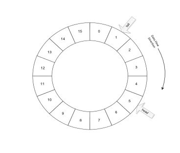

# 5.1 I/O管理概述

## 5.1.1 I/O设备

>  I/O 设备管理包含了很多领域的不同设备及与设备相关的应用程序，因此很难有一个通用且一致的设计方案。

### 1. I/O设备的基本概念

**I/O设备：**可以将数据输入到计算机，或者可以接收计算机输出数据的外部设备，属于计算机中的硬件设备。

### 2. I/O设备的分类

**按使用特性分类**

- 存储设备：用于存储信息的设备。
- 输入输出设备：输入设备向计算机输入数据信息，输出设备用于计算机向外输出数据信息。
  - 网络适配器、调制解调器等网络设备既属于输入设备也属于输出设备。

**按传输速率分类**

- 低速设备：传输速率仅为每秒几字节到数百字节的设备。
- 中速设备：传输速率为每秒数千字节到数十万个字节的设备。
- 高速设备：传输速率为每秒数十万字节到千兆字节的设备。

**按信息交换单位分类**

- 字符设备：以字符为信息交换单位的设备，每次可以交换一个或多个字符，传输速度较低，通常采用中断驱动方式。
- 块设备：以数据块为信息交换单位的设备，每次可以交换一个或多个数据块的信息，传输速度较高，且支持对存储的信息进行寻址和随机读写。

**按设备的共享属性分类**

- 独占设备：同一时刻只能由一个进程占用的设备。
- 共享设备：同一时间段内允许多个进程同时访问的设备。
- 虚拟设备：通过SPOOLing等技术，把原本独占设备改造为逻辑上的共享设备，并可以把一个物理设备变换为多个对应的逻辑设备。

### 3. I/O接口

>  I/O设备通常由机械部件和电子部件组成：
>
> - 机械部件负责执行真正的I/O行为，CPU需要通过电子部件间接控制和管理机械部件的执行；
> - 其中的电子部件就是I/O接口，又称I/O控制器、设备控制器。

#### I/O接口的功能

I/O接口是主机和外设之间进行信息传输的“桥梁”，因此它在主机侧和外设侧各提供了一个接口：

- 主机侧的接口称为**内部接口**，它通过系统总线和CPU、内存相连，数据的传输方式只能是并行传输；
- 外设侧的接口称为**外部接口**，它通过USB、串/并行电缆等各种接口电缆与外设相连，数据的传输方式可以是串行或并行方式。

I/O接口的主要功能如下：

- **数据缓冲**：讲数据提前存到I/O接口中的数据缓冲区，以缓和高速系统组件和低速外部设备之间的速度差异。
- **数据格式转换**：I/O接口提供数据格式的相互转换。
- **控制和定时**：为来自系统总线的控制和定时信号提供控制和定时逻辑，对内部资源及外设间动作的先后关系进行协调，并对数据通信过程进行控制。
- **错误或状态检测**：提供可以保存各种状态信息的状态寄存器，CPU通过读取这些寄存器来了解接口和外设的出错情况或状态。
- **与主机和设备通信**：上述四个功能都必须通过主机与I/O接口之间和I/O接口与外设之间的通信来完成。

#### I/O接口的基本结构

- 数据缓冲寄存器主要用于暂存与CPU或内存进行传送的数据信息
- 状态寄存器主要用于记录接口和设备的状态信息
- 控制寄存器主要用于保护CPU对外设的控制信息
- 上述的数据信息、状态信息和控制信息都是通过数据线传输的
- 状态寄存器和控制寄存器在传送方向上是相反的

> 状态寄存器和控制寄存器的使用在时间上是错开的，所以很多时候会将两者放在一起，变为状态/控制寄存器。

#### I/O接口的类型

- 按数据传送方式分类：
  - 并行接口：一个字或字节的所有位同时传送。
  - 串行接口：一位一位地按顺序传送。
- 按主机访问I/O设备的控制方式分类：
  - 程序查询接口：程序查询方式的接口。
  - 程序中断接口：程序中断方式的接口。
  - DMA接口：DMA方式的接口。
- 按功能选择的灵活性分类：
  - 可编程接口：可通过程序来改变或选择接口的功能和操作方式。
  - 不可编程接口：不能从程序层面改变接口的功能，但可以通过硬连线逻辑来实现不同的功能。

#### I/O端口

- I/O端口是指I/O接口中CPU可以直接访问的寄存器。
  - I/O接口中的数据缓存寄存器用于存放数据信息，称为**数据端口**，CPU可以对其中的数据进行读写；
  - 控制寄存器用于存放控制命令，称为**控制端口**，CPU只能对其写入各种控制命令；
  - 状态寄存器用于存放状态信息，称为**状态端口**，CPU只能对各外设的状态进行读取。
- 为了使CPU能够访问I/O端口，必须对上述寄存器进行编址，I/O端口的编址方式有独立编址和统一编制两种。
  - 独立编址方式(I/O映射方式)
    - 该方式对主存地址空间和I/O端口地址空间分别进行编址，因此它们的地址取值范围可以重叠，相同的地址可能属于不同的地址空间，所以需要用专门的I/O指令来表明访问的是I/O地址空间。
    - 优点：① 由于I/O端口数明显少于主存单元，从而I/O接口只需要少量的地址线，这使得在选择I/O端口时译码更加简单，寻址速度更快；② 由于使用专用的I/O指令，和主存指令完全区分开，这使得程序更加清晰，有助于理解和检查。
    - 缺点：① I/O指令通常只支持简单的传输操作，降低了程序设计的灵活性；② CPU必须分别为存储器和I/O设备提供单独的读写命令，这使得总线控制逻辑变得更加复杂；③ 使用独立的地址空间需要有专门的硬件保护机制。
  - 统一编址方式(内存映射I/O、存储器映射方式)
    - 该方式对主存地址空间和I/O地址空间统一进行编址，将主存地址空间的一部分地址划分给I/O端口。
    - 优点：① 由于I/O端口被当作存储器的单元进行地址分配，访问时不再需要专门的I/O指令，这使得CPU对I/O端口的访问更加灵活方便，且I/O寄存器的数目只受存储容量的制约，有利于扩大系统吞吐率；② 由于任何访存指令都可以用于I/O端口，这意味着方寸指令的寻址方式和保护机制等特性都可以被共享，所以不再需要设置专门的保护机制，提高了编程的灵活性。
    - 缺点：① I/O端口占用了部分主存空间的地址，减少了主存可用容量；② 由于在访问I/O端口时全部地址线都参与地址译码，这使得译码过程复杂，降低了寻址速度。

## 5.1.2 I/O控制方式

> 设备管理的主要任务之一是控制设备和内存或CPU之间的数据传送。外围设备和内存之间的输入输出控制方式有4种。（其中通道方式已经移出408大纲，故不介绍。）

### 1. 程序直接控制方式

程序直接控制方式是指直接通过查询程序来控制主机和外设之间数据传输的I/O控制方式，所以又称**程序查询方式**。

程序查询方式可分为**定时查询方式**和**独占查询方式**。

- 定时查询方式：CPU周期性地查询结构中的状态寄存器，直到条件满足后才开始传送数据，待数据传送完成后返回用户程序。
- 独占查询方式：一旦设备被启动，CPU必须连续不断地查询接口的状态，此时，该设备的I/O独占CPU，I/O的整个过程均由CPU控制，CPU与外设完全串行工作。

> ⚠️ 定时查询方式在周期内只有特定时间需要去查询接口中的状态寄存器，所以还是有一定的时间可以执行其他任务。

- 优点：实现简单，只需要少量硬件，在读/写指令的基础上，加上实现循环检查等一系列指令即可。
- 缺点：CPU需要一直在原地轮询外设的状态，会出现“忙等”现象，CPU和外设只能串行工作，CPU的利用率很低。

### 2. 中断驱动方式

中断驱动方式使得CPU与外设能够并行工作，提高了CPU的利用率。

当CPU需要进行I/O操作时，CPU在启动外设后不再需要原地等待其准备就绪，而是将执行I/O操作的进程暂时挂起，然后在就绪队列中选择另一个进程开始执行。此时，CPU与外设并行工作。

优点：实现了CPU与I/O设备的并行工作，提高了CPU的利用率。

缺点：每次中断仅传输一个字节的数据，中断处理需要耗费一定的时间，频繁中断会导致CPU的利用率大幅下降。

### 3. DMA方式

DMA方式在I/O设备和内存直接开辟直接的数据交换道路，彻底“解放”CPU。

DMA方式的特点：

- 以数据块为基本单位进行数据传输，每次可以传送一个或多个数据块。
- 外设与主存之间可以直接进行数据交换，数据传送过程无需CPU干预。
- 只有预处理时需要CPU的干预，进一步提高了CPU与I/O设备的并行程度。

要在主机与控制器之间实现成块数据的直接交换，须在DMA控制器中设置如下4类寄存器：

- 命令/状态寄存器(CR)：接收从CPU发来的I/O命令、有关控制信息，或设备的状态。
- 内存地址寄存器(MAR)：在输入时，它存放把数据从设备传送到内存的起始目标地址；在输出时，它存放由内存到设备的内存源地址。
- 数据寄存器(DR)：暂存从设备到内存或从内存到设备的数据。
- 数据计数器(DC)：存放本次要传送的字节数。

优点：使内存和设备之间交换信息无需通过CPU，CPU和I/O设备可以并行工作，显著地提高了CPU的效率。

缺点：需要更多的硬件支持。

## 5.1.3 I/O软件层次结构

操作系统的设备管理模块分为若干个层次，低层软件用于屏蔽硬件细节的差异，高层软件向用户提供简洁、友善的界面，每一层都利用其下层提供的服务，来完成输入输出功能中的某些子功能，并屏蔽这些功能的实现细节，向高层提供服务。

操作系统通常把I/O软件组织成中断处理程序、设备驱动程序、设备独立软件和用户层I/O软件四个层次。下图中最底层的“硬件”不属于操作系统I/O软件的组成层次，图中的箭头表示I/O的控制流。

### 1. 中断处理程序

中断处理程序的主要任务是分析中断类型并作出相应的处理，处理时需先保存中断前的状态，然后转入相应的中断服务程序进行处理，处理完毕后恢复中断前的状态。

中断处理程序处于I/O软件层次结构的最底层，直接与硬件交互，且与系统的其余部分尽可能少地发生联系。I/O设备发送中断信号时，先由硬件做出初步处理，保存被中断进程的CPU环境，并转由中断处理程序处理该中断信号。处理完成后恢复该进程的CPU环境，然后返回断点继续执行。

### 2. 设备驱动程序

设备驱动程序用于具体事项系统对设备发出的操作指令，驱动I/O设备工作。

设备驱动程序处于I/O软件层次结构的次底层，每一类设备通常对应一个设备驱动程序，负责上层I/O软件与设备控制器之间的通信。设备驱动程序负责具体实现系统对设备发出的操作指令，驱动I/O设备工作，并为应用程序提供了统一抽象的接口，从而屏蔽了不同设备之间的差异。

### 3. 设备独立软件

设备独立软件，又称**设备无关性软件**，位于设备驱动程序与用户层I/O软件之间。

设备独立软件使得I/O软件独立于具体使用的物理设备，便利了操作系统对设备的分配，提高了操作系统的可适应性和可扩展性。

设备独立软件的主要功能：

- **缓冲区管理：**用于缓和CPU与I/O设备的速度差异，提高CPU和I/O射别之间的并行性。
- **设备分配与回收：**引入逻辑设备名，并实现逻辑设备名到物理设备名的转换；将设备、控制器和通道分配给进程，确保CPU与I/O设备之间能正常通信。
- **虚拟设备：**将独占设备改造为共享设备的技术，以SPOOLing(假脱机技术)为例，可以将独占设备改造为共享设备，并将一台物理I/O设备虚拟为多台逻辑I/O设备，从而提高设备的利用率。
- **设备驱动程序接口：**方便用户添加设备驱动程序，更换设备时就无需修改I/O软件，大大方便了系统的更新和扩展。

### 4. 用户层I/O软件

用户层I/O软件位于I/O软件层次的最上层，用于实现与用户交互的接口，包括库函数和SPOOLing软件等。

用户层I/O软件一般工作在核心态，也有一小部分在用户态，它们通过系统调用来获取操作系统的服务。

## 5.1.4 输入输出应用程序接口

在I/O系统和主机的接口中，根据设备类型的不同，可分为块设备接口、字符设备接口和网络设备接口。

### 1. 字符设备接口

字符设备是以字符为信息交换单位的设备，每次可以交换一个或多个字符，传输效率较低，通常采用中断驱动方式。

字符设备接口，又称流设备接口，用于控制字符设备的输入和输出。字符设备接口提供以下操作：

- **打开和关闭操作：**由于大多数字符设备都属于独占设备，因此在共享时需要实现互斥，使用字符设备时需先使用打开操作来打开设备，如果设备已被打开，则表示它正被其他进程使用。
- **get和put操作：**由于字符设备不可寻址，只能以顺序方式存取，字符设备接口建立字符缓冲区，向用户程序提供get和put操作来从字符缓冲区输入和输出。

### 2. 块设备接口

块设备是以数据块为信息交换单位的设备，每次可以交换一个或多个数据块的信息，传输速率较高，且支持对存储的信息进行寻址和随机读写。

块设备接口用于控制块设备的输入和输出，提供以下功能：

- **隐藏磁盘的二维结构：**磁盘的每个扇区的地址需要用磁道号和扇区号来表示，因此磁盘地址是二维结构。块设备接口将磁盘上的所有扇区从0到n-1依次编号，将磁盘地址映射到一维，从而隐藏了硬盘的二维结构。
- **将抽象命令映射为低层操作：**由于用户进程使用的`open`、`close`,`read`、`write`无法直接被设备识别并执行，块设备接口将这些命令映射为设备能够识别的具体操作。

### 3. 网络设备接口

操作系统需要通过一定的方式把计算机连接到网络上，并提供网络软件和网络通信使用的网络设备接口，用于描述具体网络设备属性和操作，使计算机能够通过网络与其他计算机进行通信。

## 5.1.5 阻塞/非阻塞I/O

输入输出应用程序接口的另一方面涉及选择阻塞I/O与非阻塞I/O。阻塞I/O和非阻塞I/O的区别主要在于应用程序的调用是否立即返回。

### 1. 阻塞I/O

阻塞I/O是指进程发起I/O系统调用后，进程被阻塞，从操作系统的运行队列被移到阻塞队列。

- 优点：
  - 进程阻塞不消耗CPU资源，可以及时响应每个操作；
  - 实现难度低、开发应用较容易；
  - 适用于并发量小的网络应用开发。
- 缺点：
  - 不适用于并发量大的应用，因为请求I/O会阻塞进程；
  - 需要给每个请求分配一个处理进程以便及时响应，系统开销大。

### 2. 非阻塞I/O

非阻塞I/O是指进程发起I/O系统调用后，如果内核缓冲区没有数据，需要到I/O设备中读取，进程返回一个错误，这个过程无需阻塞；进程发起I/O系统调用后，如果内核缓冲区有数据，内核就会把数据返回进程。

优点：进程发起I/O系统调用无需阻塞，系统开发相对较小，适用于并发量大应用。

缺点：对I/O系统调用的执行情况的跟踪需要轮询OS内核，将占用一定的CPU资源；实现难度高，开发应用较困难。

# 5.2 设备独立软件

## 5.2.1 高数缓存与缓冲区

### 1. 磁盘高速缓存

操作系统中使用磁盘高速缓存技术来提高磁盘的I/O速度，对访问高速缓存要比访问原始磁盘数据更为高效。

磁盘高速缓存在逻辑上属于磁盘，在物理上则是驻留在内存中的盘块。

高速缓存在内存中分为两种形式：

- 一种是在内存中开辟一个单独的空间作为磁盘高速缓存，大小固定；
- 另一种是把未利用的内存空间作为一个缓冲池，供请求分页系统和磁盘I/O时共享。

### 2. 缓冲区

缓冲区是一块存储区域，用于保存在两个设备之间或在设备和应用程序之间传输的数据。

缓冲区管理的主要功能是对系统中的缓冲区进行有效组织，并提供获得和释放缓冲区的手段。

> 💡 缓冲区可以由寄存器等专用的硬件实现(硬件缓冲)，也可以由操作系统在内存中开辟一个空间来实现(软件缓冲)。

引入缓冲区的原因：

- 缓和CPU和I/O设备的速度差异。
- 减少对CPU的中断频率，提高CPU的效率。
- 解决数据单元大小不匹配的问题。
- 提高CPU和I/O设备之间的并行性。

缓冲区的基本思想：

- 当进程与设备执行数据交换时，先向系统申请一个缓冲区，然后由进程或设备将数据送至缓冲区，待缓冲区填满或数据输入完成时，将缓冲区中的数据送给设备或进程。
- 缓冲区为空时，才能向缓冲区输入数据；缓冲区的数据填满时，才能从缓冲区输出数据。

高速缓存和缓冲区的区别：

- 高速缓存由高速寄存器组成，主要解决CPU与内存间的速度不匹配的问题；而缓冲区用于缓解CPU与I/O设备间速度不匹配的问题，提高CPU和I/O设备之间的并行性。
- 高数缓存存放的内容是低速设备的子集；而缓冲区存放的内容不一定存在于低速设备，缓冲区只是以“中介”的身份，在高速设备和低速设备之间传输数据。

#### 单缓冲

单缓冲仅使用一个缓冲区，每当用户进程发出I/O请求时，操作系统便在内存的系统区中为之分配一个缓冲区。

#### 双缓冲

双缓冲为输入和输出设备共分配两个缓冲区，在一个进程往一个缓冲区中传送(或读取)数据的同时，操作系统可以清空(或填充)另一个缓冲区。双缓冲可以加快输入和输出速度，提高设备利用率。

采用双缓冲策略处理一个数据块平均耗时为`max(T, C+M)`。

#### 循环缓冲

循环缓冲将多个大小相等的缓冲区链接成循环队列。在循环缓冲机制中，每个缓冲区都有一个链接指针指向下一个缓冲区，最后一个缓冲区指针指向第一个缓冲区，组成循环缓冲区。

#### 缓冲池

缓冲池包含了一个数据结构及一组操作函数的管理机制，用于管理大小相等的缓冲区。**缓冲区既可用于输入又可用于输出，可被多个进程共享。**

> ⚠️ 循环缓冲中的缓冲区仅仅是一组内存块的链表，而缓冲池则是包含了一个用于管理的数据结构及一组操作函数的管理机制，用于管理多个缓冲区。

- 缓冲池的组成：

  - **空白缓冲队列：**由空缓冲区链成的队列，用于取出空缓冲区来进行写入操作。
  - **输入队列：**装满输入数据的缓冲区链成的队列，用于保存输入设备输入的数据，供用户程序读取。
  - **输出队列：**装满输出数据的缓冲区链成的队列，用于保存用户程序输出到设备的数据，供用户程序读取。

- 缓冲池还具有四种工作缓冲区：

  - **用于收容输入数据的工作缓冲区**
  - **用于提取输入数据的工作缓冲区**
  - **用于收容输出数据的工作缓冲区**
  - **用于提取输出数据的工作缓冲区**

- 缓冲池的工作机制：

  

  - **收容输入：**输入进程从空缓冲队列的队首摘下一空缓冲区，作为收容输入工作缓冲区，然后把数据输入其中，装满后再将它挂在输入队列队尾。
  - **提取输入：**计算进程从输入队列的队首取得一个缓冲区，作为提取输入工作缓冲区，从中提取数据，用完数据后将它挂在空缓冲队列队尾。
  - **收容输出：**计算进程从空缓冲队列的队首取得一空缓冲区，作为收容输出工作缓冲区，当其中装满数据后，将其挂在输出队列末尾。
  - **提取输出：**输出进程从输出队列的队首取得一装满输出数据的缓冲区，作为提取输出工作缓冲区，在数据提取完后，再将它挂在空缓冲队列末尾。

## 5.2.2 设备分配与回收

设备分配的任务是按照一定的策略，为提出I/O请求的进程分配合适的设备，确保CPU和I/O设备之间能正常通信，还应分配相应的控制器和通道。

> ⚠️ 通道是一种独立于CPU的专用于I/O控制的处理器，它可以控制I/O设备与内存直接进行数据交换。通道的启动需要由CPU执行相应指令，并在操作结束时向CPU发出中断信号。在数据交换过程中，CPU无需进行干预，可以提高CPU和I/O的并行程度。

### 1. 设备分配数据结构

用于设备分配的数据结构的主要作用是描述系统的配置、I/O设备的状态特性及当前的使用情况。

在进行设备分配时需要一下数据结构：

- **设备控制表DCT：**用于记录设备的情况，系统为每个设备配置一张设备控制表，以下是DCT应该有的字段。

  - **设备类型：**用于指示设备类型。
  - **设备标识符：**即物理设备名，同一系统中的物理设备名是独一无二的。
  - **设备状态标志：**用于表示当前设备的状态是忙或闲。
  - **指向控制器表的指针：**指向该设备所连接的控制器的控制表。
  - **重复执行次数或时间：**设备在工作中发生错误时应重复执行的次数。
  - **设备队列的队首指针：**凡因请求本设备而未得到满足的进程，应将其PCB按照一定的策略排成一个设备请求队列，其队首指针指向队首PCB。

  

- **控制器控制表COCT：**用于记录控制器情况，系统为每个控制器配置一张控制器控制表。

- **通道控制表CHCT：**用于记录通道情况，系统为每个通道配置一张通道控制表。

> 一个通道可以控制多个设备控制器，而每个设备控制器又可以控制多个设备。当通道、设备控制器和设备都成功分配时，进程才能正常使用设备。

- **系统设备表SDT：**用于记录系统中全部设备的情况，每个设备占一个表目，整个系统只有一张系统设备表。

### 2. 设备分配策略

#### 设备分配原则

设备分配的原则是根据设备特征、用户要求和系统配置情况决定的。

设备分配的**总原则**是既要充分发挥设备的使用效率，尽可能地让设备忙碌，又要避免由于不合理的分配方法造成进程死锁，还要做到把用户程序和具体物理设备隔离开来。

即用户程序面对的是逻辑设备，而分配程序将逻辑设备转换为物理设备之后，再根据要求的物理设备号进行分配。

#### 设备分配方式

- **静态分配：**在作业执行前，由操作系统一次性分配该作业所需的全部设备、控制器和通道，当作业在执行过程中不再需要，或作业执行结束时再收回设备。
  - 静态分配实现简单，破坏了死锁发生的“请求和保持”条件，能够防止死锁，但是系统会为进程一直保留设备，直到该进程完成，此时设备只能被特定的进程使用，因此降低了设备的利用率。
  - 静态分配一般用于独占设备。
- **动态分配：**在作业需要用到某设备时，操作系统才会对其进行分配，当作业用完此设备，系统就会立刻回收。
  - 动态分配可以提高设备利用率，但有可能出现死锁。
  - 动态分配一般用于共享设备。

#### 设备分配算法

- **先来先服务：**操作系统字节根据各个进程提出设备使用请求的先后次序分配设备。
- **优先级高者优先：**操作系统对进程设置优先级，进程的优先级越高，就越优先被分配设备，对于优先级相同的I/O请求，操作系统则按照先来先服务算法分配设备。

### 3. 设备分配的安全性

#### 安全分配方式

- 安全分配方式中，一个进程在同一时间段只能使用一个设备。
- 优点：破坏了死锁产生的“请求和保持”条件，设备分配安全。
- 缺点：对于同一个进程，CPU和I/O设备串行工作，进程推进的效率不高。

#### 不安全分配方式

- 在不安全分配方式中，进程在发出I/O请求后仍继续运行，需要时又发出第二个I/O请求、第三个I/O请求等，仅当进程所请求的设备已被另一进程所占用时，才进入阻塞状态。
- 优点：一个进程可同时操作多个设备，是进程迅速推进。
- 缺点：分配不安全，因其满足“请求和保持”条件，可能造成死锁。

### 4. 设备独立性

设备独立性，又称设备无关性，是指应用程序与具体使用的物理设备无关。用户可以利用逻辑设备进行I/O操作，不必指定物理设备。

优点：应用程序与具体使用的物理设备无关，系统增减或变更设备时不必修改源程序，便于处理I/O设备故障，提高系统可靠性，并使设备的分配更加灵活，提高设备的利用率。

为了实现设备独立性，需要建立逻辑设备和物理设备的映射，通常通过逻辑设备表LUT实现，表项包括逻辑设备名、物理设备名和设备驱动程序的入口地址。

逻辑设备表可以在整个系统只设置一张，也可以为每个用户设置一张。

- **整个系统只设置一张LUT：**将系统中所有进程的设备分配情况都记录在同一张LUT，无论是否是同一用户的逻辑设备，均不允许重名，因此只适合单用户系统。
- **为每个用户设置一张LUT：**将系统中每个用户的设备分配情况都记录在不同的LUT，因此对于不同的用户，该方式支持使用相同的逻辑设备名。

## 5.2.3 假脱机技术(SPOOLing)

假脱机技术可以直译为“联机情况下同时进行的外围设备操作”。

它可以将独占设备改造为共享设备，并将一台物理I/O设备虚拟为多台逻辑I/O设备，从而提高设备的利用率。

SPOOLing技术通过“空间换时间”的策略，解决了低速I/O设备与计算机主机交换信息时速度不匹配的问题。

通过SPOOLing技术，可以将一台物理I/O设备虚拟为多台逻辑I/O设备，这样也就允许多个用户共享一台物理I/O设备。

### 1. SPOOLing系统的组成

#### 输入井和输出井

输入井和输出井是磁盘上的两个区域，由输入井负责暂存输入数据，由输出井负责暂存输出数据。

#### 输入缓冲区和输出缓冲区

输入缓冲区和输出缓冲区是内存中的两个缓冲区，用于缓和CPU和磁盘之间速度不匹配的矛盾。

#### 输入进程和输出进程

输入进程，又称预输入进程，用于将用户要求的数据从输入设备通过输入缓冲区再到输入井。

输出进程，又称缓输出进程，用于将用户要求的数据成内存输出到输出井。

#### 井管理程序

井管理程序，包含输入井管理程序和输出井管理程序，用于控制设备与输入井、输出井之间信息的交换。

### 2. SPOOLing系统的特点

- 缓冲区的设置缓和了CPU和磁盘速度不匹配的矛盾。
- 将独占设备改造为虚拟的共享设备。
- 将一个物理设备变换为多个对应的逻辑设备。

## 5.2.4 设备驱动程序接口

设备驱动程序接口用于具体实现系统对设备发出的操作指令，驱动I/O设备工作。

# 5.3 外存管理

## 5.3.1 磁盘

磁盘是一种利用磁记录技术存储数据的存储器，具有记录密度高、容量大、速度快等优点、它是目前计算机存储系统中使用最普遍的一种外部存储器。

磁盘表面涂有磁性物质，通过一个称为**磁头**的导体线圈从磁盘存取数据。在读/写操作期间，磁头固定，磁盘在下面高速旋转。

磁盘是以数据块为信息交换单位的设备，每次可与内存交换一个或多个数据块的信息，且支持操作系统直接存取磁盘上的任意物理块。

> 操作系统对磁盘等辅存的访问是以块为单位的，而对主存的访问是以字节或字为单位的。

### 1. 磁盘结构

- 盘片：由铝合金材料或玻璃构成的基片，盘片的表面涂有磁性物质，每个磁盘有一个或多个盘片。
- 盘面：盘片上涂油磁性物质的面，每个盘片有一个或两个盘面。
- 磁头：对磁盘进行读写的部件，每个盘面对应一个磁头，因此盘面号又叫磁头号，所有磁头连在同一磁臂上，因此所有磁头只能“共进退”。
- 磁道：盘面上以盘片为圆心，不同半径的同心圆，每个盘面有若干个磁道，各磁道之间有必要的间隙。
- 柱面：所有盘面上由相同水平位置的磁道从上到下组成的圆柱体。
- 扇区：每个磁道可以被分为若干个弧段，一个弧段就是一个扇区，各扇区之间有必要的间隙。
  - 扇区是磁盘的最小组成单元，每个扇区存放的数据量相等，一般为512字节。

磁盘上的任意一个物理地址可以用$(柱面号，盘面号，扇区号)$来表示。

$磁盘的存储容量=磁头数(盘面数)\times磁道数(柱面数)\times每个磁道上的扇区数\times每个扇区的字节数$。

> 由于每个扇区存放的数据量相等，因此扇区所在的磁道越往内侧，扇区面积越小，扇区内的数据密度就越大，因此磁盘的存储能力由最内侧磁道的最大记录密度决定。

磁盘一般使用错位编号、对磁盘盘面进行错位命名，这样可以减少磁盘的旋转延迟时间。

### 2. 磁盘格式化和分区

#### 低级格式化

低级格式化(物理格式化)，是指对一个新磁盘划分出柱面和磁道，再将磁道划分为若干个扇区。

每个扇区又划分为头部、尾部和数据区域，其中头部和尾部包含了一些磁盘控制器的信息，用于保存扇区号、进行扇区校验。

低级格式化一般由磁盘生产厂家在出厂前完成。

低级格式化只能针对整块磁盘，不能对某个分区单独进行。

> 当磁盘出现大量坏扇区时，可以通过低级格式化来对扇区重新划分，从而修复磁盘。
>
> 但低级格式化是一种损耗性操作，会对磁盘寿命产生一定的负面影响，非必要应避免。

#### 分区

分区是指把一个物理磁盘的存储空间划分为几个相互独立的部分，由分区起始和终止的磁头、柱面、扇区、总的扇区数等信息来控制分区的边界。

在逻辑上，每个分区就是一个独立的逻辑磁盘。

如果操作系统需要从磁盘引导启动，就必须有一个分区被标记为活动分区。

#### 高级格式化

高级格式化(逻辑格式化)，是对磁盘分区创建文件系统，包括创建文件系统的根目录、初始化存储空间管理所用的数据结构等，使操作系统能够对磁盘进行读写。

高级格式化会删除硬盘驱动器上的数据，生成引导区信息、初始化文件分配表、标注逻辑坏道、校验数据等。

高级格式化的方法因操作系统的不同而有所差异。

> 低级格式化针对的是硬盘，高级格式化针对的是分区，一块新磁盘要经过低级格式化、分区、高级格式化，才可以正常使用。

### 3. 磁盘引导块和坏块

#### 引导块

引导块包含引导操作系统的代码。

每个分区都有一个引导块，引导块中的程序将装载该分区中的操作系统。

为统一起见，每个分区都从引导块开始，如果分区不包含操作系统，则引导块的内容可以为空。

计算机启动时需要先运行一个初始化程序，该程序通常位于只读存储器中。

#### 坏块

坏块是无法正常使用的扇区，属于硬件故障。

硬盘在生产时就有可能存在坏块，出厂前的低级格式化会对磁盘上的坏块进行标记，并用磁盘末尾的一些空闲块进行替换，操作系统无法感知。

坏块只能进行屏蔽，不能进行修复，可以在磁盘控制器或从操作系统层面对坏块进行处理。

### 4. 磁盘读取时间

- 寻道时间$T_s$：磁头移动到数据所在磁道需要的时间，该时间是启动磁臂的额时间$s$与磁头移动$n$条磁道所花费的时间之和，即$T_s=m\times n +s$
  - 其中$m$为常数，与磁盘驱动器的速度有关，一般磁盘的$m=0.2ms$，磁臂的启动时间$s$约为2ms。
- 旋转延迟时间$T_r$：磁头移动到指定磁道后，扇区移动到磁头下面需要的时间，设磁盘的旋转速度为$r$，则$T_r=\frac{1}{2r}$。
- 传输时间$T_t$：把数据从磁盘里读出，或向磁盘写入数据需要的时间，$T_t$的大小与每次所读写的字节数$b$和旋转速度$r$有关：$T_t=\frac{b}{rN}$。
  - 其中$r$为磁盘每秒的转速，N为一条磁道上的字节数。
- 访问时间$T_a$可表示为：$T_a=T_s+\frac{1}{2r}+\frac{b}{rN}$

### 5. 磁盘调度算法

> 由于磁盘的读写涉及磁头的移动，磁头移动产生的寻道时间是磁盘读取时间的主要部分，而旋转延迟时间和传输时间几乎无法从操作系统层面优化，因此磁盘调度的目标是使磁盘的平均寻道时间尽可能少。

#### 先来先服务算法——FCFS

FCFS算法根据进程请求访问磁盘的先后次序进行调度。该算法实现简单，对进程公平，不会导致进程饥饿。但该算法未对寻道进行优化，平均寻道时间可能较长。

#### 最短寻找时间优先算法——SSTF

SSTF算法选择调度处理的磁道是与当前磁头所在磁道距离最近的磁道，以便使每次的寻找时间最短。

这种算法会产生饥饿现象。

#### 扫描算法——SCAN——电梯调度算法

SCAN算法在磁头当前移动方向上选择与当前磁头所在磁道距离最近的请求作为下一次服务的对象，实际上就是在SSTF算法的基础上规定了磁头运动的方向。

SCAN算法对最近扫描过的区域不公平，因此它在访问局部性方面不如FCFS算法和SSTF算法好。

#### 循环扫描算法——C-SCAN

在扫描算法的基础上规定磁头单向移动来提供服务，回返时直接快速移动至起始端而不服务任何请求。

由于SCAN算法偏向于处理那些接近最里或最外的磁道的访问请求，所以使用改进型的C-SCAN算法来避免这个问题。

> 💡 LOOK调度和C_LOOK调度
>
> 在SCAN和C-SCAN的基础上，磁头移动只需要到达最远端的一个请求即可返回，不需要到达磁盘端点。

#### 磁盘调度算法的优缺点

|  算法  | 优点                     | 缺点                                       |
| :----: | ------------------------ | ------------------------------------------ |
|  FCFS  | 公平、简单               | 未对寻道进行优化，适合磁盘I/O较少的情况    |
|  SSTF  | 相比FCFS算法有更好的性能 | 不能保证平均寻道时间最短，可能出现饥饿现象 |
|  SCAN  | 解决了SSTF的饥饿现象     | 不利于远离磁头一端出现的磁盘I/O请求        |
| C-SCAN | 解决了SCAN的不公平现象   | 若某个磁道出现连续请求，磁臂将不再移动     |

## 5.3.2 固态硬盘

> 固态硬盘SSD，又称电子硬盘，其接口规范和使用方法与磁盘几乎相同。相比于磁盘而言，固态硬盘不是磁表面存储器，而是由NAND闪存组成的存储设备，具有读写快、质量轻、能耗低、体积小等优点。

### 1. 读写性能特性

固态硬盘一般使用NAND闪存来作为存储介质，一块固态硬盘中有多个NAND闪存，每个NAND闪存中包含多个块，每个块包含多个页。

由于NAND闪存的特性，固态硬盘必须以页为单位进行存取。

NAND闪存还有一个重要的特性：**只能读写单个页，不允许覆盖写入**。如果需要写入某个页，必须先清空里面的内容才能写入。

固态硬盘和磁盘的区别：

- **定位数据快：**磁盘需要经过寻道和旋转，才能定位到要读写的数据块，而固态硬盘只需通过映射表计算即可找到数据块。
- **读取速度快：**磁盘的速度取决于旋转速度，而固态硬盘的读写不涉及机械部件的移动，因此普遍快于磁盘。

### 2. 磨损均衡

NAND闪存中的块有擦写次数限制。当某个块超过一定的擦写次数后，这个块就只能读取，无法写入。

磨损均衡用于均衡固态硬盘内部各个块的使用程度，优先对擦写次数少的块进行擦写，从而延长整个固态硬盘的使用寿命。

- **动态磨损均衡：**记录每个块的擦写次数，每次写入数据时，找到擦写次数最少的空闲块进行擦除，然后写入数据。
- **静态磨损均衡：**在擦写时，优先把长久不用的数据从擦写次数较少的块转移到擦写次数较多的块，并将待写入的数据写入擦写次数较少的块中。

